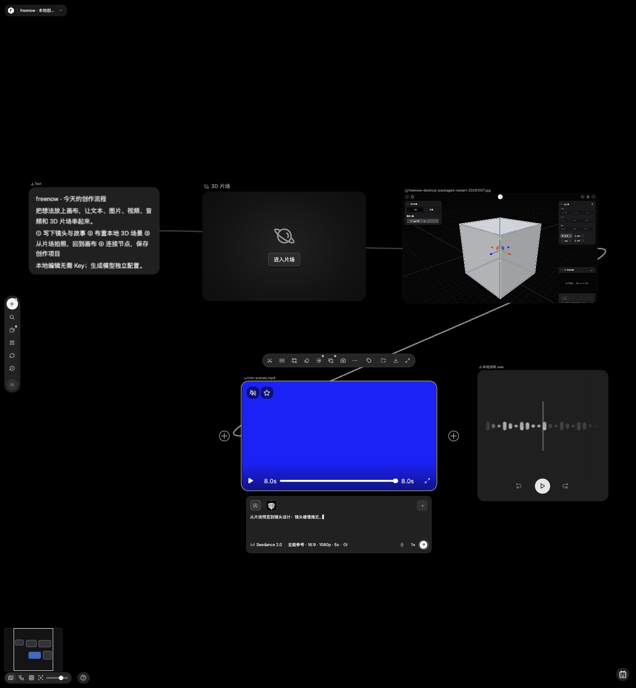
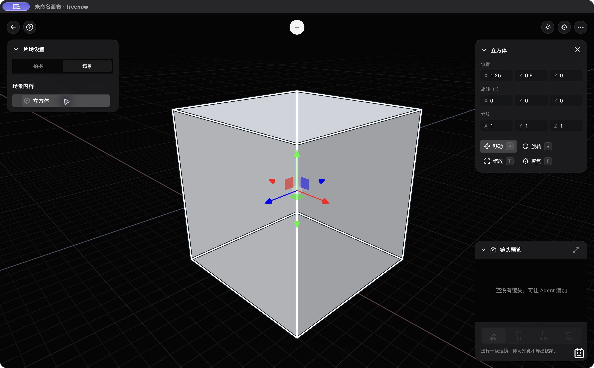
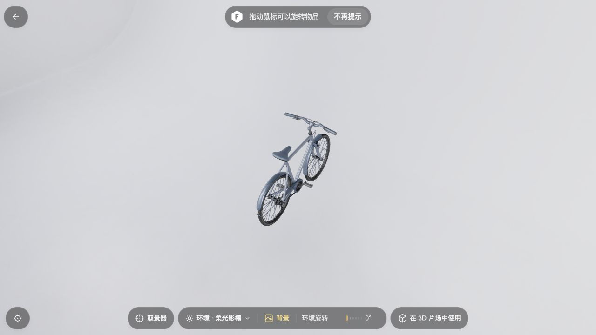
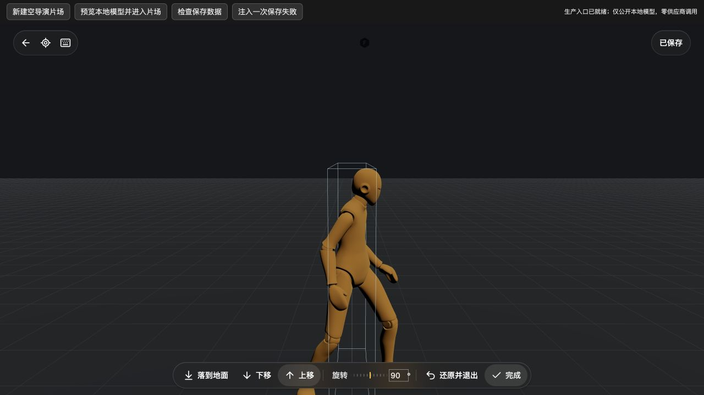
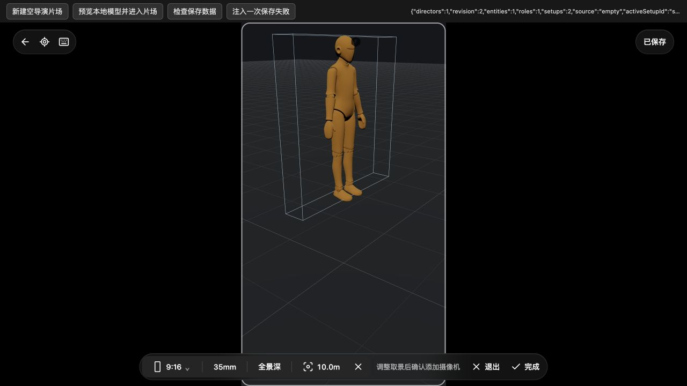
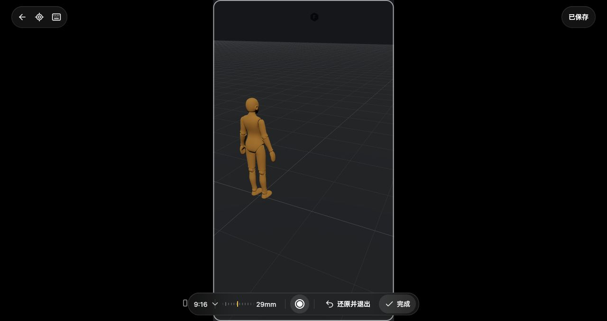
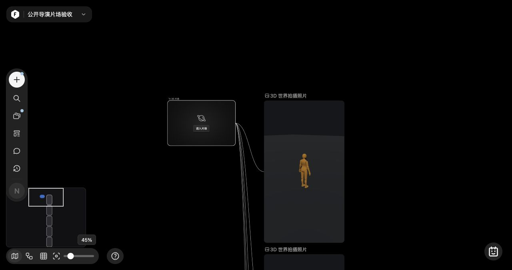

# freenow · 本地 AI 创作工作台

[简体中文](README.md) · [English](README.en.md)

**freenow 是在本机运行的 AI 无限画布（AI infinite canvas），把文本、图片、视频、音频、3D 片场和创作 Agent 放在同一个工作区。** 导入素材、连接节点、编辑内容，再按需接入独立模型供应商。项目和生成结果保存在本机。

适合个人创作者和开发者试验素材到分镜、镜头与媒体产出的创作流程。源码包版本为 **0.1.0，开发中**；桌面 **0.1.0-alpha.1** 已作为 macOS Apple Silicon 预发布公开。功能接入与专项验证不代表全站验收完成。

[下载 macOS arm64 Alpha](https://github.com/freeall12/freenow/releases/tag/v0.1.0-alpha.1) · [快速开始](#快速开始) · [功能](#可以做什么) · [API 配置](#最小-api-配置) · [文档](docs/README.md) · [状态](docs/STATUS.md) · [贡献](#开发与贡献)

## 界面预览

真实本地界面展示混合媒体画布、桌面 3D 片场和 GLB 模型预览。演示使用本地测试素材，未调用生成模型；操作记录与验证范围见[截图与复现](docs/screenshots/README.md)。



| 桌面 3D 片场 | 本地 GLB 模型预览 |
| --- | --- |
|  |  |

## 快速开始

推荐 **Node.js 22 LTS、pnpm**。本地视频裁切、封装及部分媒体处理还需要 **FFmpeg / FFprobe**。以下从源码启动浏览器版本；也可[下载 macOS arm64 Alpha](https://github.com/freeall12/freenow/releases/tag/v0.1.0-alpha.1)，桌面包内置 Node.js，但尚未签名、公证。安装与配置见[桌面指南](docs/DESKTOP.md)。

```sh
git clone https://github.com/freeall12/freenow.git
cd freenow
pnpm install --frozen-lockfile
pnpm run setup
pnpm dev
```

打开 [http://localhost:4173/](http://localhost:4173/)。服务默认只监听 `127.0.0.1:4173`。

`pnpm run setup` 初始化缺失的默认数据，不覆盖已有画布；请保留 `run`，`pnpm setup` 是包管理器的另一条命令。首次运行是空项目。**无需 API Key 即可使用本地编辑；生成与 Agent 未配置时会提示所需配置。**

FFmpeg 不在系统路径时，配置 `FFMPEG_PATH`、`FFPROBE_PATH`。启动失败时先检查端口占用与任务存储的单写者锁；不要同时启动两个服务。[运行与排错](docs/DEVELOPMENT-GUIDE.md)

## 桌面源码预览

```sh
pnpm desktop:dev
```

桌面运行固定使用 `127.0.0.1:4183` 和独立用户数据目录；`providers.env` 由后台读取，FFmpeg / FFprobe 仍需外部安装。命令会准备独立构建目录；可识别的旧 runtime 自动归档，其他已有目录拒绝覆盖。当前规则与版本边界见[桌面指南](docs/DESKTOP.md)。

当前源码新增[本机外部Agent MCP只读连接](src/features/external-agent/README.md)和[授权文件夹整理](docs/DESKTOP-FILES-20261008.md)，均需原生批准。它们尚未纳入现有Alpha包。外部连接支持能启动本机stdio进程的客户端，只读当前画布元数据；写入、生成/结果回填、媒体/素材和云端HTTP连接器未接入。

## 可以做什么

| 工作区 | 已接入能力 | 条件与边界 |
| --- | --- | --- |
| 无限画布 | 项目、节点连接、搜索、分组/堆叠、自动布局、素材库、复制粘贴、撤销重做 | 本地使用；逐态交互和性能验收仍在推进 |
| 文本与图片 | 富文本/Markdown、图层、画笔、裁剪、变换、蒙版、历史与导出 | 本地编辑可直接使用；AI 图片处理另需供应商 |
| 视频与音频 | 导入/播放、波形、取帧、裁切、播放列表、字幕及生成历史 | 部分处理需要 FFmpeg；AI 生成另需供应商 |
| 3D 片场 | GLB、SPZ 高斯世界、LOD、对象/镜头变换、运镜、拍照与短视频、保存恢复 | 本地 WebGL；含高斯场景不能完整导出为 GLB |
| 创作 Agent | 操作画布与片场、附件/技能引用、创作应用、只读子任务与 DAG 编排 | 需要支持 Responses API 和工具调用的模型 |
| 工作流与恢复 | 依赖执行、持久任务回执、原任务查询、显式继续与保存保护 | 未知状态不自动重复提交 |
| 外部Agent（桌面源码） | 本机MCP连接、原生批准、两项当前画布元数据只读工具、刷新撤权 | 支持本机stdio客户端；不含写入/生成/媒体或云端连接器，现有Alpha包未包含 |

源码另有正在补齐的[导演片场 V3](docs/STUDIO-V3-PRODUCTION-20261008.md)：人物/镜头/道具、基准与独立状态、[实体属性](docs/STUDIO-V3-ENTITIES-20261008.md)、[人物操控与摄像机创建](docs/STUDIO-V3-CONTROLS-20261008.md)已接入。最新[摄像机操控与拍摄](docs/STUDIO-V3-CAMERA-POSSESSION-20261008.md)支持三维飞行、进入/返回过渡、画幅与焦距滑尺、完成/还原，以及真实 PNG 连接到画布和同照片保存重试；实机刷新恢复五张照片与镜头参数已验。完整平面图、时间/关键帧、保存视图/历史照片、生成与完整 V3 Agent 编排仍未完成，SPZ 景深视觉待验；现有 Alpha 不含此批。

| 人物操控与朝向 | 当前视角摄像机确认 |
| --- | --- |
|  |  |

| 摄像机接管与光学工具 | 拍摄照片连接到画布 |
| --- | --- |
|  |  |

模型菜单、适配器和应用登记分别说明可选择范围；真实供应商输出质量需单独验证。[详细功能与适配器](docs/FEATURES.md) · [验收证据](docs/VERIFICATION-INDEX.md)

画布帮助菜单提供本地更新、离线教程、连接Agent、反馈和快捷键；[帮助与原始手势GIF](docs/CANVAS-HELP-20261008.md)、[实际快捷键映射](docs/CANVAS-SHORTCUTS-20261008.md)记录已验范围。真实麦克风/转写和全部硬件输入组合仍未验收。

## 最小 API 配置

服务读取进程环境，**不会自动加载 `.env`**。配置字段见 [`.env.example`](.env.example)，使用未跟踪的本机文件显式启动：

```sh
cp .env.example .env.local
# 在本机编辑 .env.local，填写需要使用的配置
node --env-file=.env.local server/server.cjs
```

该命令替代 `pnpm dev`。配置更改后重启服务；Key 保留在服务端，不填入前端源码或提交 Git。

| 想使用的能力 | 最小要求 | 详细配置 |
| --- | --- | --- |
| 本地画布与编辑 | 无 Key；部分媒体操作需 FFmpeg | [运行指南](docs/DEVELOPMENT-GUIDE.md) |
| 创作 Agent | `OPENAI_API_KEY`、`OPENAI_MODEL`；可选 `OPENAI_BASE_URL` 必须支持所用 Responses API/工具能力 | [Agent 接口](docs/AGENT-API.md) |
| 图片、视频、音频或 3D 生成 | 对应操作的供应商 Key、协议、型号映射及权限 | [多供应商配置](docs/MULTI-PROVIDER-SETUP.md)、[适配器目录](docs/FEATURES.md#独立供应商适配器) |

一个供应商 Key 不会启用全部模型。Agent 菜单别名通过 `AGENT_MODEL_MAP`、思考档位通过 `AGENT_REASONING_MAP` 映射；未映射选项不会静默回退。自定义 `tasks-v1` 和 `skin-tasks-v1` 需要实际实现对应合同的外部服务。

## 本地数据与隐私

项目、素材、Agent 会话与工作流记录保存在浏览器 **IndexedDB**；部分偏好和技能使用 **localStorage**。服务端任务、生成媒体和 Agent 检查点保存在 `server/` 下的私有隐藏目录，不提供静态访问、不纳入 Git。当前没有云同步。

日常保持同一入口：`localhost` 与 `127.0.0.1` 是不同 origin，浏览器存储不互通。清理站点数据会移除浏览器侧内容；浏览器数据与服务端数据需分别备份。大素材容量、迁移及冲突处理见[素材库与恢复](docs/LIBRARY-LOCAL-CAPACITY-20261005.md)。

**本地存储不代表 AI 请求不出站。** 调用配置的供应商时，提示词和该操作所需媒体会发送给对应服务。未配置时不进行生成。应用运行资源已本地化，原站出站请求被阻断；旧资源需显式导入修复。[本地化边界](docs/FREENOW-LOCALIZATION-ACCEPTANCE.md) · [公开仓库检查](docs/PUBLIC-REPOSITORY-AUDIT-20261004.md)

## 开发与贡献

浏览器使用原生 JavaScript / ES Modules，Node.js 提供本机 API；Three.js / Spark 负责 3D，Fabric 负责图片，Tiptap 负责文本，OpenAI SDK 负责服务端 Agent。现有根目录宿主与 `src/features/` 功能模块共同运行，按业务逐步整理。

```text
index.html、app.js        页面入口与画布宿主
src/features/           画布、媒体、Agent、3D 等业务模块
server/                 本机 API、供应商适配、任务与媒体服务
desktop/                Electron 外壳、后台配置与打包
assets/、defaults/       运行资源与空项目初始数据
scripts/、tests/         构建、定向检查与回归
docs/                   配置、模块合同与验收记录
component-library/      组件目录与预览宿主
```

贡献前阅读[项目结构](docs/PROJECT-STRUCTURE.md)和[开发指南](docs/DEVELOPMENT-GUIDE.md)。说明问题、复现输入和预期行为，提交聚焦的修改；交互变更需实际浏览器验证，供应商夹具通过不能代替模型质量验证。

```sh
node --test tests/<相关测试>.test.cjs
node --check <修改的模块>
pnpm check
# 修改对应打包入口后，按需执行：
pnpm build:text
pnpm build:image
pnpm build:mask
pnpm build:agent
pnpm build:spark
```

项目没有通用 `build`、`lint` 或 `typecheck` 脚本。[构建与验证范围](docs/DEVELOPMENT-GUIDE.md#构建表)；完整回归命令为 `pnpm test`。

## 常见问题

**freenow 是什么？** 本地 AI 创作工作台，以无限画布组织文本、图片、音视频和 3D 内容，并提供创作 Agent 与独立生成接口。

**需要 TapNow 账号吗？** 不需要。项目以 TapNow 界面与安装资源为交互参考，本机实现前后端与持久化，与 TapNow 无隶属关系。

**可以完全离线使用吗？** 依赖与资源就绪后的本地编辑可离线运行。AI 功能需要访问你配置的服务；本仓库不附带本地推理模型，也不保证任意兼容 API 能运行全部工具。

**已完成哪些验证？** 已有专项源码回归、真实本地媒体和浏览器记录；范围见[验收索引](docs/VERIFICATION-INDEX.md)。全站逐态验收、所有真实账号/Key 的模型效果、复杂 SPZ 场景与长期运行仍开放。

## 状态与许可

Sonilo SFX 原生接入通过 20 项定向检查及 4 项受影响 Music 回归；SFX 与 Agent 调色的本批浏览器验收已完成，包括调色保存/重试、实际 PNG 和刷新恢复。全站逐态与真实供应商 Key/质量仍未完成验收。详细边界见[SFX UI 记录](docs/SONILO-SFX-UI-QA-20261005.md)、[调色记录](docs/AGENT-COLOR-ADJUST-INTERACTIONS-20261005.md)和[当前状态](docs/STATUS.md)。其余进度、92 份精确模板正文缺口及供应商限制见[状态](docs/STATUS.md)、[有效缺口](docs/CURRENT-FUNCTION-GAPS-20261003.md)。团队、社区、分享营销、计费不在当前范围。

**仓库目前没有覆盖全部内容的统一开源许可证。** 第三方代码保留原许可；参考界面、模板和资源的权利不会因公开仓库或品牌替换而转移。[第三方资源来源](docs/THIRD-PARTY-RESOURCES.md)

[文档导航](docs/README.md) · [历史首页与增量记录](docs/README-HISTORY.md) · [仓库发现性说明](docs/REPOSITORY-DISCOVERY.md)
