# freenow

本地 AI 创作工作台：无限画布、图片与音视频编辑、3D 片场，以及能够操作画布和编排创作流程的 Agent。

以 TapNow 官方界面与安装包为功能和交互参考，在本机实现前后端、资源与持久化。**项目仍在开发，尚未完成全站一比一验收。** 运行不需要 TapNow 账号或服务；生成能力通过独立供应商适配器接入。本项目与 TapNow 无隶属关系。

[快速开始](#快速开始) · [功能截图](#功能截图) · [当前能力](#当前能力) · [API 配置](#api-配置) · [未完成项](#未完成项) · [文档导航](docs/README.md) · [公开仓库与密钥检查](docs/PUBLIC-REPOSITORY-AUDIT-20261004.md)

## 快速开始

推荐 Node.js 22 LTS 和 pnpm。本地视频裁切、封装及分镜处理另外需要 FFmpeg / FFprobe。

```sh
git clone https://github.com/freeall12/freenow.git
cd freenow
pnpm install --frozen-lockfile
pnpm run setup
pnpm dev
```

打开 **http://localhost:4173/**。服务默认仅监听 `127.0.0.1:4173`；这是本机应用，不是多用户云部署方案。

首次运行创建空画布。`pnpm run setup` 仅初始化缺失的默认数据，不覆盖已有画布。这里需要保留 `run`，避免调用 pnpm 自身的环境安装命令。无需 Key 即可使用本地编辑能力；未配置的生成和 Agent 功能会显示配置要求。

FFmpeg 已安装在其他位置时，可配置 `FFMPEG_PATH`、`FFPROBE_PATH`。组件预览位于 http://localhost:4173/component-library/ 。

## 功能截图

以下是本地应用的实际界面，复用正式画布、编辑器、Agent 和 WebGL 片场。使用隔离示例数据和仓库内模型；未调用生成模型。2026-10-05 已替换主要运行界面的 freenow 名称、本地 F 标识和 Agent 图片。完整品牌/导出清点仍开放。

| 当前片场：本地 Agent 图片与场景控件 | 当前模型预览：本地 GLB 与 freenow 提示标识 |
| --- | --- |
| 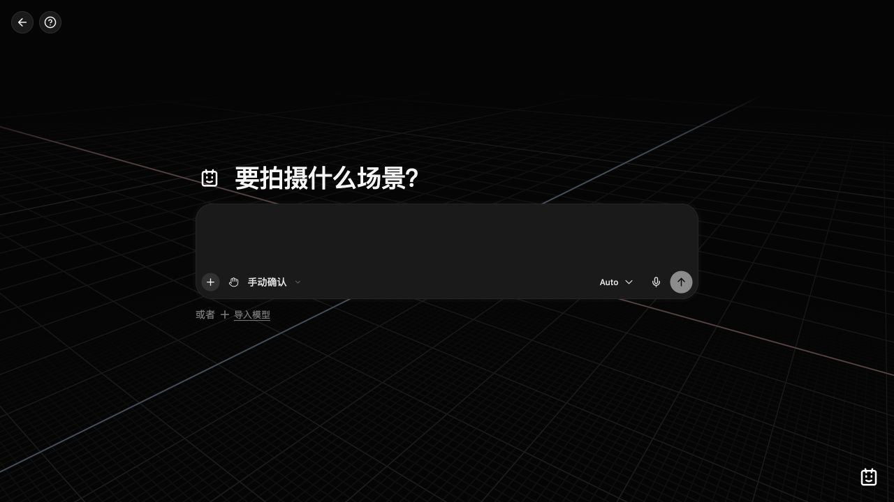 |  |

以下 2026-10-03 的历史截图保留当时标识：

| 无限画布：文本、素材、连线和片场入口 | 图片编辑：图层、选区与变换工具 |
| --- | --- |
| 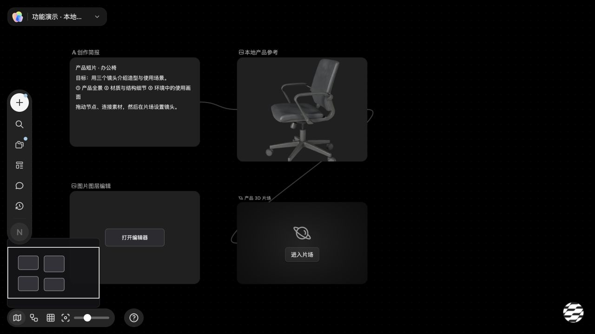 | 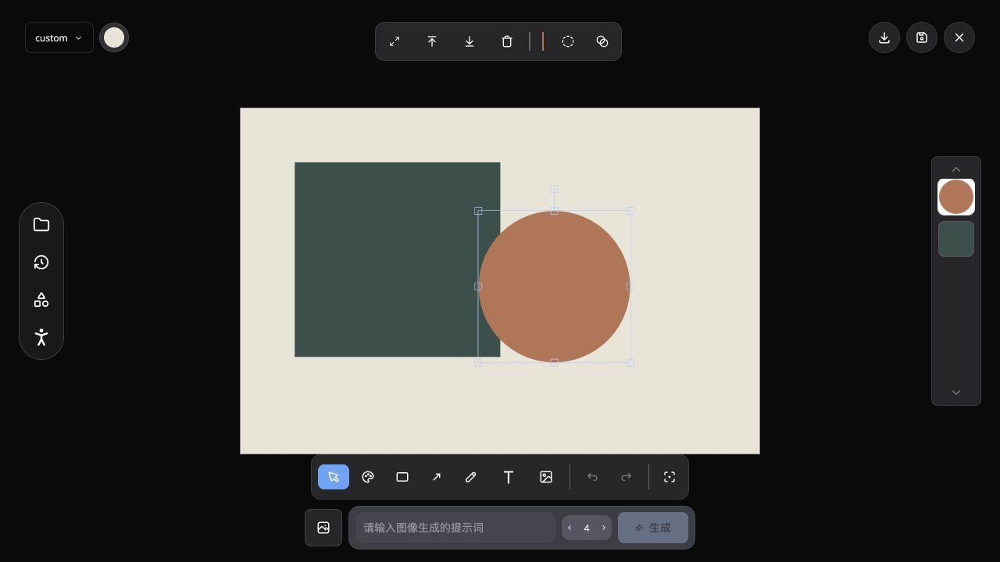 |
| **3D 片场：本地 GLB 导入和场景树** | **Agent：欢迎建议、附件与模型控制** |
| 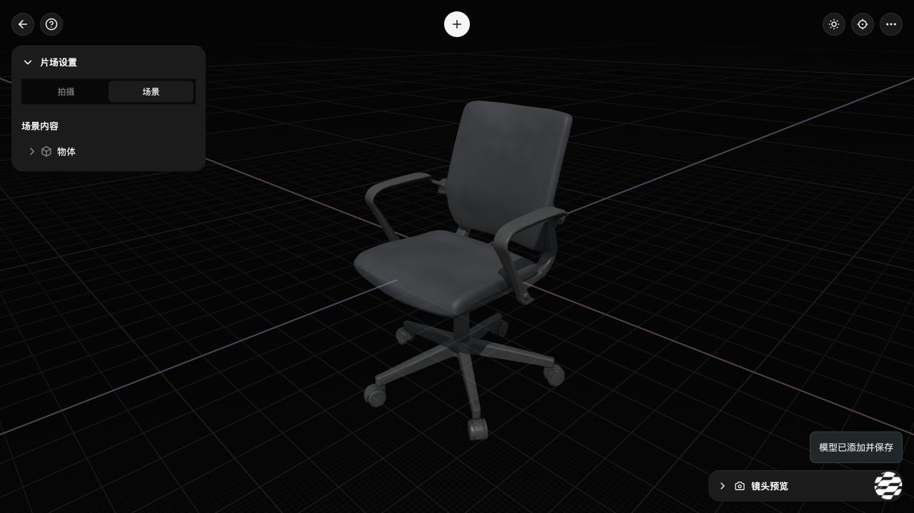 | 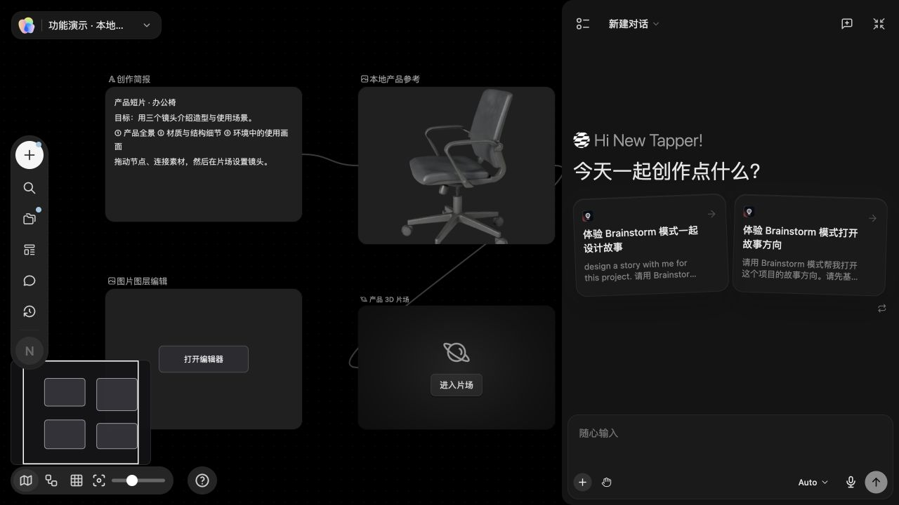 |

本机智能剪辑：实际 FFmpeg 输出、视频播放控件和来源连线。

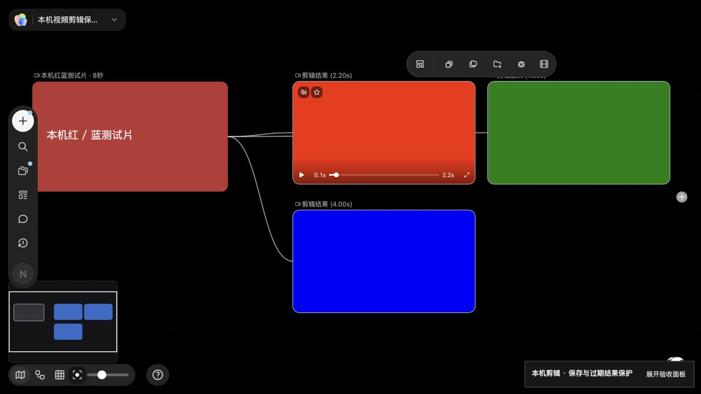

截图证明对应页面的实际渲染，不代表全部功能已验收。[截图来源与复现步骤](docs/screenshots/README.md)。

## 当前能力

下表描述已经接入的能力，不代表所有状态、菜单和视觉细节均通过最终验收。

| 模块 | 已有能力 | 使用条件 |
| --- | --- | --- |
| 无限画布 | 新建/切换项目、平移缩放、搜索、连线、分组、堆叠、自动布局、撤销重做、素材与个人模板 | 本地使用 |
| 文本与图片 | Tiptap 富文本/Markdown、Fabric 图层/画笔、裁剪、变换、蒙版、版本历史与导出 | 本地编辑；AI 编辑另需供应商 |
| 音视频 | 本地导入、播放、波形、帧捕获、裁切、播放列表、生成历史与结果归档 | 部分操作需 FFmpeg；生成另需供应商 |
| 3D 片场 | Three.js 场景、GLB 模型、SPZ 高斯世界与原生 LOD、对象变换、镜头与运镜、动画、取景及保存恢复 | SPZ 通过世界节点导入；含高斯场景不能完整导出为 GLB；生成另需供应商 |
| Agent | OpenAI SDK 工具循环、画布/片场操作、技能与附件引用、创作应用、只读子任务/DAG 编排 | 支持 Responses API 的模型与配置 |
| 工作流与恢复 | 分组依赖执行、任务持久回执、原任务查询、显式继续、项目/来源失效保护 | 未知状态不自动重新提交 |

Agent 应用已登记 22 个版本 URI、20 个功能族，包含剧本、分镜、人物、学习、产品等工作流。**登记覆盖不等于全部页面和交互验收完成。**

本地 Agent 应用本批补齐表演节奏的键盘删除、慢保存合并和确认锁，以及剧本结构板的保存后交接、失败重试与刷新恢复。已通过针对性检查、交叉审阅和实际浏览器操作；完整鼠标拖拽与全部页面验收仍开放。[交互与验收范围](docs/LOCAL-AGENT-INTERACTIONS-20261005.md)。

| 表演节奏：真实曲线、节拍和已保存参数 | 剧本结构：按幕组织、新增场景和恢复 |
| --- | --- |
| 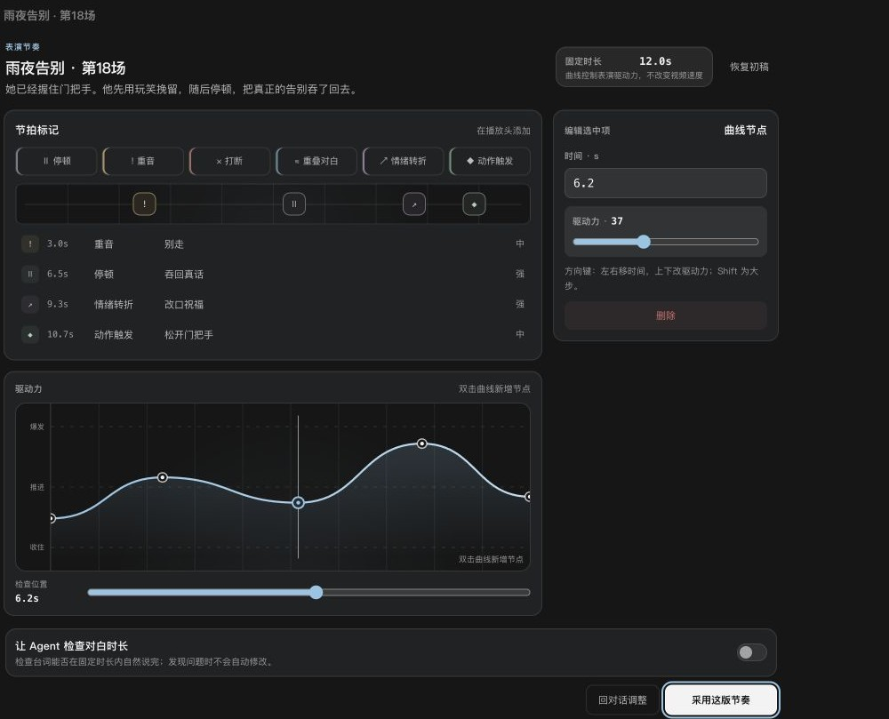 | 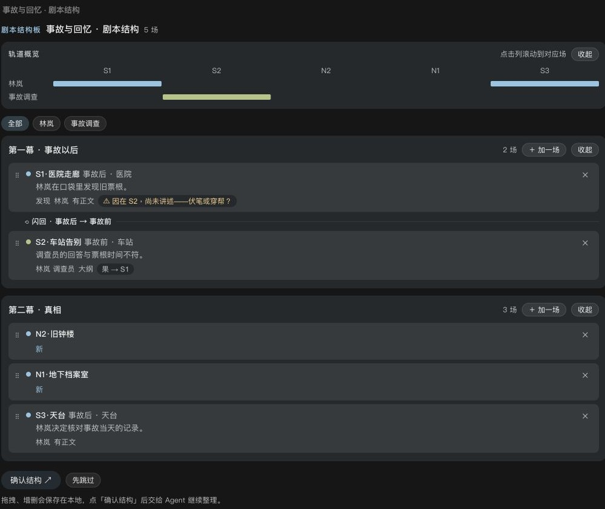 |

前批交互增量（2026-10-05）：图片图层右键菜单补复制、上移、下移和删除，以及键盘与焦点关闭；Agent流式代码即时支持复制与换行，增量更新保留焦点和横向滚动；片场聚焦小物体、大布景或镜头时保持整场导航速度。素材库保存/重新插入保留高清原图、视频裁切和来源，并修复本地视频下载。四项完成定向检查、交叉审阅及 Computer Use，见[图层菜单](docs/IMAGE-EDITOR-LAYER-MENU-20261005.md)、[流式代码](docs/AGENT-STREAMING-CODE-CONTROLS-20261005.md)、[聚焦导航](docs/STUDIO-V2-FOCUS-NAVIGATION-SPEED-20261005.md)、[素材往返](docs/LIBRARY-ASSET-ROUNDTRIP-20261005.md)。

| 图片编辑：真实图层右键菜单 | Agent：流式代码复制与换行 |
| --- | --- |
| 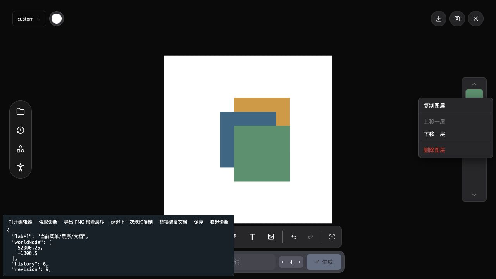 | 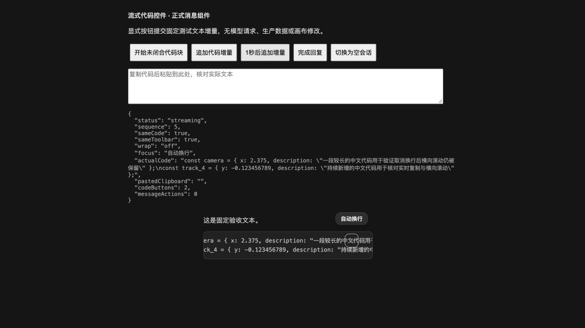 |

上批增量（2026-10-05）：图片编辑器补官方拖动吸附与辅助线；生成历史按批次分行，支持单结果；已发送 Agent 附件保留真实缩略图；运镜拖动补取消与同名片段切换保护。四项均完成定向检查、交叉审阅和 Computer Use，见[图片吸附](docs/IMAGE-EDITOR-ALIGNMENT-GUIDES-20261005.md)、[历史展开](docs/CANVAS-HISTORY-EXPANSION-20261005.md)、[消息附件](docs/AGENT-MESSAGE-ATTACHMENTS-20261005.md)、[运镜拖动](docs/STUDIO-V2-TIMELINE-KEY-DRAG-20261005.md)。

| 生成历史：两批结果分行 | Agent：已发送本地附件与失败回退 |
| --- | --- |
| 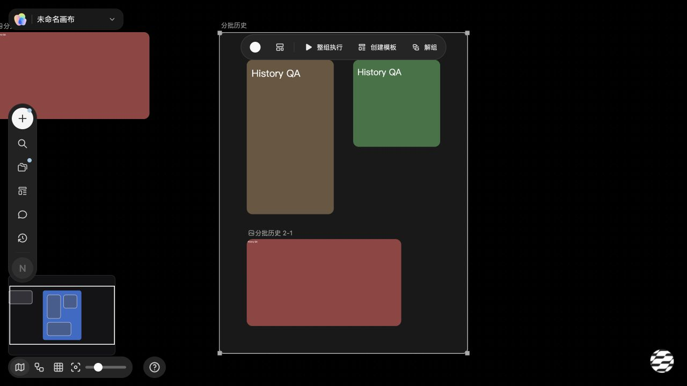 | 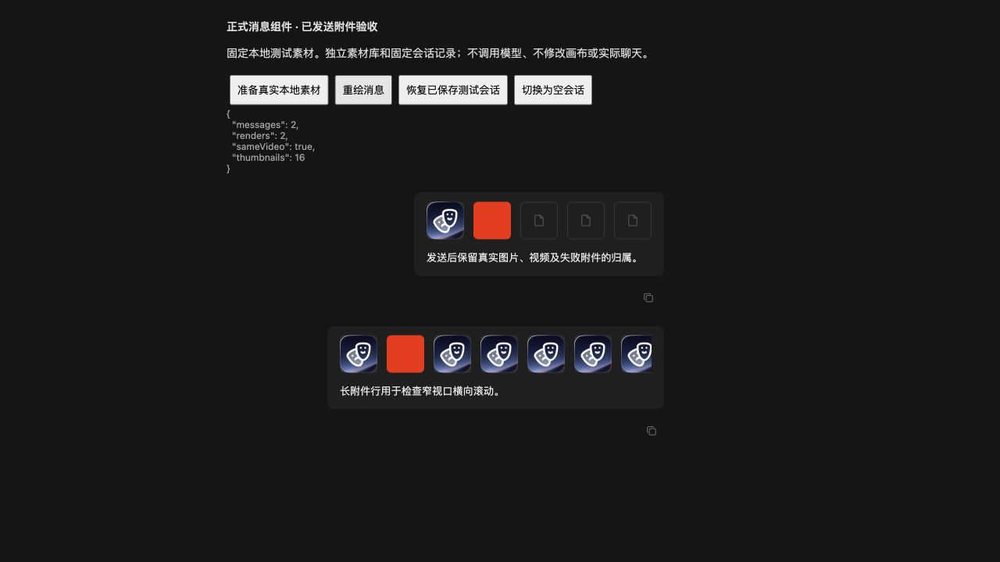 |

上批精度、目录键盘导航和无效连线落点记录： [片场](docs/STUDIO-V2-NUMERIC-DRAFT-20261004.md)、[Agent目录](docs/AGENT-REFERENCE-FOLDER-NAVIGATION-20261004.md)、[连线](docs/CANVAS-CONNECTION-FINAL-DROP-20261004.md)。

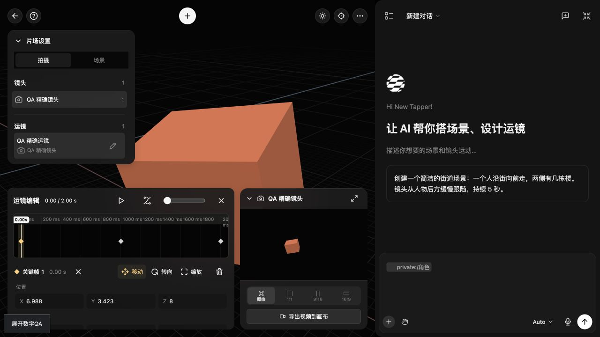

## API 配置

配置示例在 [`.env.example`](.env.example)。服务读取进程环境，**不会自动加载 `.env`**。可以复制为未跟踪的本机文件，填写后显式加载：

```sh
cp .env.example .env.local
# 编辑 .env.local，填写需要使用的供应商配置
node --env-file=.env.local server/server.cjs
```

该命令替代 `pnpm dev`，不要同时启动两个服务。更改服务端配置后重启；Key 仅保存在服务端，不填写到源码或提交 Git。

**Agent** 至少需要 `OPENAI_API_KEY` 和 `OPENAI_MODEL`。可选 `OPENAI_BASE_URL` 必须支持所用的 Responses API/工具能力。菜单模型别名通过 `AGENT_MODEL_MAP` 映射，思考档位通过 `AGENT_REASONING_MAP` 映射；未映射选项不会静默回退。[Agent 接口](docs/AGENT-API.md)

**媒体生成** 按操作和模型分别路由。Key、模型访问权限、协议和参数能力都必须匹配；目前还不能保证只填任意厂商 Key 就能使用全部菜单。优先按 [多供应商配置](docs/MULTI-PROVIDER-SETUP.md) 选择适配器：

| 适配器 | 已接入用途 | 配置与限制 |
| --- | --- | --- |
| `openai-native` | 文本、文生图/参考图、语音、视觉识别与分镜描述 | [网关](docs/GENERATION-GATEWAY.md) / [参考图](docs/OPENAI-IMAGE-REFERENCES.md) |
| `openai-masked-edit-native` | 擦除、局部重绘、扩图 | [蒙版编辑](docs/OPENAI-MASKED-EDIT-NATIVE.md) |
| `openai-relight-native` | 完整图片重新打光；面板与 Agent 共用全部五组参数 | [打光编辑](docs/OPENAI-RELIGHT-NATIVE.md)，显式参数提示词编辑；不保证物理光照或输出与来源同尺寸 |
| `magnific-native` | Magnific Precision V2 完整图片放大、四参数面板与 Agent | [原生配置](docs/MAGNIFIC-NATIVE-20261005.md)，本机原图直传；JPEG/WebP 结果需 FFmpeg，真实效果待 Key 验收 |
| `skin-tasks-v1` | 皮肤编辑三档、增强节点版本与 Agent 审批 | [专用网关](docs/SKIN-EDITOR-PROVIDER-20261005.md)，需实际实现合同的外部服务器；不是 Enhancor 原生适配，仅填其 Key 不可用 |
| `ark-native` | 火山方舟视频任务 | [Ark](docs/ARK-VIDEO.md) |
| `ark-video-extend-reference` | 工具栏延长镜头：片头/片尾、4–30秒、连续性与参考 | [延长镜头](docs/VIDEO-EXTEND-NATIVE-20261005.md)，明确为参考生成；本地视频另需公网发布通道 |
| `ark-video-reshoot-edit` | 视频重拍：分镜、四种镜头模式与提示词编译 | [重拍](docs/VIDEO-RESHOOT-EDIT-20261005.md)，实验性提示词模拟；Ark Key 外还需要独立 HTTPS 视频 |
| `fal-video-depth-native` | 普通视频节点与 Agent 视频深度转换 | [深度](docs/VIDEO-DEPTH-NATIVE-20261005.md) / [节点入口](docs/VIDEO-DEPTH-NODE-ENTRY-20261005.md)，完整 MP4、原尺寸/时长、1–2 个灰度结果；需 FFmpeg，支持多变体/铺开/堆叠 |
| `openai-panorama-edit-native` | 旧版 3D 片场全景局部编辑 | [局部编辑](docs/OPENAI-PANORAMA-EDIT-NATIVE-20261005.md)，2048×1024 全景、可见凸四角选区；透视蒙版编辑后本地回投，硬边接缝与效果待验 |
| `fal-panorama-native` | 单张图片 → Hunyuan World Panorama | [全景](docs/PANORAMA-NATIVE-20261005.md)，固定 2:1、单结果、原生尺寸；当前后端仅接受实际 PNG 像素，非区域编辑 |
| `minimax-native` | MiniMax H3 视频 | [H3](docs/MINIMAX-H3-SETUP.md) |
| `minimax-music-native` | MiniMax Music 2.6 | [音乐](docs/MINIMAX-MUSIC-NATIVE.md)，存在账号资格限制 |
| `elevenlabs-native` / `elevenlabs-sound-native` | TTS 与音效 | [TTS](docs/ELEVENLABS-NATIVE-TTS.md) / [音效](docs/ELEVENLABS-NATIVE-SOUND.md) |
| `elevenlabs-music-native` | Music 普通/纯音乐与单节自定义歌词 | [音乐](docs/elevenlabs-music-native.md)，自定义歌词须明确3–120秒；节点目录上限300秒 |
| `mureka-native` | Mureka 8 / O2 自动与自定义歌词歌曲 | [Mureka](docs/MUREKA-NATIVE-20261005.md)，精确型号、原任务查询与本地音频归档 |
| `seed-audio-native` | Seed Audio 1.0 多模态音频及字幕文本 | [Seed Audio](docs/SEED-AUDIO-NATIVE-20261005.md)，独立语音 Key；Ogg Opus 仅48kHz |
| `fal-video-audio-native` | 单个完整 MP4 → ThinkSound 拟音 | [视频拟音](docs/VIDEO-AUDIO-NATIVE-20261005.md)，显式替代 Sonilo SFX；时长跟随视频，供应商最大时长待验 |
| `fal-video-mask-native` | 已保存时序蒙层的视频物体移除／替换 | [Wan VACE](docs/WAN-VACE-VIDEO-MASK-NATIVE-20261005.md)，显式替代；需 FFmpeg、fal Key 和完整蒙层，首次识别另需分割服务 |
| `fal-native` / `fal-video-native` | 图片抠图/增强、视频增强 | [图片](docs/FAL-NATIVE-SETUP.md) / [视频](docs/FAL-VIDEO-NATIVE-SETUP.md) |
| `tripo-native` | 3D 模型生成 | [Tripo](docs/TRIPO-NATIVE-SETUP.md) |
| `marble-native` | World Labs 世界生成及本地 SPZ 渲染 | [Marble](docs/MARBLE-NATIVE-SETUP.md)，预算内高斯已接通预览、片场、照片和视频；真实供应商效果待 Key 验收 |
| `tasks-v1` | 其他统一任务服务 | [任务协议](docs/GENERATION-GATEWAY.md)，需实际实现该协议的后端 |

模型输出会校验并归档到本地。同步调用丢失回执时保留 `unknown`，不会自动重试造成重复生成；可查询任务只核对原任务身份。

## 本地数据与资源

- 浏览器 IndexedDB 保存项目、素材、Agent 会话及工作流记录；部分偏好、技能等仍使用 localStorage。没有云同步。
- 个人素材库和文件夹现由 IndexedDB 单事务保存，旧 localStorage 数据只读迁移；大图保持原始字节。多标签冲突时保留草稿并可导出，不能盲目覆盖较新数据。[容量与恢复](docs/LIBRARY-LOCAL-CAPACITY-20261005.md)
- 服务端任务、生成媒体与 Agent 检查点保存在 `server/` 下的私有隐藏目录，不提供静态访问、不纳入 Git。
- `localhost` 与 `127.0.0.1` 是不同浏览器 origin，存储不互通；日常使用请保持同一个入口。清理站点数据会移除浏览器侧内容。
- 新克隆使用 `defaults/` 空数据；个人素材、原始账号抓包、本机运行数据与 API Key 不发布。
- 页面和内嵌应用使用本地资源限制；服务端拒绝向原站域名请求或转交原站媒体。未知旧资源须显式导入修复，不自动联网回源。[本地化验收边界](docs/FREENOW-LOCALIZATION-ACCEPTANCE.md)

## 最新接入与核验

本批完成分组/多选复制粘贴、Agent 拼装审阅保存交接，以及 SPZ 原生 LOD。复制保留父子几何和输入连线，连续粘贴偏移40像素，支持精确撤销；审阅的保留/裁切、确认和“再改改”等待同一份状态保存，关闭失败保留编辑。三项均完成定向回归、独立交审及 Computer Use。[复制粘贴](docs/CANVAS-GROUP-COPY-PASTE-20261005.md) · [拼装审阅](docs/AGENT-CUTLIST-REVIEW-INTERACTIONS-20261005.md) · [高斯 LOD](docs/SPZ-LOD-20261005.md)。

| 分组复制：父子位置、输入连线与连续粘贴 | 拼装审阅：真实视频、裁切及保存恢复 |
| --- | --- |
| 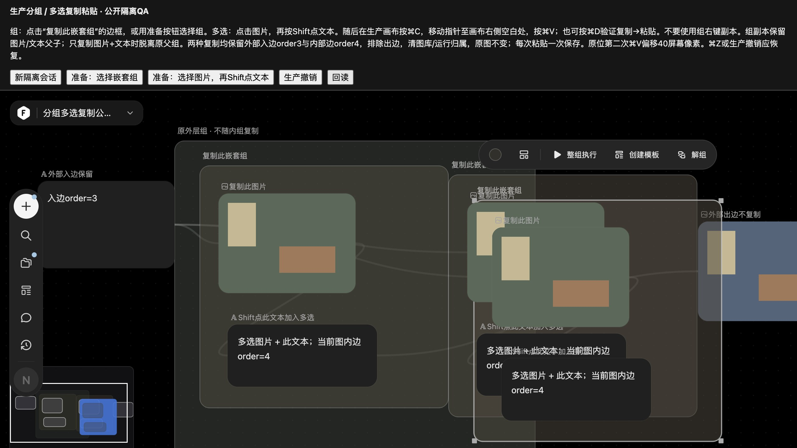 | 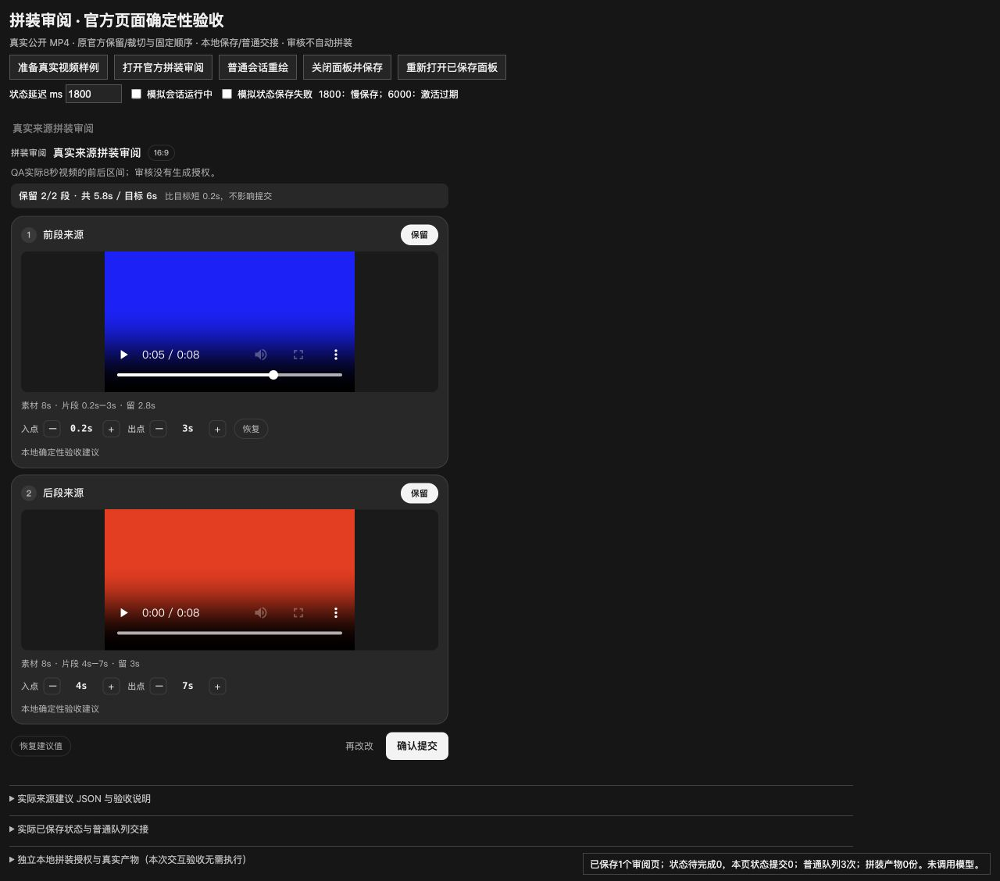 |

这些截图使用隔离公开/合成素材，审阅不会自动拼装或生成。前批记录：[普通副本](docs/CANVAS-SINGLE-DUPLICATE-20261005.md)、[人物走位](docs/AGENT-CHARACTER-BLOCKING-INTERACTIONS-20261005.md)、[混合拾取](docs/SPZ-MIXED-PICKING-20261005.md)、[延长生命周期](docs/VIDEO-EXTENSION-LIFECYCLE-20261005.md)。

SPZ 高斯世界使用 Spark 2.3.1，本地加载代码、WASM、Worker 和素材。新接入官方 tiny-lod：真实786,233高斯样本近景绘制249,999、远景83,321，单视图绘制/排序预算250,000；原始高斯与派生树保留，**这不是驻留内存上限或帧率保证**。实际点选、删除释放/撤销、1280×720照片、2秒运镜和刷新恢复已验。压缩/展开预算仍为64/256MiB，源高斯上限250万；真实Marble生成、跨设备压力及长视频待验。[本地渲染](docs/SPZ-LOCAL-RENDERING-20261005.md) · [LOD证据与限制](docs/SPZ-LOD-20261005.md)

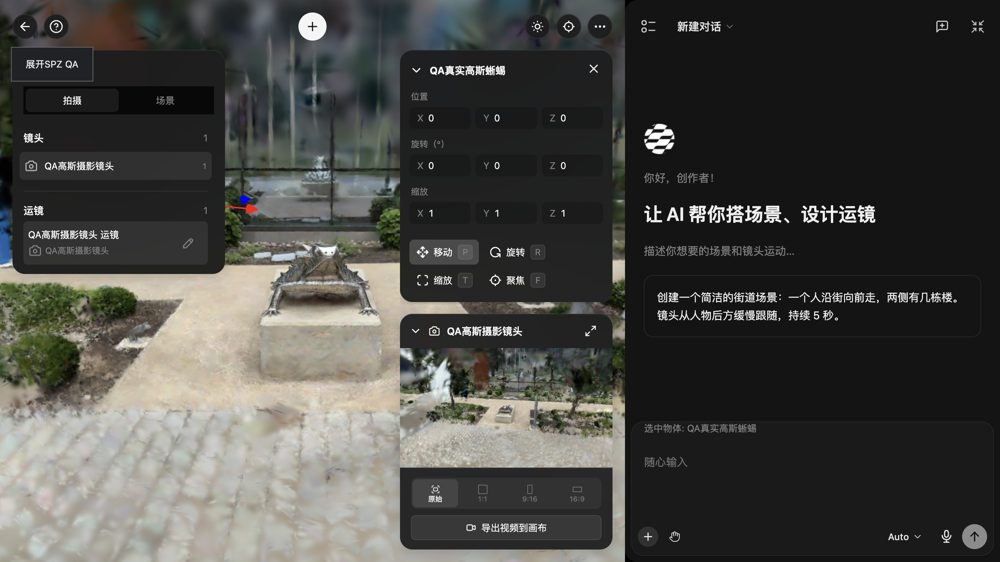

| SPZ：真实高斯预览 | 片场产物：照片、视频和来源连线 |
| --- | --- |
| 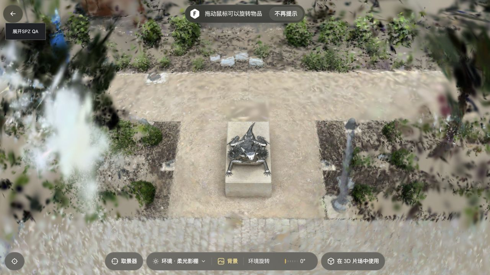 | 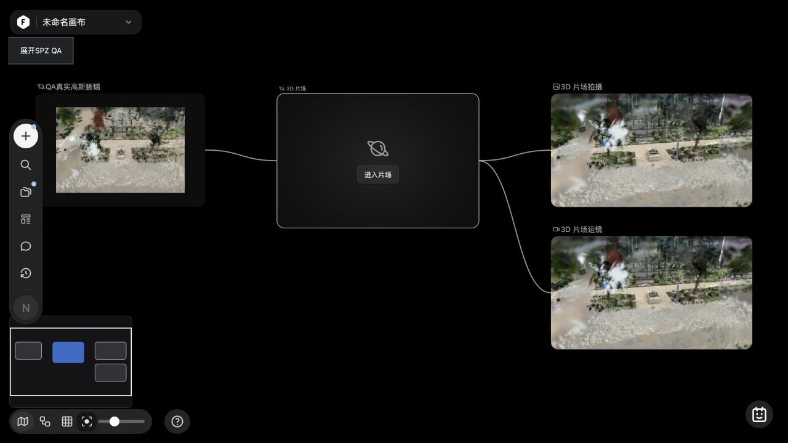 |

普通视频节点已补 Depth Anything Video 的官方同位模型菜单、自动规格和 1/2 数量；两个结果使用独立持久子任务，恢复仅查询原任务。实机验证多变体、铺开、保存失败后的同结果重试及刷新恢复。Agent 平台裁切修复同宽高比选项的拖动互斥；搜索高亮减少重复 DOM 操作，并补两级 Escape 与焦点返回验收。[本批记录](docs/LOCAL-DEPTH-BATCH-AND-CANVAS-20261005.md)

| 视频深度：正式双结果历史 | 搜索：500 节点场景的键盘高亮 |
| --- | --- |
| 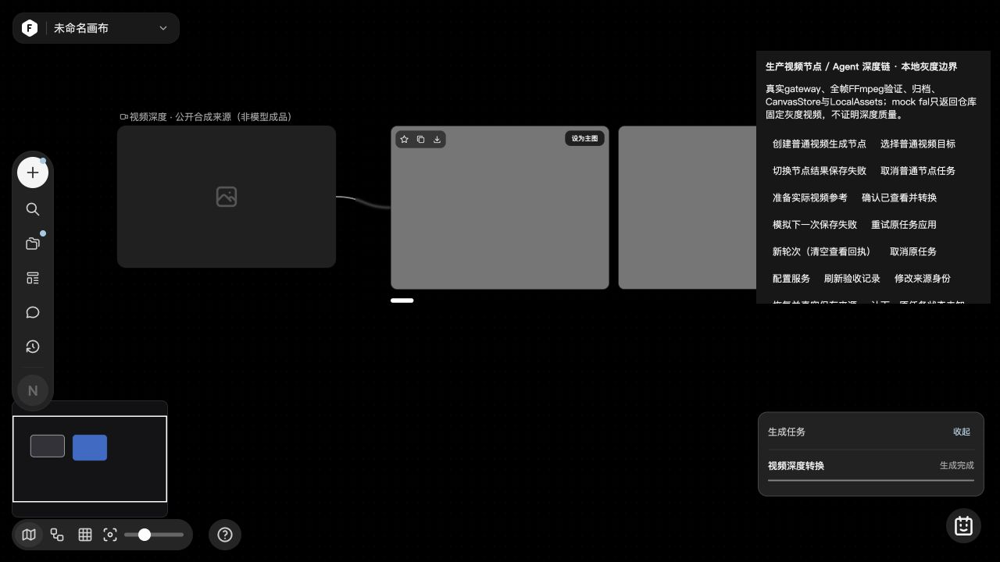 | 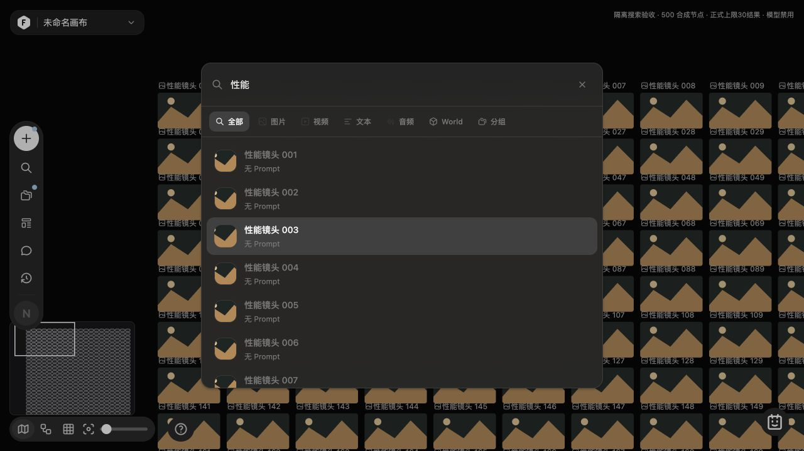 |

本批补齐视频深度原生接口、全景局部蒙版编辑和 Agent 页面关闭前保存。全景实机验证鼠标框选、缺 Key 不提交、真实 2:1 图片归档、保存失败锁定与同结果重试、历史刷新恢复；深度通过正式 Agent 链输出可播放的本地 MP4。供应商返回使用合成夹具，不代表真实模型效果。[本批记录与未完成项](docs/LOCAL-DEPTH-PANORAMA-LIFECYCLE-20261005.md)

| 全景：真实鼠标框选、编辑描述与 freenow 标识 | Agent：保存失败保留最后编辑 |
| --- | --- |
| 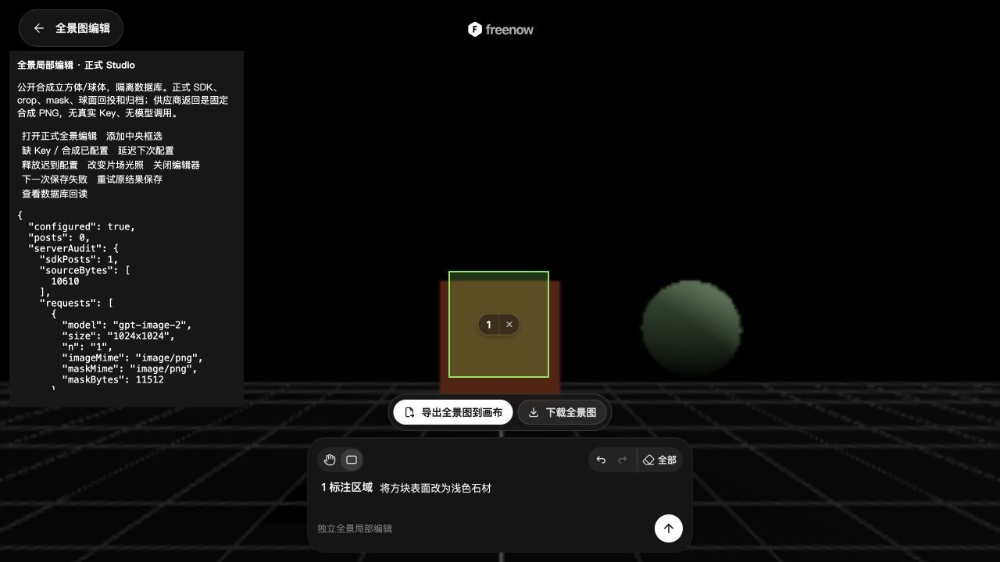 | 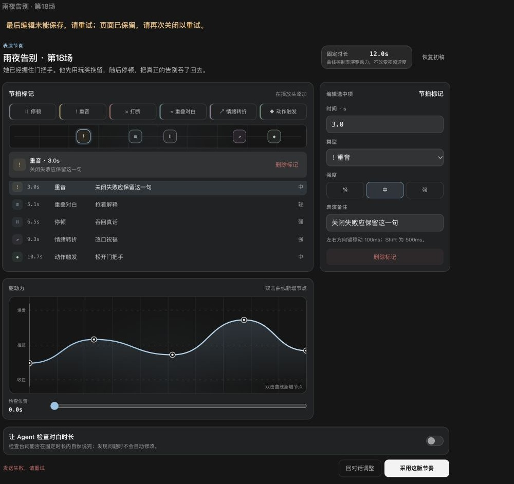 |

Magnific 高清放大已接独立公开原生 API，正式面板和 Agent 保留倍率、锐化、颗粒、细节四项设置；完整本机图片直接物化提交，不需要原站账号或公网素材托管。配置按示例合并路由后填写自己的 Magnific Key。已验来源原尺寸、真实归档、保存重试、原任务查询及 Agent 持久派发回执。[本批实机记录](docs/LOCAL-MAGNIFIC-AGENT-20261005.md) · [安装包与官方协议证据](docs/MAGNIFIC-PRECISION-NATIVE-CONTRACT-20261005.md)

| Magnific：四项控件与增强结果 | Agent：明确参数与目标审批 |
| --- | --- |
| 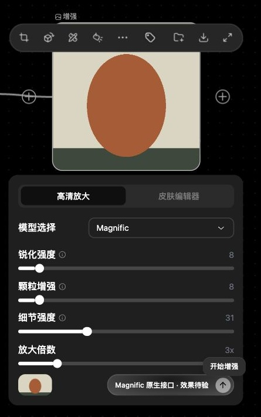 | 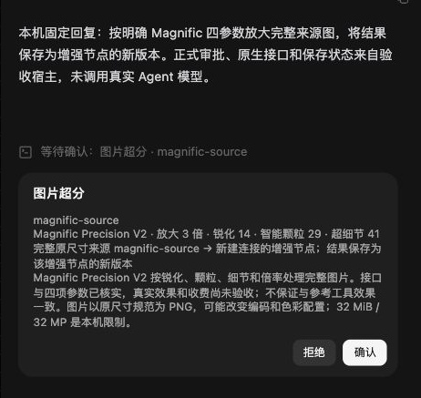 |

截图来自正式页面的隔离合成数据。供应商响应与 Agent 回复使用本机夹具，**不代表真实放大质量、倍率效果或付费账号验收**。

皮肤编辑器保留细节／标准／重度三档、原面板几何与警告，补全配置反馈、键盘关闭、原任务查询和保存失败重试。Agent 可处理完整原图并新建相连增强节点，或写回指定增强节点；任务 ID 先持久化，再读取素材和派发。正式页面已验原尺寸 PNG、真实本地归档、零重复生成及刷新回读。[本批实现与实机记录](docs/LOCAL-SKIN-AGENT-20261005.md)

| 皮肤编辑：增强节点与正式控件 | Agent：模式、来源和接口条件 |
| --- | --- |
| 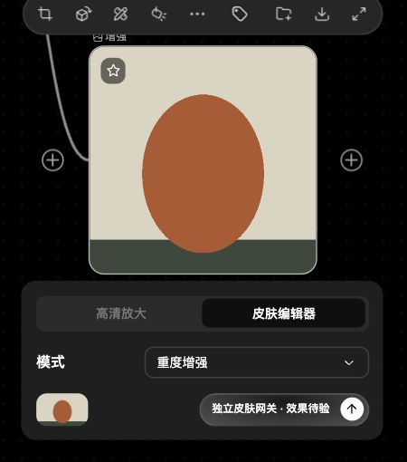 | 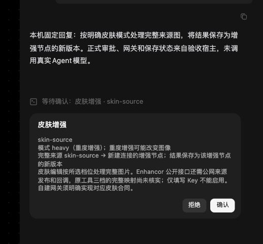 |

截图使用合成 PNG 和固定 Agent 回复，不代表皮肤生成质量。专用 `skin-tasks-v1` 合同已经接通；**Enhancor 原生接入仍缺公网来源、回调和精确参数映射，不能直接填 Enhancor Key 启用。** [合同与配置](docs/SKIN-EDITOR-PROVIDER-20261005.md) · [官方证据和缺口](docs/SKIN-EDITOR-NATIVE-CONTRACT-20261005.md)

图片重新打光已接通正式面板与 Agent，保留26光位、亮度、色温和独立轮廓光。五参数经现有 OpenAI SDK 发送，结果归档后连接原图；缺配置、等待期间关闭/换图、保存失败重试和 Agent 持久回执已实操。另修复本地图片刷新时的初始化竞态、配置保存快照和 Agent 过期配置缓存。[本批实现与验收](docs/LOCAL-RELIGHT-AGENT-20261005.md)

| 重新打光：完整源图与 Three 预览 | Agent：五参数和独立编辑说明 |
| --- | --- |
| 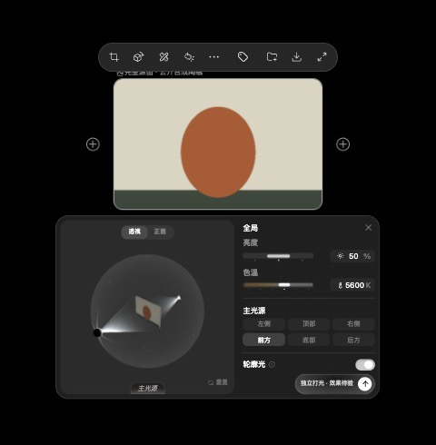 | 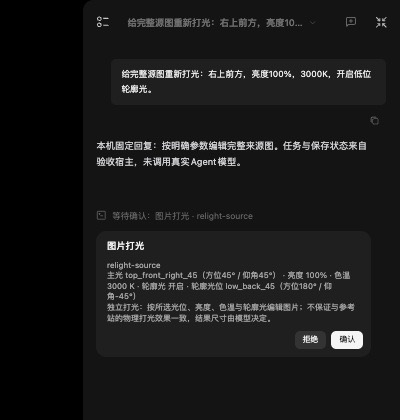 |

截图素材和供应商回复为本机合成夹具，不是实际打光效果。适配器须明确配置 `parameter-prompt-edit`，不保证物理光照、相同画幅或原站模型等效；真实 Key 验收仍开放。预览复用每帧临时对象，保留灯位和动画，尚未据此宣称整体FPS提升。[配置](docs/OPENAI-RELIGHT-NATIVE.md) · [性能](docs/RELIGHT-STAGE-FRAME-ALLOCATION-20261005.md)

视频物体移除／替换已接入正式工具栏和 Agent：完整来源与时序蒙层共同裁片、fal CDN 上传、原任务恢复、MP4 本机归档及原音轨保留。结果保存真实首帧封面；保存失败复用原结果节点。正式替换面板、Agent 审批、实际视频播放与刷新恢复已通过隔离本机服务验收。[本批实现与浏览器证据](docs/LOCAL-VIDEO-MASK-AGENT-20261005.md)

| 视频替换：目标、参考图与实际接入条件 | Agent：来源绑定与上传说明 |
| --- | --- |
| 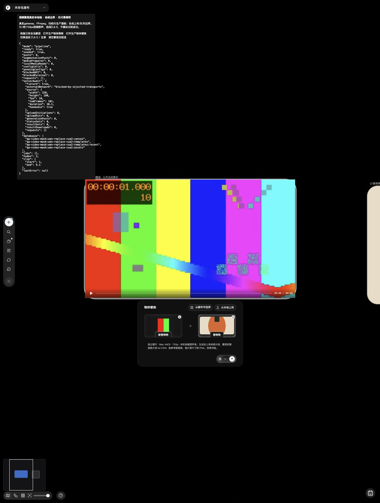 | 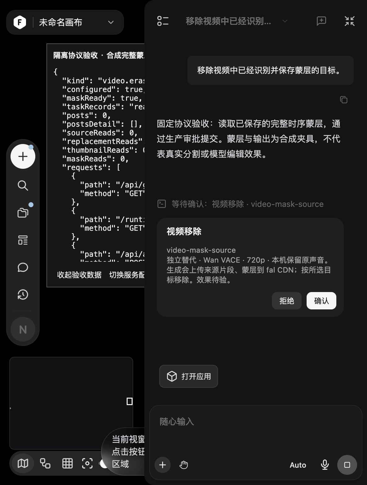 |

这是显式 Wan VACE 独立替代。选段须为恒定 5–30 fps、81–241 帧；不截断、补帧或改速。首次目标识别仍需独立分割服务，**仅填 fal Key 不能完成新视频从识别到编辑的全流程**。截图使用合成蒙层和固定结果，不代表模型效果。[接口配置](docs/WAN-VACE-VIDEO-MASK-NATIVE-20261005.md) · [媒体处理](docs/VIDEO-MASK-MEDIA-PREPARATION-20261005.md) · [分割合同缺口](docs/VIDEO-SEGMENTATION-FAL-CONTRACT-20261005.md)

图片转 360° 全景已接正式节点菜单、Agent 确认卡和独立供应商协议；真实 PNG 解码、WebGL 预览、刷新恢复及错误画幅拒绝均已实操。Agent 抠图与自动多角度使用高清原图，先保存任务身份再派发；补齐中文任务标题和固定欢迎文案。[本批实现与浏览器证据](docs/LOCAL-PANORAMA-RESHOOT-AGENT-20261005.md)

| 全景结果：实际 WebGL 预览 | 视频重拍：完整镜头控件与接入条件 |
| --- | --- |
| 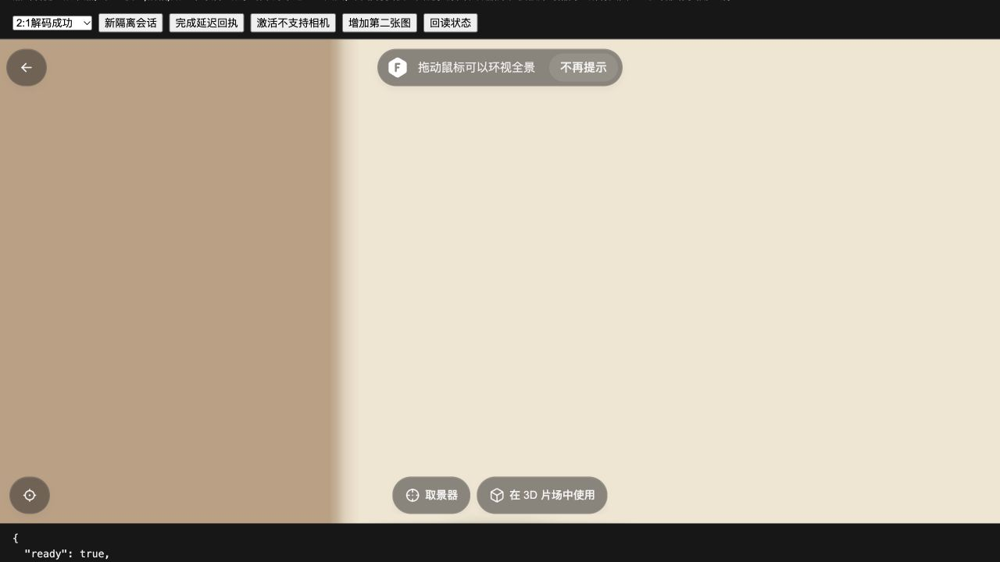 | 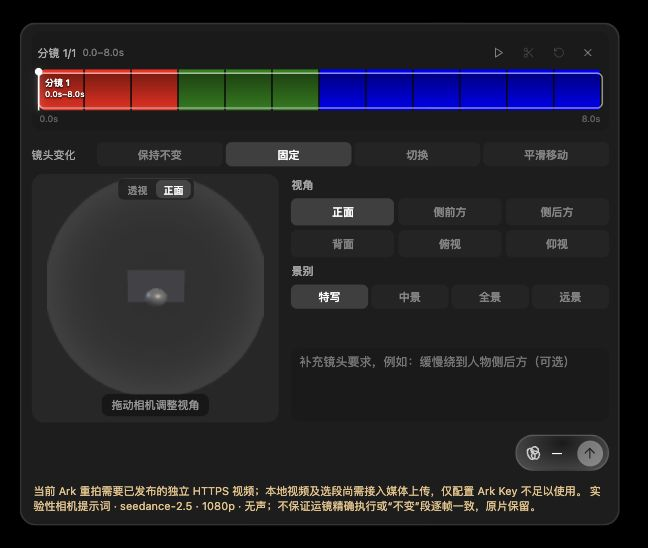 |

截图使用合成夹具，不代表真实模型质量。重拍的来源设置变更、关闭后的迟到回调和全“不变”计划已阻断；Ark 本地媒体上传、真实供应商效果仍待接入与验证。

短窗口中的右键菜单现在会把键盘焦点滚入可视范围。End/Home、方向键绕回、禁用项跳过、关闭与重开已实际验证；菜单滚动保持画布位置。[交互与截图证据](docs/CANVAS-CONTEXT-MENU-KEYBOARD-VISIBILITY-20261005.md)

视频拟音与延长镜头已接入独立供应商协议，Agent 确认卡具备时长、配置预检和素材加载保护。正式按钮和 Agent 卡均通过本机 HTTP 服务，8 秒 WAV 实际播放到结束、刷新可读；明确时长冲突及缺配置不会派发。这里验证的是调用与媒体链路，音频是固定测试音调。[本批实现与验收](docs/LOCAL-VIDEO-TOOLS-STORAGE-BRAND-20261005.md)

| Agent 视频拟音：实际供应商与跟随时长 | 延长镜头：完整参数菜单与接入条件 |
| --- | --- |
| 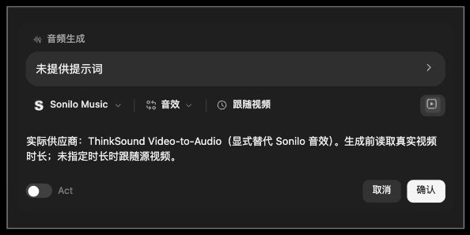 | 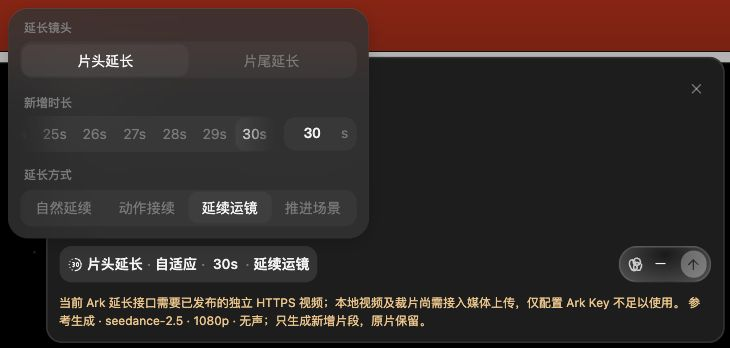 |

个人素材库已用 6.6 MB、2048×1152 原图完成正式保存、picker 插入及刷新核对，原始 SHA、像素和来源保持；旧库键零写入。Agent 等待素材加载时可以取消排队，未保存模板有离页保护。嵌套制作进度卡完成 freenow 名称、F 图片、深浅色与中英文替换，用户正文和来源保持。[存储](docs/LIBRARY-LOCAL-CAPACITY-20261005.md) · [进度卡品牌](docs/FREENOW-PRODUCTION-PROGRESS-BRAND-20261005.md)

Ark 延长镜头使用官方工具栏的参考生成语义，当前仍要求公网 HTTPS 视频，不能只靠 Ark Key 上传本地视频。ThinkSound 是操作者明确选择的 Sonilo SFX 替代，未覆盖 Sonilo 音乐及分段。所有真实账号权限和生成效果仍待 Key 验收。

此前已落地 10 个公开工作流、8 类筛选、72 个原节点、112 条连线及全部引用媒体；列表约332KB缩略图，保留约95MB原封面。Mureka、Seed Audio 与 ElevenLabs Music 已接原生协议；Agent 组图质量及编辑交互也有专项证据。[工作流与音频](docs/LOCAL-WORKFLOW-AND-NATIVE-AUDIO-20261005.md) · [Music](docs/elevenlabs-music-native.md)

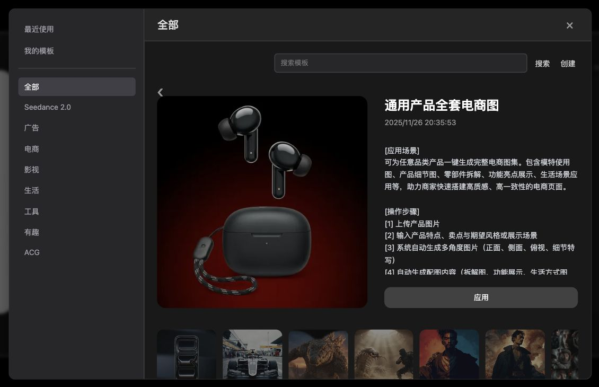

生成配置列出 24 类操作的实际就绪条件；多角度已有受限 Qwen 2511 替代，不能将通用网关登记当作专用能力完成。[逐项 Key 条件](docs/OFFICIAL-CROSSCHECK-AND-KEY-READINESS-20261005.md) · [多角度](docs/FAL-MULTI-ANGLE-NATIVE-20261005.md)

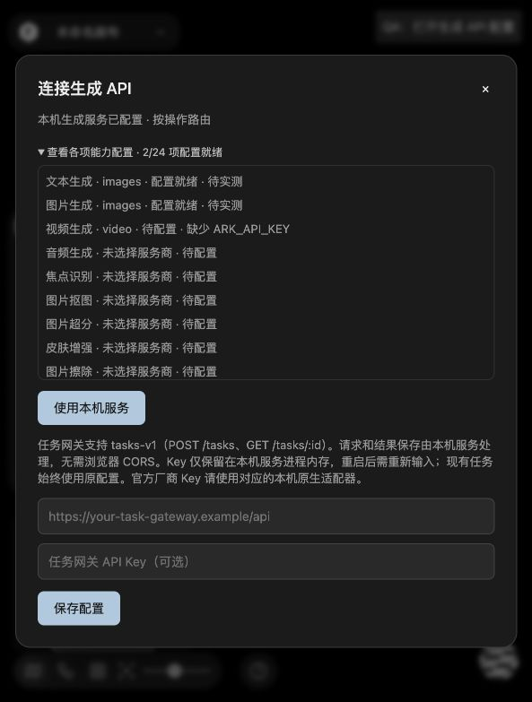

堆叠索引已减少全图扫描与临时数组分配；素材写入已移出同步 localStorage，QA 也避免将数 MB data URL 展开成 DOM 文本。尚未完成全局帧率和长时间内存验收。[性能记录](docs/CANVAS-PILE-INDEX-ALLOCATION-20261005.md)

## 开发

技术栈：原生 JavaScript/ES Modules、Node.js、Three.js、Fabric、Tiptap、OpenAI SDK、Tabler 和 esbuild；依赖版本以 pnpm 锁文件为准。

```text
index.html、app.js       主入口与现有画布宿主
src/features/           按业务组织的功能模块、Agent 应用与片场
server/                 Agent、供应商适配、任务和本地媒体服务
assets/                 运行需要的本地美术、字体及库资源
runtime-reference/      运行需要的本地技能材料
component-library/      组件预览与调用说明
defaults/               公开空项目初始数据
scripts/、tests/         构建、派生资源、定向检查与回归
docs/                  配置、功能合同、验收证据与历史记录
```

视频相关的 23 个源码与样式文件已归入 `src/features/video-*/`，根目录不再保留转发文件。其余旧业务模块按功能分批迁移，并同步更新生产入口、组件目录、服务端和验证页面。[结构约定](docs/PROJECT-STRUCTURE.md) · [功能入口、构建与定向验证](docs/DEVELOPMENT-GUIDE.md)

普通前端模块直接加载。修改对应编辑器入口后运行相应构建命令：

```sh
pnpm build:text
pnpm build:image
pnpm build:mask
pnpm build:agent
pnpm build:spark
```

按改动选择验证，避免每次运行完整回归：

```sh
node --test tests/<相关测试>.test.cjs
node --check <修改的模块>
pnpm check   # 全部源码语法检查
pnpm test    # 全库回归，需要时运行
```

交互改动另做实际浏览器验收；测试绿灯、模拟供应商或资源文件存在不能代替真实页面、媒体内容和模型质量验证。

## 未完成项

- 全站菜单、hover、微动效、坐标与性能的逐态对照和交叉验收。
- 92 份精确创意模板正文；SPZ 的跨设备压力、复杂半透明场景、按页流式加载与长视频验收。
- 新视频的原生目标分割适配；已找到[Replicate SAM2二值PNG及双向时序方案](docs/VIDEO-SEGMENTATION-REPLICATE-READINESS-20261005.md)，持久子任务和真实模型结果尚未接入验收。
- 其余专用生成能力的原生供应商适配，及真实 Key/账号下的端到端验证。
- 部分本地存储容量和长期运行边界的继续完善。
- 主要运行位置已替换为 **freenow** 名称和本地标识；剩余嵌套应用、导出和旧内容的品牌清点仍需逐项验收，保留来源与用户原文。

团队、社区、分享营销、计费和付费宣传不在复刻范围。兼容存储键、用户媒体、原始来源及第三方许可证不会随品牌替换被盲目改写。

完整状态以 [当前进度](docs/STATUS.md)、[功能缺口](docs/CURRENT-FUNCTION-GAPS-20261003.md) 和 [本地化验收清单](docs/FREENOW-LOCALIZATION-ACCEPTANCE.md) 为准。历史报告保留当时结论，不能把旧“待完成”直接当作现在缺失。

第三方代码和参考资源保留各自来源与许可；仓库目前未提供覆盖全部内容的统一开源许可证。
