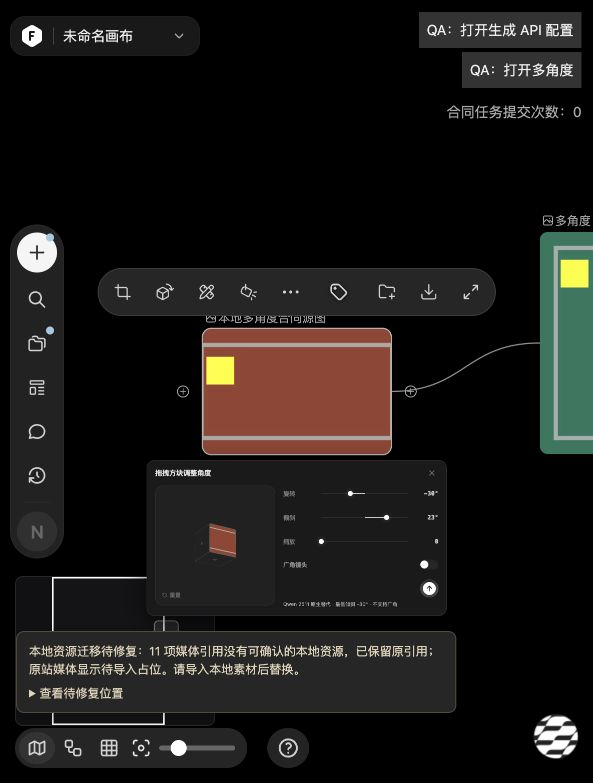

# freenow

本地 AI 创作工作台：无限画布、图片与音视频编辑、3D 片场，以及能够操作画布和编排创作流程的 Agent。

以 TapNow 官方界面与安装包为功能和交互参考，在本机实现前后端、资源与持久化。**项目仍在开发，尚未完成全站一比一验收。** 运行不需要 TapNow 账号或服务；生成能力通过独立供应商适配器接入。本项目与 TapNow 无隶属关系。

[快速开始](#快速开始) · [功能截图](#功能截图) · [当前能力](#当前能力) · [API 配置](#api-配置) · [未完成项](#未完成项) · [文档导航](docs/README.md) · [公开仓库与密钥检查](docs/PUBLIC-REPOSITORY-AUDIT-20261004.md)

## 快速开始

推荐 Node.js 22 LTS 和 pnpm。本地视频裁切、封装及分镜处理另外需要 FFmpeg / FFprobe。

```sh
git clone https://github.com/freeall12/freenow.git
cd freenow
pnpm install --frozen-lockfile
pnpm run setup
pnpm dev
```

打开 **http://localhost:4173/**。服务默认仅监听 `127.0.0.1:4173`；这是本机应用，不是多用户云部署方案。

首次运行创建空画布。`pnpm run setup` 仅初始化缺失的默认数据，不覆盖已有画布。这里需要保留 `run`，避免调用 pnpm 自身的环境安装命令。无需 Key 即可使用本地编辑能力；未配置的生成和 Agent 功能会显示配置要求。

FFmpeg 已安装在其他位置时，可配置 `FFMPEG_PATH`、`FFPROBE_PATH`。组件预览位于 http://localhost:4173/component-library/ 。

## 功能截图

以下是 **2026-10-03 本地应用的实际界面**，复用正式画布、编辑器、Agent 和 WebGL 片场。使用隔离示例数据和仓库内模型；未调用生成模型。这些历史截图保留当时标识；2026-10-05 已按新要求替换主要运行界面的 freenow 名称和本地 F 标识。最新界面见下图，完整品牌/导出清点仍开放。

| 无限画布：文本、素材、连线和片场入口 | 图片编辑：图层、选区与变换工具 |
| --- | --- |
|  |  |
| **3D 片场：本地 GLB 导入和场景树** | **Agent：欢迎建议、附件与模型控制** |
|  |  |

本机智能剪辑：实际 FFmpeg 输出、视频播放控件和来源连线。


截图证明对应页面的实际渲染，不代表全部功能已验收。[截图来源与复现步骤](docs/screenshots/README.md)。

## 当前能力

下表描述已经接入的能力，不代表所有状态、菜单和视觉细节均通过最终验收。

| 模块 | 已有能力 | 使用条件 |
| --- | --- | --- |
| 无限画布 | 新建/切换项目、平移缩放、搜索、连线、分组、堆叠、自动布局、撤销重做、素材与个人模板 | 本地使用 |
| 文本与图片 | Tiptap 富文本/Markdown、Fabric 图层/画笔、裁剪、变换、蒙版、版本历史与导出 | 本地编辑；AI 编辑另需供应商 |
| 音视频 | 本地导入、播放、波形、帧捕获、裁切、播放列表、生成历史与结果归档 | 部分操作需 FFmpeg；生成另需供应商 |
| 3D 片场 | Three.js 场景、模型与光照、对象变换、镜头与运镜、动画、取景、GLB 导出及保存恢复 | 本地使用；生成模型/世界另需供应商 |
| Agent | OpenAI SDK 工具循环、画布/片场操作、技能与附件引用、创作应用、只读子任务/DAG 编排 | 支持 Responses API 的模型与配置 |
| 工作流与恢复 | 分组依赖执行、任务持久回执、原任务查询、显式继续、项目/来源失效保护 | 未知状态不自动重新提交 |

Agent 应用已登记 22 个版本 URI、20 个功能族，包含剧本、分镜、人物、学习、产品等工作流。**登记覆盖不等于全部页面和交互验收完成。**

本批增量（2026-10-05）：图片图层右键菜单补复制、上移、下移和删除，以及键盘与焦点关闭；Agent流式代码即时支持复制与换行，增量更新保留焦点和横向滚动；片场聚焦小物体、大布景或镜头时保持整场导航速度。素材库保存/重新插入保留高清原图、视频裁切和来源，并修复本地视频下载。四项完成定向检查、交叉审阅及 Computer Use，见[图层菜单](docs/IMAGE-EDITOR-LAYER-MENU-20261005.md)、[流式代码](docs/AGENT-STREAMING-CODE-CONTROLS-20261005.md)、[聚焦导航](docs/STUDIO-V2-FOCUS-NAVIGATION-SPEED-20261005.md)、[素材往返](docs/LIBRARY-ASSET-ROUNDTRIP-20261005.md)。

| 图片编辑：真实图层右键菜单 | Agent：流式代码复制与换行 |
| --- | --- |
|  |  |

上批增量（2026-10-05）：图片编辑器补官方拖动吸附与辅助线；生成历史按批次分行，支持单结果；已发送 Agent 附件保留真实缩略图；运镜拖动补取消与同名片段切换保护。四项均完成定向检查、交叉审阅和 Computer Use，见[图片吸附](docs/IMAGE-EDITOR-ALIGNMENT-GUIDES-20261005.md)、[历史展开](docs/CANVAS-HISTORY-EXPANSION-20261005.md)、[消息附件](docs/AGENT-MESSAGE-ATTACHMENTS-20261005.md)、[运镜拖动](docs/STUDIO-V2-TIMELINE-KEY-DRAG-20261005.md)。

| 生成历史：两批结果分行 | Agent：已发送本地附件与失败回退 |
| --- | --- |
|  |  |

上批精度、目录键盘导航和无效连线落点记录： [片场](docs/STUDIO-V2-NUMERIC-DRAFT-20261004.md)、[Agent目录](docs/AGENT-REFERENCE-FOLDER-NAVIGATION-20261004.md)、[连线](docs/CANVAS-CONNECTION-FINAL-DROP-20261004.md)。


## API 配置

配置示例在 [`.env.example`](.env.example)。服务读取进程环境，**不会自动加载 `.env`**。可以复制为未跟踪的本机文件，填写后显式加载：

```sh
cp .env.example .env.local
# 编辑 .env.local，填写需要使用的供应商配置
node --env-file=.env.local server/server.cjs
```

该命令替代 `pnpm dev`，不要同时启动两个服务。更改服务端配置后重启；Key 仅保存在服务端，不填写到源码或提交 Git。

**Agent** 至少需要 `OPENAI_API_KEY` 和 `OPENAI_MODEL`。可选 `OPENAI_BASE_URL` 必须支持所用的 Responses API/工具能力。菜单模型别名通过 `AGENT_MODEL_MAP` 映射，思考档位通过 `AGENT_REASONING_MAP` 映射；未映射选项不会静默回退。[Agent 接口](docs/AGENT-API.md)

**媒体生成** 按操作和模型分别路由。Key、模型访问权限、协议和参数能力都必须匹配；目前还不能保证只填任意厂商 Key 就能使用全部菜单。优先按 [多供应商配置](docs/MULTI-PROVIDER-SETUP.md) 选择适配器：

| 适配器 | 已接入用途 | 配置与限制 |
| --- | --- | --- |
| `openai-native` | 文本、文生图/参考图、语音、视觉识别与分镜描述 | [网关](docs/GENERATION-GATEWAY.md) / [参考图](docs/OPENAI-IMAGE-REFERENCES.md) |
| `openai-masked-edit-native` | 擦除、局部重绘、扩图 | [蒙版编辑](docs/OPENAI-MASKED-EDIT-NATIVE.md) |
| `ark-native` | 火山方舟视频任务 | [Ark](docs/ARK-VIDEO.md) |
| `minimax-native` | MiniMax H3 视频 | [H3](docs/MINIMAX-H3-SETUP.md) |
| `minimax-music-native` | MiniMax Music 2.6 | [音乐](docs/MINIMAX-MUSIC-NATIVE.md)，存在账号资格限制 |
| `elevenlabs-native` / `elevenlabs-sound-native` | TTS 与音效 | [TTS](docs/ELEVENLABS-NATIVE-TTS.md) / [音效](docs/ELEVENLABS-NATIVE-SOUND.md) |
| `fal-native` / `fal-video-native` | 图片抠图/增强、视频增强 | [图片](docs/FAL-NATIVE-SETUP.md) / [视频](docs/FAL-VIDEO-NATIVE-SETUP.md) |
| `tripo-native` | 3D 模型生成 | [Tripo](docs/TRIPO-NATIVE-SETUP.md) |
| `marble-native` | World Labs 世界生成后端 | [Marble](docs/MARBLE-NATIVE-SETUP.md)，SPZ 渲染尚未完成，前端阻止派发 |
| `tasks-v1` | 其他统一任务服务 | [任务协议](docs/GENERATION-GATEWAY.md)，需实际实现该协议的后端 |

模型输出会校验并归档到本地。同步调用丢失回执时保留 `unknown`，不会自动重试造成重复生成；可查询任务只核对原任务身份。

## 本地数据与资源

- 浏览器 IndexedDB 保存项目、素材、Agent 会话及工作流记录；部分偏好、技能等仍使用 localStorage。没有云同步。
- 服务端任务、生成媒体与 Agent 检查点保存在 `server/` 下的私有隐藏目录，不提供静态访问、不纳入 Git。
- `localhost` 与 `127.0.0.1` 是不同浏览器 origin，存储不互通；日常使用请保持同一个入口。清理站点数据会移除浏览器侧内容。
- 新克隆使用 `defaults/` 空数据；个人素材、原始账号抓包、本机运行数据与 API Key 不发布。
- 页面和内嵌应用使用本地资源限制；服务端拒绝向原站域名请求或转交原站媒体。未知旧资源须显式导入修复，不自动联网回源。[本地化验收边界](docs/FREENOW-LOCALIZATION-ACCEPTANCE.md)

## 最新接入与核验

已新增 fal Qwen 2511 多角度原生替代，并修复 Agent 续轮、Ark 视频参数和截断图片响应。生成 API 配置现在列出 24 类操作，明确缺失路由与通用网关能力边界。[官方/安装包/社区交叉核验及 Key 接入清单](docs/OFFICIAL-CROSSCHECK-AND-KEY-READINESS-20261005.md) · [多角度配置](docs/FAL-MULTI-ANGLE-NATIVE-20261005.md)




新多角度后端需要显式选择该模型，广角及倾斜低于 -30° 会在提交前提示。真实供应商效果、部分专用接口和 SPZ 仍待补齐，不能把通用网关或已有 Key 当作全部功能可运行。

## 开发

技术栈：原生 JavaScript/ES Modules、Node.js、Three.js、Fabric、Tiptap、OpenAI SDK、Tabler 和 esbuild；依赖版本以 pnpm 锁文件为准。

```text
index.html、app.js       主入口与现有画布宿主
src/features/           按业务组织的功能模块、Agent 应用与片场
server/                 Agent、供应商适配、任务和本地媒体服务
assets/                 运行需要的本地美术、字体及库资源
runtime-reference/      运行需要的本地技能材料
component-library/      组件预览与调用说明
defaults/               公开空项目初始数据
scripts/、tests/         构建、派生资源、定向检查与回归
docs/                  配置、功能合同、验收证据与历史记录
```

视频相关的 23 个源码与样式文件已归入 `src/features/video-*/`，根目录不再保留转发文件。其余旧业务模块按功能分批迁移，并同步更新生产入口、组件目录、服务端和验证页面。[结构约定](docs/PROJECT-STRUCTURE.md) · [功能入口、构建与定向验证](docs/DEVELOPMENT-GUIDE.md)

普通前端模块直接加载。修改对应编辑器入口后运行相应构建命令：

```sh
pnpm build:text
pnpm build:image
pnpm build:mask
pnpm build:agent
```

按改动选择验证，避免每次运行完整回归：

```sh
node --test tests/<相关测试>.test.cjs
node --check <修改的模块>
pnpm check   # 全部源码语法检查
pnpm test    # 全库回归，需要时运行
```

交互改动另做实际浏览器验收；测试绿灯、模拟供应商或资源文件存在不能代替真实页面、媒体内容和模型质量验证。

## 未完成项

- 全站菜单、hover、微动效、坐标与性能的逐态对照和交叉验收。
- 92 份精确创意模板正文，以及 SPZ 渲染与相应依赖接入。
- 其余专用生成能力的原生供应商适配，及真实 Key/账号下的端到端验证。
- 部分本地存储容量和长期运行边界的继续完善。
- 主要运行位置已替换为 **freenow** 名称和本地标识；剩余嵌套应用、导出和旧内容的品牌清点仍需逐项验收，保留来源与用户原文。

团队、社区、分享营销、计费和付费宣传不在复刻范围。兼容存储键、用户媒体、原始来源及第三方许可证不会随品牌替换被盲目改写。

完整状态以 [当前进度](docs/STATUS.md)、[功能缺口](docs/CURRENT-FUNCTION-GAPS-20261003.md) 和 [本地化验收清单](docs/FREENOW-LOCALIZATION-ACCEPTANCE.md) 为准。历史报告保留当时结论，不能把旧“待完成”直接当作现在缺失。

第三方代码和参考资源保留各自来源与许可；仓库目前未提供覆盖全部内容的统一开源许可证。
