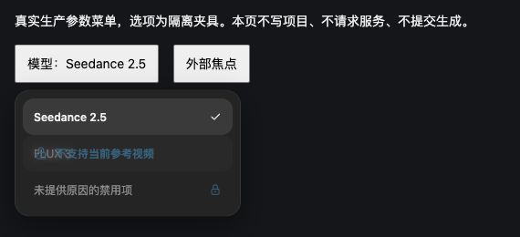

# Agent 生成确认卡：禁用模型原因反馈 · 2026-10-04

本批只补生成确认卡模型菜单已经缺失的行内原因反馈，不重复已实现的参数选项、生成合同或 Agent composer 模型说明卡。官方站与留存发布包是设计依据；隔离本地页面仅用于验证。

## 官方证据

- `reference/agent-generation.md` 记录发布版本 `eb1c3578957450302e3cff5edd2ad253d0874421`、生成确认官方文档及 `Ps` 参数菜单来源。
- `reference/vendor-pkg-canvas-CwfaULgq.js` 的 `Ps=a.memo(...)`（字符偏移 2210520）：模型菜单宽 248px、最大高 400px；禁用行 `aria-disabled`，有原因时 `aria-label` 为“模型名: 原因”。`onMouseEnter/onFocus` 设置当前行、`onMouseLeave/onBlur` 清除。条件 `b && _.disabled && _.disabledReason && h===_.value` 为真时，覆盖层显示原 `Xi` lock 与原因；原行锁标记暂时隐藏。覆盖层 `pointer-events-none`、`absolute inset-0`、`rounded-xl`、`bg-black/20`、`px-3`、`backdrop-blur-sm`、`text-xs font-bold text-primary`。
- 同包 `Xi` 为 `vendor-libs-DqoAc28N.js` 的导出 `fW` → `D1n` → `Fsi` Tabler outline lock。直接复用现有 `agent-composer/model-icons.mjs` lock，未手绘图标。
- `reference/original-index.css` 原 `--primary:#1fa2dc` 用于本地未声明 primary token 时的回退。

## 修改与行为

- `src/features/agent-generation/menu.mjs`：禁用模型行添加原锁图标与纯文本原因覆盖层；hover 或键盘焦点显示，mouseleave 或 blur 隐藏。沿用官方逐事件行为，mouseleave 之后即使仍有键盘焦点也清除，下一次 focus / mouseenter 再显示。
- 模型行取消浏览器原生 title，避免两种提示叠加；原因通过 `aria-label` 供辅助技术读取，装饰覆盖层和 SVG 设为 `aria-hidden`。非模型参数仍保持原 tooltip。
- 禁用行保留可聚焦状态以说明原因，点击仍不调用选择回调、不关闭菜单、不提交生成。选中禁用行优先显示 lock，与官方分支一致。
- Escape、outside、选择完成或调用 close 都隐藏原因并移除菜单；旧行的迟到 hover/focus 不能重新展示。没有异步 hover 定时器，没有增加网络、任务或存储接口。
- `src/features/agent-generation/styles.css`：使用官方覆盖层位置、内边距、圆角、黑色20%遮罩、4px模糊与primary颜色；保留现有父行disabled的50%透明度及原布局。

## 窄验证

```sh
node --test tests/agent-generation-disabled-model.test.cjs tests/agent-menu-dismissal.test.cjs
node --check src/features/agent-generation/menu.mjs
git diff --check
```

13 项通过，其中 5 项新增覆盖实际生产菜单：hover退出与lock恢复；方向键focus/blur及hover/focus逐事件顺序；已选禁用模型点击不产生选择回调；Escape/outside/dispose及关闭后迟到事件；非模型参数保持原反馈。已有 8 项 Agent 菜单回归通过。测试执行真实模块配合 jsdom 合成事件，不冒充浏览器像素验收。

## 浏览器入口与当前边界

`/src/features/agent-generation/qa/disabled-model.html` 使用真实生产菜单和隔离选项，配套控制模块在同目录。页面不写项目、不请求供应商、不提交生成。

1. 点击“模型：Seedance 2.5”，hover第二行 FLUX 3，原因覆盖层出现；移出恢复锁标记。
2. 打开菜单后 ArrowDown 聚焦 FLUX 3，原因出现；再次 ArrowDown 移到下一行，原因清除。
3. 点击禁用行，选择回调次数保持0、菜单保持打开；Escape关闭后回触发器。
4. 重开后点击“外部焦点”，菜单关闭；再次重开无残留覆盖层。

2026-10-04 已经主线程 Computer Use：真实鼠标进入/离开显示及撤销原因；方向键 focus/blur；鼠标点击禁用行选择回调为0且菜单保持；Escape关闭返回触发器；外部点击关闭后重开无残留。使用真实生产菜单与隔离选项，没有派发模型。



完整同态像素、所有生成参数菜单关闭生命周期、真实供应商与全站还原仍开放。
