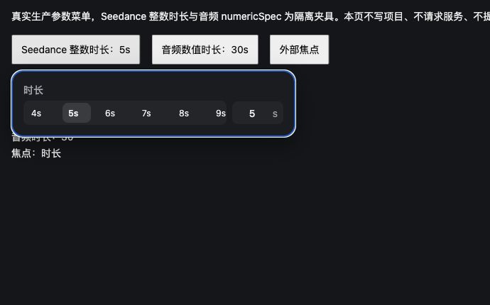

# Agent 整数时长输入 Escape 层级 · 2026-10-04

本批修复官方 `o5` 对应的 Seedance 2.5 整数时长输入关闭层级，并保证同入口全部数字输入Escape取消不产生blur提交。音频数值范围及直接关闭方式保持原样。官方包是设计依据，隔离 localhost 页面只用于验证。

## 官方证据与差距

`reference/agent-generation.md` 已记录发布版本 `eb1c3578957450302e3cff5edd2ad253d0874421` 及 `iZe/o5` 时长选择器。留存官方 `reference/vendor-pkg-canvas-CwfaULgq.js`：

- `o5`（字符偏移 1840663）数字框 `onKeyDown`：先 `stopPropagation()`；Enter执行 `preventDefault()`、提交 `x()`、选中输入；Escape执行 `preventDefault()`、恢复当前值 `m(String(e))`、`currentTarget.blur()`。输入Escape不直接调用父浮层关闭。
- `iZe`（字符偏移 2233433）将 `o5` 放入400px独立 `Ls` popover；父浮层生命周期独立于数字编辑。
- 本地生产入口 `src/features/agent-generation/card.mjs:99-101` 将 Seedance 2.5 duration 传入 `openParameterMenu`，不传 `numericSpec`。之前数字框Escape直接执行 `close(true)`，撤销输入与关闭父层合并。旧 `reference/agent-generation.md:33` 的“Escape关闭”是先前本地验收记录，不是官方 `o5` 关闭设计证据。

## 实现范围

修改 `src/features/agent-generation/menu.mjs` 同一数字输入入口：

- 仅 `duration` 数字输入且没有 `numericSpec` 时采用两层Escape。恢复当前已接受的值，抑制本次blur提交，执行真实 `numeric.blur()`，保持父浮层。
- 本地只在浮层内部处理键盘事件，若仅blur则焦点会落到body、后续Escape无法到达浮层。为保持键盘归属，该分支给浮层root设置 `tabIndex=-1`，blur后主动聚焦root。此焦点承接是本地事件实现的必要适配，未声称官方也显式聚焦root。
- 第一次Escape不调用参数选择回调、不关闭父层；第二次Escape由原父菜单处理并回到触发器。外部点击沿用原关闭入口。
- 正常Enter和普通blur仍使用原提交、范围与近邻选择逻辑。已由合法整数 `oninput` 接受的值仍保持；Escape取消的是尚未接受的输入缓冲，不撤销此前参数修改。
- `numericSpec` 音频参数仍保持原Escape直接关闭语义；非duration模型菜单没有行为修改。本批不改模型、请求、任务、供应商、持久化或样式，不新增图标。
- 所有数字输入在Escape开始时就标记本轮取消，保护状态保持到下次输入focus才解除；移除输入、返回trigger或迟到blur均不能把恢复后的值再提交。整数输入重新进入编辑后，普通blur仍可正常提交。

## 浏览器发现与本次补修

初版6项专项遗漏了浏览器在移除输入或回到trigger时触发blur的顺序。主线程Computer Use发现：整数Enter后回调累计1次，打开音频30、输入47、Escape后音频仍30，但回调累计变2，说明取消重复提交恢复值。

原因是此前 `cancellingBlur` 仅在整数分支包住同步 `numeric.blur()`；音频分支直接close没有取消保护。jsdom默认移除活动输入未触发同样的blur，原音频检查因此未覆盖浏览器顺序。现将取消标记提前到两个分支共同入口，并保持到下一次focus；不以短暂同步标志覆盖所有浏览器事件顺序。浏览器后续复验由主线程追加。

## 窄验证

```sh
node --test tests/agent-generation-duration-dismissal.test.cjs
node --check src/features/agent-generation/menu.mjs
node --check src/features/agent-generation/qa/duration-dismissal-controls.mjs
git diff --check
```

当前9项通过：原6项包括整数取消与root焦点、第二次Escape关闭、Enter与实时值、outside/重开、普通blur、音频直接关闭及非duration菜单；新增3项覆盖移除前真实input.blur、移除前trigger.focus造成真实blur，移除后回焦期间及之后送达的FocusEvent blur，以及整数迟到blur与重新focus恢复正常提交。

其中移除前检查使用jsdom原生blur/focus，移除后顺序显式投递FocusEvent以补jsdom缺失的浏览器事件；真实生产菜单处理两种顺序。该证据仍是合成DOM回归，不替代主线程浏览器复验。

修改限定在numeric输入分支；未改已验收的禁用模型hover分支，不重复跑其13项旧测试。新增专项含非duration菜单和音频路径窄回归。

## 实际浏览器入口与边界

`/src/features/agent-generation/qa/duration-dismissal.html` 与同目录控制模块调用生产菜单，提供Seedance整数及音频numericSpec隔离选项。本页不写项目、不请求接口、不提交生成。

1. 打开“Seedance 整数时长：5s”，在“时长秒数”输入19，按Escape：恢复5、菜单保持、焦点在浮层、选择回调仍0；第二次Escape关闭并回到触发器。
2. 重开输入19，Enter：按原近邻规则提交15，回调一次且菜单保持；Escape结束输入无额外回调，再Escape关闭。
3. 首次Escape后点击“外部焦点”：菜单关闭；重新打开无旧输入或焦点残留。
4. 打开“音频数值时长：30s”，输入47后Escape：保持既有直接关闭、恢复30且无选择回调。

主线程已完成实际Computer Use：输入19后首次Escape恢复5且回调0、浮层与键盘焦点保留；第二次Escape关闭并返回触发器。取消后重新进入输入，Enter接受15且只回调一次，随后Escape不重复提交；外部点击正常关闭。

首次真实音频复验发现取消恢复30时blur多回调一次，随后按本文取消保护修复；重新加载后输入47→Escape，回调保持0、值仍30并直接关闭。保留同一输入下次focus解除保护，实测取消后还能正常提交。全程隔离选项、无供应商派发或用户存储写入。



完整生成卡参数视觉与所有关闭组合、真实供应商及全站复刻仍开放。
