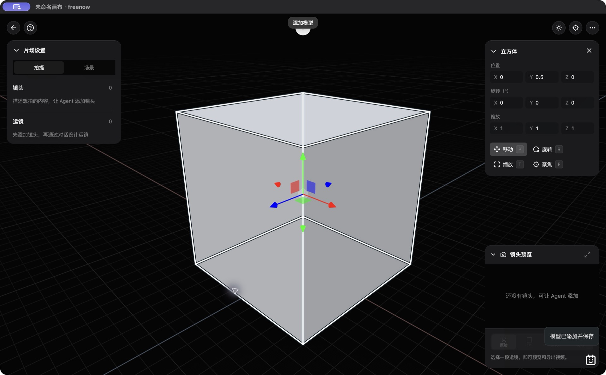

# freenow Desktop · 桌面预发布指南

freenow Desktop 用 Electron 窗口运行现有无限画布、媒体编辑器、3D 片场和 Agent，并在应用内启动独立的本机 Node.js 后台。它沿用现有功能与供应商合同；桌面外壳不增加模型、付费账号权限或全站验收承诺。

**当前桌面版本：`0.1.0-alpha.1`。目标为 macOS Apple Silicon（arm64）的 unsigned ZIP。Electron 开发窗口已实际运行，新的打包产物仍在验收，尚未提供可下载发布包。** 根项目版本仍为 `0.1.0`。实际发布成功后才补下载链接；[构建与核验记录](releases/DESKTOP-ALPHA-VERIFICATION-20261007.md)提供本次字节和SHA-256。

[项目首页](../README.md) · [当前状态](STATUS.md) · [开发指南](DEVELOPMENT-GUIDE.md)

## 从源码启动

需要 Node.js 22 LTS、pnpm，以及锁文件中声明的 Electron / electron-builder 开发依赖。

```sh
pnpm install --frozen-lockfile
pnpm desktop:dev
```

`desktop:dev` 先运行 `desktop:prepare`，再打开 Electron。准备脚本从 Git index 中已跟踪的公开运行文件构造 `build/desktop/runtime/`，使用空项目默认数据和独立依赖；不会把私人画布、原始抓包、服务端任务或本机 Key 文件打入资源目录。

已有 `build/desktop/runtime/` 时，脚本检查其中的 `runtime-manifest.json`。只有 `version: 1` 且 `dataIncluded: false` 的旧 runtime 会自动移到 `build/desktop/runtime.previous-<时间戳>/`，随后创建新的 staging，不合并旧字节。任意未识别目录仍拒绝覆盖，应先由开发者核对并移到独立备份位置。新增运行文件应进入 Git index 后再构建，否则不会被打包；个人数据不放入构建目录。

浏览器源码启动仍使用 `pnpm run setup`、`pnpm dev` 和 `localhost:4173`；桌面启动使用独立资源与用户目录，不读取源码工作区的个人画布。

## 构建与安装范围

```sh
pnpm desktop:pack
```

此命令同样先准备资源，再按 `desktop/electron-builder.cjs` 构建 macOS arm64 ZIP。输出目录为 `build/release/`，目标文件名为 `freenow-0.1.0-alpha.1-mac-arm64.zip`。当前配置不签名、不公证、不自动发布；以上是构建目标，不代表文件已经通过运行验收或已上传。

正式产物确认后，安装方式是解压 ZIP，将 `freenow.app` 放入 Applications 后打开。unsigned / 未公证预发布包可能触发 macOS 的来源验证提示；发布页应同时提供真实来源、校验值和本版本限制。当前不提供其他 CPU、Windows、Linux、自动更新、DMG 或商店分发承诺。

打包的 Electron 包含运行窗口与后台所需运行时；**FFmpeg / FFprobe 不随包附带**。本地裁切、封装、部分转码与生成媒体处理需要另外安装，或在接口配置中设置 `FFMPEG_PATH`、`FFPROBE_PATH`。默认后台工具路径包含 `/opt/homebrew/bin` 和 `/usr/local/bin`。

## 模型接口配置

首次启动在用户数据目录创建 `providers.env` 模板。菜单 **freenow → 模型接口配置…** 打开该文件；也可使用 **打开数据目录** 手动编辑。

```text
~/Library/Application Support/freenow-desktop/providers.env
```

- 本地编辑无需 Key。Agent 至少需要 `OPENAI_API_KEY` 与 `OPENAI_MODEL`；媒体生成按[独立供应商配置](MULTI-PROVIDER-SETUP.md)填写。
- Key 由本地后台读取，页面不直接读取配置文件。修改后退出并重新打开应用。
- 桌面后台不继承其他项目的供应商环境。只使用模板支持的供应商与媒体工具字段。
- 不填写 `PORT`、`NODE_OPTIONS`、`ELECTRON_*`、`FREENOW_*`、代理或动态库环境变量；桌面配置解析会拒绝这些运行时覆盖。
- 一个供应商 Key 不启用全部菜单。自定义任务网关仍须真实实现对应接口，模型资格、实际输出与计费由独立供应商决定。

配置文件、浏览器会话和后台任务均属于本机个人数据，不能放入 Git 或发布包。

## 数据与端口

| 对象 | 桌面行为 |
| --- | --- |
| 本机页面/API | 固定 `http://127.0.0.1:4183`，仅 loopback；不会接入占用该端口的其他服务 |
| 用户数据目录 | `~/Library/Application Support/freenow-desktop/` |
| 浏览器存储 | 独立持久会话 `persist:freenow-desktop-v1`；项目、素材和会话保存在此应用的数据目录中 |
| 后台存储 | 用户目录下 `backend/`，用于任务、媒体与 Agent 检查点；不写入 app 包 |
| 浏览器源码数据 | `localhost:4173` 的项目不会自动迁入桌面；通过现有导入/导出方式处理，并保留原备份 |
| 外部供应商 | 由隔离后台根据 `providers.env` 调用；本地数据存储不代表生成请求不出站 |

同一应用使用单实例锁；重复打开会聚焦原窗口。若 4183 被其他服务占用或数据目录不可写，应用报告启动失败。重新运行时不应通过修改端口绕过任务锁。

## 关闭、刷新与排错

关闭窗口、菜单重新加载以及 Cmd/Ctrl+R、F5 均先请求画布与会话保存确认。桌面会等待 `AgentUI.close()` 完成保存与交接，再等待活动片场的正常 `close()`；片场打开不会直接阻止退出。图片编辑器、语音输入/恢复、技能表单仍需先完成或取消；内嵌交接或保存失败时保留页面以便重试。不要把退出操作当作取消或自动重发生成任务。

后台收到退出请求后等待持久化关闭；等待超时会给出继续等待或强制退出选项。强制退出后的未知任务需要按现有原任务查询与显式恢复流程处理。

| 现象 | 检查入口 |
| --- | --- |
| 启动失败 | 确认 4183 没有被占用、用户目录可写、`providers.env` 只含模板支持字段 |
| `Unrecognized staging directory` | 核对已有目录与 manifest，保留并移到独立备份位置；脚本只自动归档明确的无个人数据 runtime |
| Agent / 生成不可用 | 检查对应供应商 Key、模型、协议和账号权限，修改配置后退出重开 |
| 裁切 / 封装失败 | 检查外部 FFmpeg / FFprobe 及配置路径 |
| 关闭或刷新被阻止 | 先处理图片编辑器、语音或技能表单；检查 Agent / 片场自己的保存与交接错误后重试 |
| 桌面中找不到浏览器项目 | 两者存储隔离，不是数据被覆盖；回原浏览器入口确认并导出 |

## 开发窗口截图



该图记录 2026-10-07 的实际开发 Electron 窗口与正式片场。它证明这一开发外壳中的渲染，不代表 ZIP 安装包、签名公证、所有功能或跨设备验收。[截图来源](screenshots/README.md)

## 代码与验收边界

- [desktop/main.cjs](../desktop/main.cjs)：窗口、后台进程、菜单、单实例与关闭。
- [desktop/runtime-config.cjs](../desktop/runtime-config.cjs)：固定端口、配置筛选、后台环境与同源导航。
- [desktop/electron-builder.cjs](../desktop/electron-builder.cjs)：arm64 ZIP、资源与打包配置。
- [资源准备](../scripts/prepare-desktop.cjs)：公开运行文件白名单、依赖、默认数据及 SHA-256 manifest。
- [页面保存握手](../src/features/desktop/lifecycle.mjs)：沿用现有画布、素材和 Agent 保存合同。

本指南依据当前接线编写。构建、实际 app 打开、WebGL/Worker/WASM、媒体处理、关闭/重开和完整功能对照的已验范围以[当前状态](STATUS.md)和后续发布证据为准。原参考资源与第三方代码的许可仍遵循[来源说明](THIRD-PARTY-RESOURCES.md)；桌面包不赋予新的统一许可。
