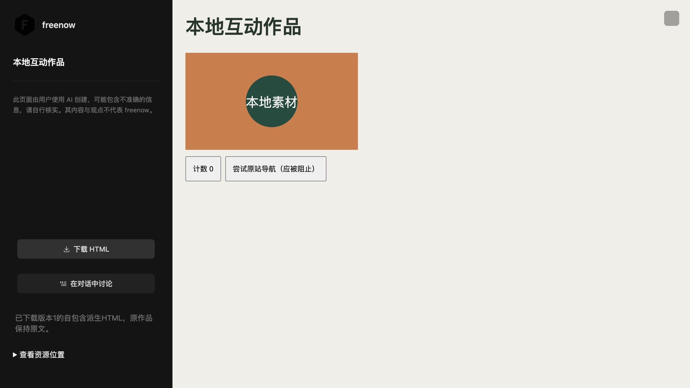

# 当前导出与内嵌品牌窄审计 · 2026-10-05

1005o 补充：Widget 的 PNG、默认 H.264 MP4 和 WebM 能力环境已通过真实捕获、正式宿主下载、文件落盘、SHA 回读及浏览器播放。两个视频均实际解码 40 个不同画面帧，见[实机记录](WIDGET-WHITEBOX-DOWNLOAD-QA-20261005.md)与[文件和运动采样](research/widget-whitebox-download-20261005.json)。此批只验证下载，加入画布仍须独立验收；以下 1005m 清单保留历史依据。

本批重新读取当前生产源码和 manifest，对 HTML、Widget 媒体、PNG/JPEG、WebM/MP4、GLB 与内嵌应用的品牌归属作窄审计。**没有发现新的、可以明确归属于应用自加的旧产品品牌，未修改生产代码。** 本结论不覆盖任意用户 HTML、历史媒体或全部动态可达状态，不是全站品牌完成声明。

## 当前代码与输出归属

| 链路 | 当前实际入口与行为 | 品牌判定及限制 |
| --- | --- | --- |
| HTML 下载 | `agent-artifacts/html-preview.mjs` 调用 `local-export.mjs`；已准备 HTML 放入 opaque iframe wrapper，下载名取 artifact_path，wrapper title 取用户标题 | 宿主预览侧栏使用本地 freenow F 图和免责声明；下载 wrapper 没有宿主侧栏或产品水印。用户标题/正文/路径包含 TapNow 时保持。资源待修复不能返回成功离线导出 |
| Widget PNG/WebM/MP4 下载 | `agent-widgets/media-receiver.mjs` 接收 Blob 后，经正式宿主“下载素材”按钮调用下载适配；stem 取用户 options.filename 或“白模截图/白模录像”，扩展名取实际 MIME | 下载原 Blob，无品牌像素绘制。`whitebox-capture.mjs` 同任务复制调用方 Canvas、截图/录制，不叠加名称或 Logo。`window.tapnow.*` 是兼容 API，不能替换。加入画布的视频另走本机 finalize，不等于下载原片已被转码 |
| PNG/JPEG/PSD | `image-editor-entry.mjs` 的手动菜单和 `image-editor/agent-export.mjs`；Fabric 文档渲染后编码，JPEG 补白底，默认 `Image Editor.png/.jpg/.psd` | 默认名中性，不因用户图片包含旧 Logo 而改图。没有额外产品文字或图片水印绘制；Agent download receipt 明确不证明文件已保存。编解码和像素仍须浏览器实测 |
| WebM/MP4 | `studio.mjs` / 只读检查的 `studio-v2/video-export.mjs` 录制场景 Canvas，回填“3D 片场录制/运镜”；视频节点、剪辑、播放列表下载使用节点/播放列表标题 | 捕获场景渲染，不捕获宿主顶部 Logo。`server/media.cjs`、`server/playlist.cjs` 的本机 FFmpeg 参数只有裁切、时长/帧率/尺寸封装等，没有 drawtext/品牌图片 overlay。用户原片字幕、商标和可能存在的元数据不清除；最终文件名/元数据仍需回读 |
| GLB / 堆叠 ZIP | `studio-v2/scene-export.mjs` 使用用户场景/节点名或 `Scene.glb`，堆叠/原片 ZIP 使用用户标题和中性兜底 | 未发现固定旧品牌名。Three.js 导出器字段、`tapnow_easing_v1` 兼容元数据、用户对象名保留；不能把来源标识改成 freenow |

表中 `studio-v2` 和共享视频/画布入口仅作读取，本批没有改动。源码对品牌水印的否定范围仅是这些已读路径，不否定用户/供应商媒体自身有标记，也不把中性文件名强制改为产品前缀。

## 当前 22 个内嵌应用

本批执行实际 `registry.getApp()` 与 `resources/apps/manifest.json` 的交集，得到 22 个版本，读取它们当前 manifest 选中的 HTML。固定 TapNow/Tapies 命中集中在制作进度、平台尺寸和电商计费；当前代理已经派生处理。其他命中是选择器/Previs 的构建注释，协议 SDK 标识保持。

独立执行当前派生函数确认：

- 平台尺寸中英固定成功提示指向 freenow，Tapies 改为本机裁切说明。
- 电商组图五语言计费字典不再使用 Tapies，准确说明配置供应商计费。
- 制作进度中英字典与页脚使用 freenow，本地 F data URI 回读与已批准 SVG 完整字节一致。
- 本批未发现上述 22 个当前运行 HTML 的静态远程 src/href 或固定原站 URL；任意动态代码不能由这个静态结果推断已隔离/可用。历史 Product Kit 源和许可证保持。

平台尺寸中文成功态不是待验：主线程 1005k 已真实拖动与添加三张 PNG，尺寸/保存/回执和 freenow 成功提示通过，见[实机记录](AGENT-PLATFORM-RESIZE-DRAG-SELECTION-20261005.md)。English、刷新及失败/重试在该轮没有重复验收。选择器导出仍是交互预览/录屏边界，见[内嵌应用记录](AGENT-EMBEDDED-LOCAL-BRAND-20261005.md)，不能宣称完整视频导出。

## 本批新鲜证据

只运行已有测试的三个相关 case，未新增镜像测试或运行全套：

```sh
node --test --test-name-pattern='opaque wrapper|derived export retains|export borrows production' tests/agent-artifact-local-export.test.cjs tests/image-editor-agent-export.test.cjs
```

3 项通过。HTML 会话输出保持源路径/revision，wrapper 保留完整派生文档；PNG/JPEG 的平台编码器为明确测试替身，PSD 是真实编码字节，不能因此声称真实浏览器 PNG/JPEG 下载成功。

另用不落盘的 Node 验证执行当前三组品牌派生，及实际 `offlineHtmlWrapper`/`exportFilename`：`TapNow 用户作品.html`、标题“TapNow 用户标题”和正文“用户正文 Tapies”原样保留，srcdoc 解转义后等于完整输入。没有请求模型、读取 Key/私有存储、浏览器操作或修改用户作品。

## 给主线程的最少真实导出验收

优先完成下列三条，均不需供应商；使用明确隔离的 QA 项目/数据，保存实际输出并回读，不能只观察 download receipt。

1. **HTML**：`http://127.0.0.1:4173/src/features/agent-artifacts/qa/local-export.html`。点击“保存本地图片互动作品”→“预览当前互动作品”→正式“下载 HTML”。核对 `离线互动.html`，重新打开后图片与计数按钮可用、导航不恢复原站依赖，下载不包含宿主侧栏 Logo。该按钮仅写本页专用产物存储；已有 QA 作品若需保留，先直接预览，勿覆盖。
2. **PNG/JPEG**：正式 `http://127.0.0.1:4173/` 在独立 QA 项目上传同一已知本地图片，打开图片编辑器→导出 PNG/JPG。核对 `Image Editor.png/.jpg`、实际解码尺寸、PNG 透明度和 JPG 白底；检查整张像素没有应用自加品牌。若输入本身带用户商标/文字，应保留它；不把用户图的旧名当缺陷。旧 `qa/image-editor-app.html` 是历史壳，仍有原静态 Logo，不作当前正式品牌截图。
3. **MP4 与原文件下载**：仍在独立正式项目上传已知本地短视频，裁切后走正式下载；播放列表可用“下载合并视频（mp4）”。核对标题决定的文件名、真实 MP4 编码/时长及抽帧，检查没有宿主 UI 或自加 Logo；原始 WebM 下载另核对原字节，不能用转码 MP4替代原片下载验收。FFmpeg 为现有本机依赖。旧 `qa/video-trim-app.html` 同属历史壳，不证明当前主页面品牌。

Widget 白模 PNG/MP4/WebM 的专属下载记录已在上方 1005o 增量补齐，旧 `qa/whitebox-capture-check.mjs` 仍只是 Node 平台替身检查。全格式、最大尺寸、发布包、动态网络和全部用户工作流仍按[总验收清单](FREENOW-LOCALIZATION-ACCEPTANCE.md)开放。

## 1005o HTML 实际下载

在 `/src/features/agent-artifacts/qa/local-export.html?session=export-1005o` 使用真实产物 store、预览与“下载 HTML”。本次将验收产物和素材均隔离到 session 专属 IndexedDB，并仅允许转换器读取本地 Blob，不读取用户资源映射。原文中的本地素材引用保持不变，下载的是含内联图片与 opaque iframe 的派生文件。

实际 `离线互动 (1).html` 文件为 2,359 bytes，SHA256 `e2bba158c7ef9df9be5282f02f004550708e84d0e1b9c35eb1f2d42821b916b7`；文件回读确认 `connect-src 'none'`、`frame-src about:` 和 `sandbox="allow-scripts"`。浏览器下载事件等待 20 秒超时，但文件在本次点击后真实落盘，不能以事件超时判定下载失败。浏览器工具策略拒绝打开 `file://`，未绕过限制，因此**独立离线文件重新打开的浏览器验收未完成**；当前证据只覆盖生产预览、实际下载及静态文件回读。


