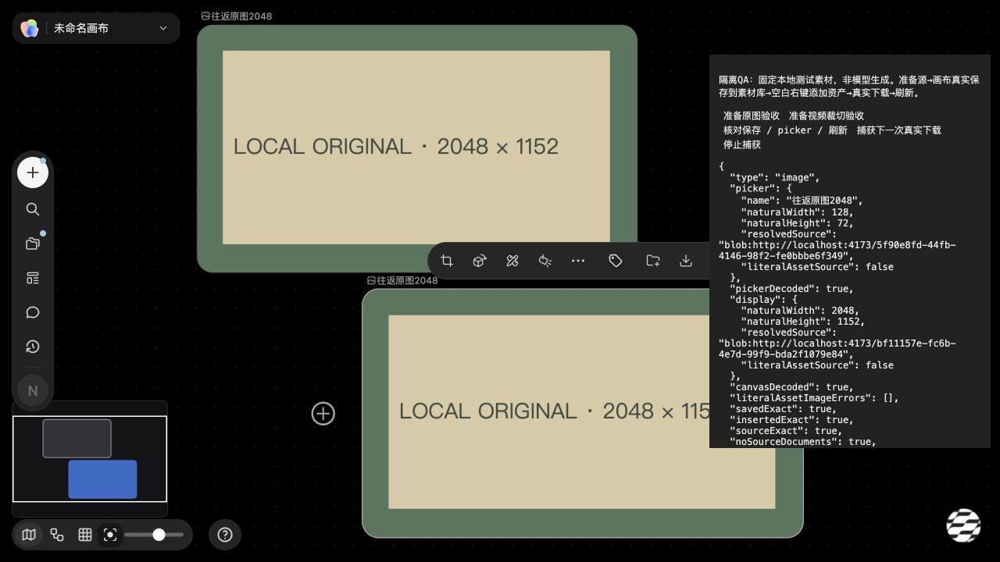
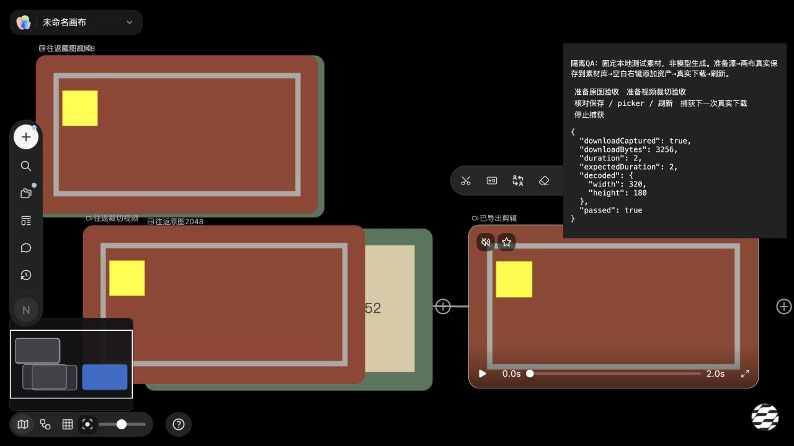

# 素材库原始媒体往返（2026-10-05）

普通图片/视频节点保存到素材库后，重新添加应保留当前原始媒体和对应结果信息。此前普通保存仅留缩略图等基本字段；图片 `fullImage`、原始像素和结果来源，以及视频裁切/元数据会丢失。

## 官方行为证据

权威参考是 `reference/vendor-pkg-canvas-CvuTKiTt.js`，SHA-256：

```text
5648122748e3c9d050cdf781a9308f8a584150eb717244dd5d291e108d68d2bb
```

`kD=e=>` 起始字节偏移 **1341380**。其 `h` 保存选择节点，构造 `{data:{...k.data||{},options:[]},measured:k?.measured,type:k?.type||"",id:kn()}`，调用 `createCanvasTemplate`；后续应用方法 `g`（同函数后续分支）将素材节点数据加入画布。这里的产品证据是保留当前节点数据、清除历史候选、使用新身份。项目的本地白名单与本地资源可靠性措施属于本地实现约束，不宣称官方使用同样存储方式。

## 范围与实现

- `src/features/library-asset-roundtrip/core.js`：内部同步 capture/restore，区分原图与预览图，保存有限、有效的像素/尺寸、视频 clip/metadata、音频 metadata、当前结果 provenance/source identity。provenance 若明确指向另一媒体，不把旧来源、像素或裁切信息标在新源上。
- `sidebars.js`：普通保存保留完整当前媒体；沿用准备一次 ID、失败可重试、素材库 CAS/Web Locks 规则。新记录仅保存本媒体类型的字段；同 ID 旧视频间接引用仅适用于视频类型。已存在旧记录不批量清理。
- `app.js`：既有同步 `insertAsset` 一次加入完整节点、一次历史和持久化，坐标与文字/音频模式行为不变。恢复 seed 原图只允许原类型、原预览、无待执行状态且来源身份不冲突；换源或转换类型同 ID 不继承旧原图。
- `canvas-commands.js`：真实添加资产 picker 使用已有 `bindLocalImage`，解析 `asset:` 和屏蔽原站待迁移媒体；搜索重绘/关闭销毁绑定并拒绝迟到图像。
- `canvas-menus.js`：只有 fullImage 的图片也允许保存。
- `index.html`、`docs/screenshots/demo.html`、`qa/menus-app.html`、`qa/image-editor-app.html`、`qa/library-template-lifecycle.html`：在 app/sidebars 前加载内部模型（后三个为本地 gitignored QA 壳，仅定向接线，未批量重生成）。组件目录页本身不加载 app/sidebars，链接的生产画布走 index。旧独立宿主未加载模型时保留原有基本媒体和高清原图的兼容 fallback，不会 TypeError；完整结果元数据往返依赖已接线的真实模型。CanvasApp 公开方法签名不变，无新增依赖。

不会复制源节点的运行任务、editorDoc、Agent 编辑器绑定、World 文档、历史候选或下一次生成配置。保存的历史 provenance.taskId 是结果收据，不是新节点的正在运行任务。未配置服务不会伪造生成结果。

## 已验证

```bash
node --test tests/library-asset-roundtrip.test.cjs tests/canvas-app-persistence.test.cjs
```

**37/37 通过**（20 个素材往返回归 + 17 个现有生产持久化回归）。测试包含真实生产保存函数的成功/失败重试、同步插入、picker 的本地解析/原图回退/关闭和重绘竞态、不同类型残留媒体过滤、来源冲突，以及真实 hydration 恢复分支的同 ID 换源/类型保护。QA 收据存储另有模拟 IndexedDB 回归：即使 localStorage 读取/写入都抛错，baseline/picker 仍可写入并重新加载。

追加 sidebars 相关验证：`tests/library-template-lifecycle.test.cjs` 与 `tests/library-template-resource-migration.test.cjs` 全通过；与 `tests/sidebar-dismissal.test.cjs` 合跑共 30 项中 28 通过，2 个未改主体库 fixture 因未提供 `readySubjects` 而抛 ReferenceError（该文件 48/49 行），不是本批 save/picker 路径失败。未修改其他模块来掩盖此限制。

静态检查不代表界面或下载验收；本分支未操作浏览器，实际 UI 由主任务统一验收。主任务已观察正常源图显示和保存配额失败时对话框保留；这促使 QA 与用户已满 localStorage 配额完全隔离。完整保存/picker/下载/刷新链需主任务最终 CUA 证据确认。

## 独立生产入口 QA

```bash
node src/features/library-asset-roundtrip/qa/generate-page.cjs
```

在运行本项目服务上打开：

```text
/src/features/library-asset-roundtrip/qa/roundtrip.html?session=<unique>
```

入口从当前生产 index 生成，保留 importmap 与生产脚本依赖，唯一加载顺序调整是先安装无 app 依赖的 local-assets.js，避免动态脚本逐个等待时历史初始化先于本地素材服务运行。boot.mjs 等待 session 独立 preferences IndexedDB bootstrap，再加载正式脚本和 QA 控件。QA 使用内存同步 preferences，实际持久化到独立 IDB；生产 CanvasLibrary 仍走它自己的 CAS/Web Locks 保存，QA lock 仅在 preferences IDB commit 后返回，失败拒绝。baseline/picker 收据另存独立 session IDB；画布/媒体/模板 DB 也隔离。不读取、清理或写入用户 origin localStorage。生产全局素材库仍为原 localStorage 存储，本次未迁移为生产 IDB。

1. 点“准备原图验收”：创建真实本地 PNG（原图 2048×1152，缩略图 128×72）。
2. 用源节点真实“保存到素材库”对话框保存，关闭素材库；画布空白右键“添加资产”，点击同名项。
3. 点“核对保存 / picker / 刷新”：要求保存与插入字段一致、源节点未变化、原图 SHA 相等、源编辑文档未复制；真实 picker 激活前图片 naturalWidth 大于零，新节点图片 naturalWidth/Height 为 2048×1152，且不出现 asset 协议字面 src 错误。picker 证据保留用于刷新复核；首次通过后记录实际插入节点 ID，刷新可直接核对此实际节点，不依赖刷新后选中状态。
4. 点“捕获下一次真实下载”，使用新节点真实下载。PNG 下载字节 SHA 应等于准备的原图，并实际解码到原始像素。刷新并再次核对。
5. 视频用“准备视频裁切验收”重复同一保存/picker流程；固定本地合成素材为 320×180、4 秒，clip 为 0.5–2.5 秒。使用节点工具栏“下载视频”，已有本地 trim 实际导出应解码为 320×180、约 2 秒。通用上下文下载保持既有原源语义，不用于裁切验收。

QA 素材是明确标记的本地合成测试文件，不是模型输出。控件不替代真实保存、picker 插入或下载动作。

## 主线程 Computer Use

正式保存→画布空白右键“添加资产”→实际picker点击→下载图片→刷新重新选中通过。picker真实缩略图128×72，重新插入节点与刷新后的图片均解码为2048×1152；保存/插入字段、源对象、来源、编辑文档隔离全部一致。原始PNG为83379字节，SHA-256 `5f2719a36a26bf86b1389d0c333c009dd24c6e0202295718ab8dabd3ee8be26f`；真实下载动作捕获的Blob哈希相等且实际解码成功。浏览器download事件未返回，故该证据不包含下载落盘确认。



验收最初遇到当前origin localStorage已满：正式保存保留对话框并报告失败。QA随后改用session独立IndexedDB与内存同步缓存，真实保存路径等待事务提交后才成功；不读写/清理用户localStorage。**生产素材库仍使用原localStorage，未因QA隔离而完成存储迁移。**

## 视频原始素材下载修复与最终验证

真实视频保存/picker 往返首先通过全部字段和源字节哈希，随后正式“下载视频”暴露 `Failed to fetch`：`LocalMedia.trim` 直接 fetch 持久化 `asset:`，浏览器无法把它当可读取 URL。

- `media-tools.js`：先调用已有 `LocalAssets.url`，原引用与解析结果都通过现有 display gate；读取视频源检查 `response.ok`，404 不提交处理 API。沿用独立 `LocalMedia.process/trim/asDataUrl/download` 接口、正式 `/api/media/trim` 与原有 clip 参数。解析、源读取、真实处理和解码的每个异步边界验证源节点对象、媒体、clip、类型和项目，变化时不创建迟到导出节点。
- `src/features/video-tools/entry.js`：正式工具栏下载在处理返回后再次验证节点、类型、媒体、clip、项目身份，防止变化后启动下载。普通未裁切视频下载同样检查迟到解析。
- `tests/library-asset-download.test.cjs`：实际本地 Blob 经真实 LocalAssets put/url、正式 `server/media.cjs` HTTP/FFmpeg 路径处理，再用 ffprobe 检查实际 MP4。没有伪造处理 API 或更改 clip 来使验收通过。

```bash
node --test tests/library-asset-download.test.cjs tests/media-display-sinks.test.cjs tests/media.test.cjs
```

**19/19 通过**：11 个新下载回归、7 个现有 display sink 回归、1 个本地媒体参数回归。覆盖实际 320×180/2 秒导出、404 不派发、原站资源 gate、解析时换源/改 clip/切项目/同 ID 替换对象、真实处理或解码期间变化不创建输出，以及工具栏处理返回后的项目/类型变化不下载。既有 display sink 测试的 clip 场景现在使用真实 state 节点，而不是不在画布中的浅复制对象。两生产文件语法检查与 diff 检查通过；与前述素材往返/持久化主回归共 **56 项通过**，没有为该修复重跑不相关模块。

主线程最新 Computer Use 使用正式“下载视频”：捕获 **3256 字节真实 MP4**，实际解码 **320×180、2 秒**；正式“已导出剪辑”节点及来源连线渲染。导出后刷新再次核对保存/picker 往返，全部检查为 true，原始 clip 与 source 未变化。原视频素材为 4582 字节，保存/插入的 clip 为 0.5–2.5、metadata 为 320×180/4 秒，源编辑文档未复制。这里证明真实处理、下载 Blob、渲染和刷新，不额外宣称浏览器下载落盘。


