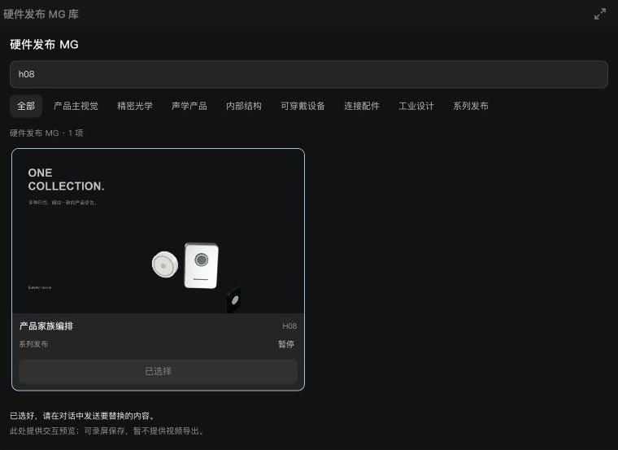

# Agent 内嵌页面交互闭环（2026-10-05）

本批修复表演节奏与剧本结构板的真实保存/确认问题，并本地化三个模板选择器的能力说明。没有调用模型、原站生成接口或读取真实 Key，不改变已有供应商协议。**这是一批交互修复，不是全站完成或全部能力只填 Key 即可使用的声明。**

## 来源与实现

以下五个原始 HTML 已与本机 `/Applications/TapNow.app/Contents/Resources/web/usercontent-proxy/apps/` 逐字节比对，全部一致：

| 页面 | 原始 SHA256 | 本地增量 |
| --- | --- | --- |
| performance-rhythm v3 | `9ead0d0bb847a55c3598ba90626b3fba85f9d2acbc773a447b12ee57d8994ae3` | 确认快照/锁、保存合并、键盘目标、失败重试及焦点 |
| story-room v1 | `dae7d235df8887af866f8b1984b75075c651f1b4d8f79775a0470a4b89f569a0` | 确认前提交、失败反馈、慢保存重试、场名恢复 |
| creative-picker / website-design-picker v1 | `2a07bc2e7e3874c49f012f1022cbf838939bf8ea502ca33af31b277986dadcc9` | 五语言说明当前只有交互预览和录屏保存，无视频导出 |
| motion-picker v1 | `11addd0cd6cdf70ec7896452ea607ce3dc9800d95c0e0279c7cc30fdd7e2ff33` | 同上，保留实际模板引用和交接脚本 |

原文件保持不变。正式 `mcp-app-proxy.html` 在校验完整 SHA 后调用各自派生模块，再应用原有 CSP。服务器只增加三个公开静态模块的读取许可；双 iframe、来源校验、短时用户激活和 API 同源边界保持。

详细合同：[表演节奏](AGENT-RHYTHM-INTERACTIONS-20261005.md)、[剧本结构与人物站位](AGENT-STORY-BLOCKING-INTERACTIONS-20261005.md)、[内嵌品牌与导出审计](AGENT-EMBEDDED-LOCAL-BRAND-20261005.md)。本次人物站位仅增加隔离验收会话，没有新增生产功能。

## 实际浏览器结果

使用正式本机 `4173` 服务、生产 registry/controller/card/host 和真实 IndexedDB。页面内所有编辑经原生键盘输入完成，回执通过页面可见的已提交状态读取；不调用页面内部状态函数或注入编辑结果。两个持久会话均为 `?session=interactions-1005i`，不读取日常画布。

| 页面与操作 | 实际结果 |
| --- | --- |
| 节奏：选中 b1，Tab 聚焦 b2，Delete | 只删除 b2；b1 与其余三项保留 |
| 节奏：保存延迟1800ms，驱动力36→37，快速两次确认 | 保存期间控件不可操作；最终1条精确 PS1，采用按钮恢复焦点 |
| 节奏：保存失败后启用对白检查，再确认 | 失败时不新增交接；重试后 review=1，队列1→2 |
| 节奏：关闭/重开、浏览器刷新 | 6.2秒/驱动力37、删除b2及两条交接均保留 |
| 节奏：再次失败/重试 | 成功后旧“发送失败”提示清除；采用相同内容仍只有2条交接 |
| 剧本：第二幕新增“地下档案室” | 实际保存 N1，确认后1条NS1，新增场景明确没有正文 |
| 剧本：模拟保存失败，再新增“旧钟楼”并确认 | 页面显示失败，持久状态和队列保持旧值；解除失败重试后N2实际保存，队列增至2 |
| 剧本：重复确认与刷新 | 队列保持2，第二幕顺序 N2/N1/S3 与创建幕均保留 |
| Creative A01 | 搜索过滤、键盘修改 dragX=0.15、暂停反馈通过；该操作在文案派生接线前完成 |
| Hardware H08 | 八项目录、搜索、键盘修改 dragX=0.15、暂停、一次隐藏交接通过；重建后接受标记/禁用提交和队列1保持 |

H08 交接仍是 `awaiting-content`，含原精确模板 SHA；没有生成 HTML 或视频。其验收页“重载已保存状态”重建当前内存会话，不等同浏览器刷新持久化。原始 picker 中参数编辑区的祖先设为 `hidden aria-hidden=true`，本批没有擅自展示这些隐藏控件，也不将它们算作已实操参数菜单。

## 检查与边界

- 新回归分别通过：Rhythm 12项及最后发现的错误提示回归1项；Story 5项及慢保存/缓存回归2项；picker五语言/来源2项；正式HTTP静态边界2项。关联原合同（包括人物站位）在本批早期通过，没有反复执行全库。
- 三名 `gpt-6.1-sol / high` 子Agent交叉审阅。发现并修复保存泵完成时遗留快照、焦点恢复、跳过误称确认、激活过期重试。浏览器实操另发现成功后残留错误提示，已修复并实际复验。
- 主浏览器日志检查覆盖已打开的节奏、结构板和模板页面，三个页面均无warn/error。12个变更脚本语法通过、328个本地Markdown链接有效、diff检查通过。未测整体FPS，不把保存合并等同于画布帧率提升。
- 本批没有取得跨幕鼠标拖拽的有效实操证据：高层工具无法命中双 opaque iframe，原生指针尝试没有改变结构。没有用脚本改状态来代替拖拽验收。原生曲线拖拽、人物拖动、所有语言/视口和主Agent实时模型回合仍待验。
- Story QA 仅把外层验收壳的行高/标题间距设为整数，方便坐标核对；生产页面与原应用布局未改。截图只裁取真实页面区域，见[来源记录](screenshots/README.md)。
- 在跨iframe请求尚未抵达或事务尚未完成时强制销毁页面，不能保证最后编辑落盘。已提交状态恢复已验；完整关闭前flush协议仍开放。
- 缺失的92份精确模板正文、SPZ渲染、部分原生供应商合同/本地上传限制，以及真实Key和商业模型质量不在本批闭环范围。
