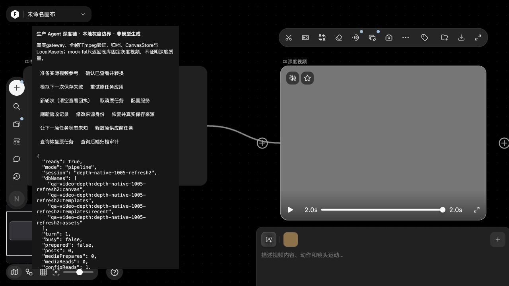
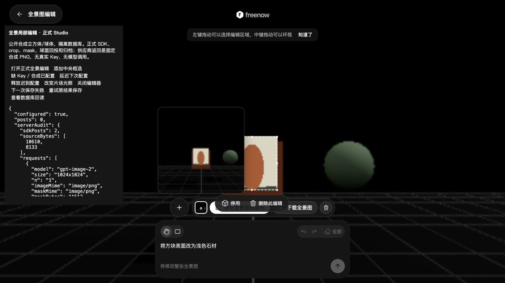
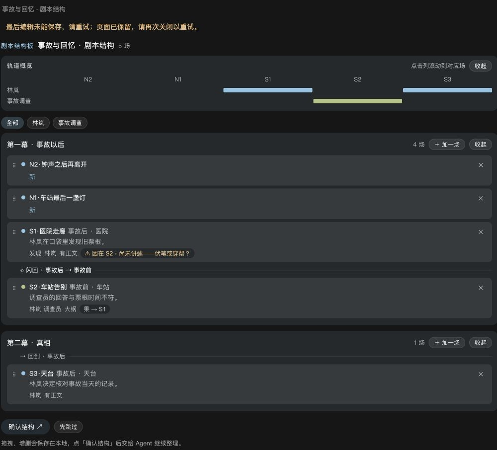

# 视频深度、全景局部编辑与 Agent 关闭保存

2026-10-05。本批完成两条独立供应商适配、正式前端接线及两个内嵌 Agent 页面的关闭保存。使用原安装包、官方文档和 Web 作参考；本机页面用于验收。没有读取真实 Key、调用原站生成接口或上传用户素材。供应商回复使用公开合成图片和视频，不代表模型效果。

## 交付与使用条件

| 能力 | 当前链路 | 仍有限制 |
| --- | --- | --- |
| Agent 视频深度 | 准备完整来源、查看回执、fal 队列、逐帧媒体验证、本地 MP4、来源连线和原任务恢复 | 需 fal 模型权限、FFmpeg/FFprobe；普通视频节点同位入口未接入 |
| 旧片场全景局部编辑 | 正式球面框选、1024×1024 透视裁片和蒙版、OpenAI SDK、2048×1024 本地回投、补丁历史和保存重试 | 仅当前可见凸四角选区；整图编辑未接；硬边接缝与真实效果待 Key 验收 |
| 表演节奏与剧本结构 | 关闭前保存、慢事务等待、失败保留、同页重试、重开和刷新恢复 | 强制关窗/刷新不能保证最后一次未提交编辑；其他内嵌应用未宣称获得该屏障 |

配置参见[多供应商设置](MULTI-PROVIDER-SETUP.md)。新增协议是 `fal-video-depth-native` 和 `openai-panorama-edit-native`；必须显式映射模型和操作并填写自己的 Key。现有配置不能被示例整段覆盖；合并对应 provider 与 route 后重启服务。

## 参考依据

- 官方[视频生成与编辑](https://docs.tapnow.media/zh/docs/canvas/generate-and-edit-video)把深度图放在视频生成选项，来源是连接或上传的视频，提示词留空、时长跟随来源。本批没有据此另造工具栏；普通节点的同位入口仍是缺口。
- 官方[图片生成与编辑](https://docs.tapnow.media/zh/docs/canvas/generate-and-edit-images)和[文本与 3D](https://docs.tapnow.media/zh/docs/canvas/create-text-and-3d)用于交叉核对功能边界。当前官方 Web 的 3D 2.0 空欢迎页不能证明旧全景编辑已逐项实操。
- 旧版全景选区、相机方向、位置和补丁历史来自官方安装包 `ThreeDWorkspace-BzPphAqB.js`，SHA 与精确符号见[前端验收说明](../src/features/panorama-edit/qa/README.md)。原包使用三张参考图；这里是明确的单透视裁片加蒙版独立替代。
- 两个内嵌应用保持原 HTML SHA，校验成功后派生本地保存桥，不增加工具权限。[关闭合同与来源](AGENT-CLOSE-LIFECYCLE-20261005.md)

## Computer Use 实际结果

以下均使用 Chromium 原生交互、正式组件与真实 IndexedDB。媒体 QA 只替换供应商传输边界，TaskService、SDK、FFmpeg、归档及画布保存实际执行。

### 视频深度

入口 `src/features/video-depth/qa/main.html?mode=pipeline`，服务由 `node src/features/video-depth/qa/native-server.cjs 0` 启动。使用专用会话，日常项目不受影响。

1. 正式 Agent 链准备来源并确认查看后派发。保存失败保留唯一结果节点，再点正式「重试应用结果」，没有新增供应商 POST。
2. 新会话将完整来源真实存入 LocalAssets。供应商状态暂不可查询后，释放同一任务并点击正式「查询恢复」。供应商提交计数保持 3，原 ID 状态查询从 3 增至 4；结果查询及下载各增加 1。计数包含之前的 HTTP smoke 和另一次 UI 会话，本次只提交 1 次。
3. 刷新仍保留唯一结果、来源连线和本地素材；零迁移告警、零新增生成 POST。视频实际解码为 64×48、2 秒，`readyState=4`、无解码错误，播放时间正常推进。

这是 FFmpeg 生成的固定灰度合同视频，灰色画面不证明深度推理质量。早期 QA 使用静态脚本目录视频，刷新曾产生两条来源迁移告警；仅将新会话夹具改为真实媒体存储，没有放宽生产迁移规则，也没有抹除旧会话警告。

### 全景局部编辑

入口由 `node src/features/panorama-edit/qa/server.cjs 4267` 提供，建议使用 `http://localhost:4267/?session=unique-session`。本批正常视口为 1280×720。

1. 正式片场内实际鼠标拖出球面选区，输入「将方块表面改为浅色石材」。缺 Key 时显示配置要求，供应商 POST 为 0。
2. 恢复隔离配置后，真实 OpenAI SDK multipart 发送一次 crop/mask；结果回投为可解码的 2048×1024 PNG，再归档本机。
3. 注入一次保存事务失败后，保留同一补丁，`applied=false`；描述、历史、取景和退出锁定。点正式重试后保存次数从 1 增至 2，补丁仍为 1，`applied=true`，供应商 POST 没有增加。
4. 刷新后正式编辑历史保留提示词与缩略图。选择历史能显示原范围、控制点、停用和删除入口。该观察不等同于本批已逐项操作全部历史菜单。

| 正式鼠标框选与描述 | 刷新后的补丁历史 |
| --- | --- |
|  |  |

### Agent 关闭保存

正式 registry/controller/card/host 的两个隔离入口见[生命周期说明](AGENT-CLOSE-LIFECYCLE-20261005.md)。

- 表演节奏：1800ms 慢保存时显示等待，真实事务完成后关闭；保存失败保留最后输入，重试后关闭，刷新仍保留备注。最终 readiness 版本再次关闭通过。
- 剧本结构：新增 N1「车站最后一盏灯」和 N2「钟声之后再离开」；保存失败保留页面与新场景。解除失败后等待实际保存才关闭，重开和刷新仍有 5 场，Agent 排队 0 次。
- 浏览器发现官方 SDK 抢先处理本地关闭请求而报 `Method not found`。Story 桥移至 SDK 的唯一启动点 `R_()` 前注册，保留 SHA、来源及 nonce 校验。最终失败提示已中文化，原始诊断仅保留在内部错误原因。

| 表演节奏保存失败 | 剧本结构保存失败 |
| --- | --- |
|  |  |

## 验证与实现边界

定向回归分组记录于[深度后端](VIDEO-DEPTH-NATIVE-20261005.md)、[深度前端](VIDEO-DEPTH-FRONTEND-QA-20261005.md)、[全景后端](OPENAI-PANORAMA-EDIT-NATIVE-20261005.md)、[全景前端](../src/features/panorama-edit/qa/README.md)和[生命周期](AGENT-CLOSE-LIFECYCLE-20261005.md)。共享路由 4 项已通过，新增 routed metadata 到媒体准备的回归通过；发现并修复了别名元数据压缩后丢失深度原生型号的问题。Story 完整 SDK 回归 2/2，最终本地错误和重试 3/3。独立交叉审阅覆盖接线、媒体与生命周期，没有重复运行全库。

全景 prepare 只验证，提交时只构建一次裁片；像素循环避免逐像素分配 Vector3。供应商配置与来源变化会使旧请求失效；保存失败只重试实际保存，不重复模型、合成或节点创建。这些是明确的局部改进，不代表整体画布帧率已有新基准。

尚未证明任意 Key 可开启全部功能。真实模型质量、账号资格与额度仍需独立验收；92 份精确模板正文、SPZ 渲染、Enhancor 原生参数合同、首次视频分割和 Ark 本地视频公网来源仍开放。详见[当前缺口](CURRENT-FUNCTION-GAPS-20261003.md)及[供应商就绪表](OFFICIAL-CROSSCHECK-AND-KEY-READINESS-20261005.md)。本批不构成全站完成声明。
