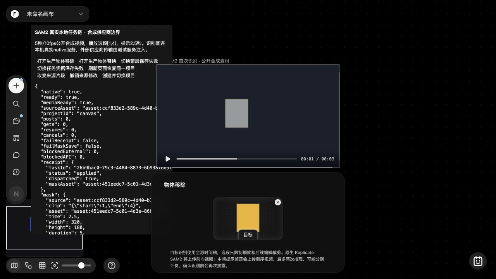
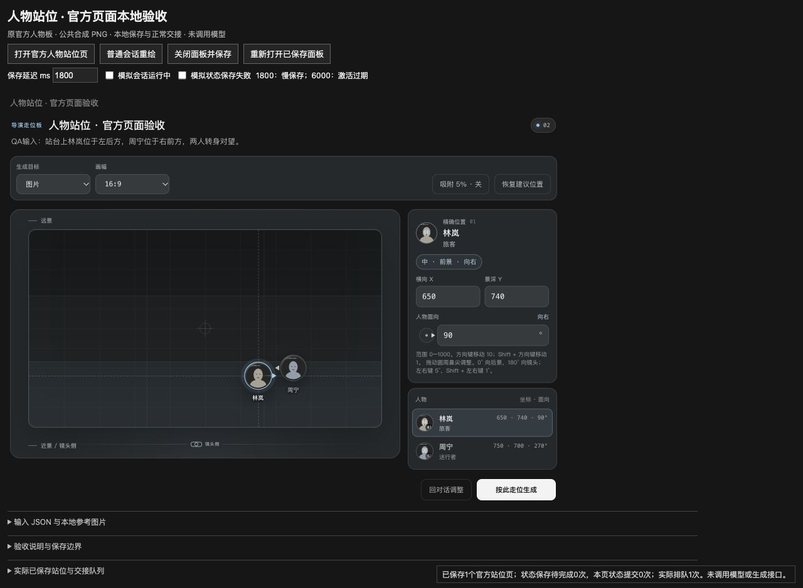

# 原生视频识别与人物站位补验 · 2026-10-05 / 1005n

本批从 `main` / `d1842ac` 继续。实现新视频的独立 Replicate SAM2 识别链路，并补人物走位的实际鼠标验收。运行与资源保持本地化，未读取真实 Key、上传用户视频或调用付费模型。官方页面仅用于界面观察，隔离 QA 使用原创合成视频/PNG；供应商边界响应为明确的测试夹具。

## 已实现

- 固定 `replicate-sam2-native` 协议，保留原自定义 `segment-video`。真实前向/倒序视频、独立预测、即时逐帧 PNG 归档、严格二值解码和完整原时轴 RLE 合并。
- UUID 在创建前落盘；丢失回执、重启和保存失败均保留原任务。GET 不重新推理，未派发分支仅在明确续发时提交。已知兄弟任务在另一方向上传/推理失败时收尾，不发布部分结果。
- 前端真实读取来源字节；绑定项目、节点、clip、选区、提示帧、来源 SHA 和供应商身份。原配置漂移、旧来源恢复及取消后的迟到响应均被拦截。
- 原源 RGB 写私有磁盘并逐帧处理，避免整个高清 RGB 视频驻留内存；实际取消退出子进程、清理所属临时目录并释放任务槽。预算与限制见[媒体模块](VIDEO-SEGMENTATION-MEDIA-20261005.md)。
- 参数面板按可用窗口高度滚动，恢复按钮可见且可操作，视频和选区几何保持不变。

## 浏览器发现与修复

| 实际问题 | 修复与证据 |
| --- | --- |
| 720px 高窗口中恢复按钮落到 y850 | 面板 y444/max-height260，内部滚动使真实点击可达；视频仍为 x405.328/y168/469.328×264。 |
| 活跃前向归档期间，倒序仍 pending，被误报 needs_resume | 活跃任务DTO显示 running、canResume=false；停止后才允许续发。下载hold定向回归和独立恢复复审通过。 |
| 已应用蒙层刷新仅检查URL/clip，漏掉来源元字段 | 同任务绑定完整receipt指纹，非asset来源重验SHA；实际方法最小复现确认漂移来源零读取、零展示。 |
| 未派发意图同版更换供应商身份后仍可能先POST | 创建前重新核对版本和供应商身份；实际恢复方法最小复现零POST。 |
| 初次自动保存失败后，单独存储模块成功而主画布仍脏 | 初始来源和最终蒙层保存都使用带beforeCommit的正式CanvasApp.saveProject；真实最新事务成功后清dirty/提示，完整历史与视图保留。新增实际宿主回归3项及最终CUA通过。 |

## 实际本机整链

运行 `node src/features/video-mask/qa/sam2-native-server.cjs 0`，使用返回端口的 `localhost` 地址。页面路径 `/src/features/video-mask/qa/segmentation-app.html?mode=native&session=<独立会话>`。原生模式只替换供应商fetch/下载边界，正式本机HTTP、持久仓库、FFmpeg、PNG解码、RLE合并、前端和IndexedDB均实际执行。

源为320×180、5秒、10 FPS、H.264/yuv420p原创移动方块视频，首次存入LocalAssets，刷新复用同一asset。播放器选段 `[1,4)`；识别使用完整5秒原轴，提示2.5秒，对应原第25帧。

首轮 `sam2-native-final1005n`：

1. 框选后确认上传，但模拟receipt保存失败：本机task POST、Files上传及prediction POST均为0；原意图留在页面。
2. 解除receipt故障后，用实际“恢复原识别任务”确认同一意图。实测1个本机任务、2次上传/预测、25/26帧分支、51张真实PNG归档，合并50帧原轴RLE。
3. 两路首帧RGB SHA相同：`30c4a3c8ffc2b4874ed734231aef39791a1034ed6fc0a50e8c68d14c3dafe08c`。源SHA `6f1626326e04801beac78be182d855fffcd30e4067fe3cb72c94392a8f06a306`；完整RLE摘要 `105176f136923ee8e3f6b8a3b3072df1221b989ea3c1c29bccbbcf2587327897`。
4. 蒙层保存失败显示真实错误，receipt为succeeded而非applied。解除故障后同UUID重试，同一mask asset保存完成；上传/预测计数仍2，PNG下载仍51。首轮发现主画布脏状态未清，此时刷新被保护，未计作刷新通过；真实“保存画布”后刷新成功。
5. 刷新后源与mask asset、原UUID、full-source duration5保留，未出现资源迁移警告，也没有新的task POST。实际canvas在2.5秒显示第25帧、非透明2000像素、边界 `[120,60,159,109]`；播放走至片段末尾回到1秒，蒙层为原轴第10帧。
6. QA进程重启保留私有目录、原字节、归档与计数；GET原UUID仍返回succeeded/50帧，没有追加上传、下载或预测。

隔离服务器HTTP smoke另覆盖提示帧mask冲突拒绝、未知回执仅一次POST、PNG下载中断续取，以及关闭/重新打开服务后显式续发；这些是HTTP证据，不冒称全部已用鼠标操作。

最终修补版 `sam2-native-final1005n-b` 另建隔离项目验证，没有覆盖首轮来源或归档：

- 提示2.5秒后创建一次，自动观察至完整结果；不再误停在needs_resume，也没有点击续发。
- 开启蒙层保存失败后，原结果保持succeeded、生成禁用；解除失败并点击一次恢复，原UUID及原mask asset不变，receipt实际变为applied，主画布存储失败提示自动消失。
- 直接真正reload，无需额外“保存画布”；同源asset、同mask、UUID和完整5秒时间轴恢复。前后均为undoCount2/redoCount0，分别对应QA初始入库与单次蒙层修改，重试未重复插入历史。
- 刷新后再seek2.5秒，实际原视频320×180/5秒、蒙层第25帧一致；此轮浏览器warn/error为空。服务器最终两个隔离任务各50帧，共4次上传/预测、102张PNG，task POST2；每个任务始终只有两次预测。后续编辑API明确未配置，没有执行移除/替换模型。

截图为完整1280×720浏览器视口，左侧是明确标识的合成供应商QA审计；页面计数刷新后归零，服务器累计计数以上述独立审计为准。没有覆盖生产CSS、修图或拼接。较早的127.0.0.1页继承浏览器33%缩放，最终验证使用localhost正常视口；临时设备模拟已清除。

## 人物站位

官方v3原件字节不变。本批真实鼠标补验：超界坐标clamp到1000/1000、5%吸附400/750、关闭吸附492/570、朝向0°/90°、失败保留旧状态、同卡重试CB3一次、真正刷新恢复650/740/90°。详见[人物站位记录](AGENT-CHARACTER-BLOCKING-INTERACTIONS-20261005.md)。

## 配置、验证与边界

[配置说明](VIDEO-SEGMENTATION-SETUP.md) · [后台](REPLICATE-SAM2-NATIVE-20261005.md) · [前端](VIDEO-SEGMENTATION-FRONTEND-20261005.md) · [传输来源](REPLICATE-SAM2-TRANSPORT-20261005.md) · [PNG/RLE](VIDEO-SEGMENTATION-MASK-CODEC-20261005.md) · [官方UI观察](VIDEO-SEGMENTATION-OFFICIAL-UI-20261005.md)。

媒体专项7项、codec11项、后台原16项与下载中查询新增1项通过；独立交审只运行相关最小复现。前端和主画布保存相关48项定向检查通过，新增实际宿主3项被独立复核；上述最终CUA确认失败提示和离页保护真实解除。同步协议选中2项兼容检查通过。主服务在无Key环境优雅重启，首页/config为200，私有任务目录访问403；未跑全库回归。

实际模型质量、RGB H.264的线上解码、供应商账号资格和双向提示帧mask一致率尚未验证。后续编辑还需要独立fal配置及81–241帧等条件；不能仅凭本批5秒/10 FPS识别夹具声称整套Wan VACE编辑可用。

[安装包/模板增量审计](AGENT-TEMPLATE-SOURCE-AUDIT-20261005.md)重算883个Resources文件和2,521个ASAR叶文件，92份精确模板正文仍无命中；22份既有官方应用原件均逐字节相同。全站逐态、缺失模板、特殊模型适配和剩余导出品牌验收继续开放。
