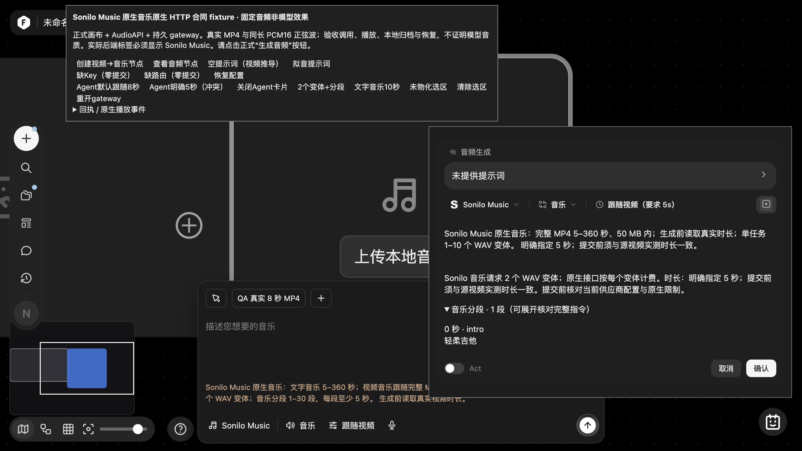
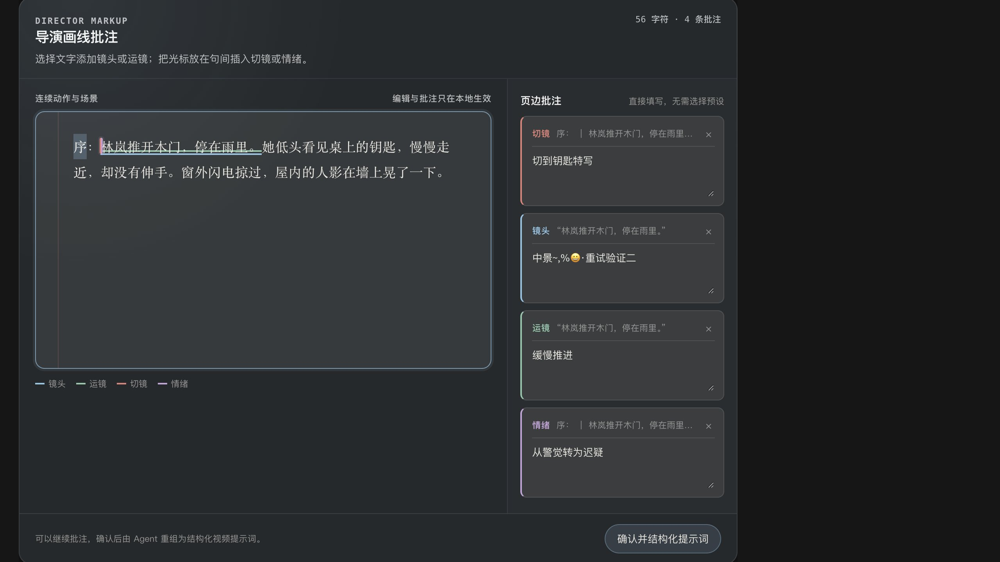
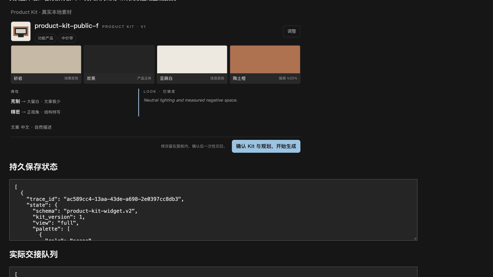
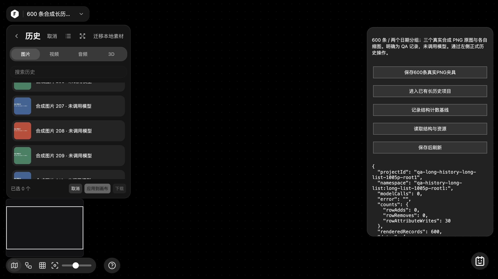

# Sonilo 原生音乐、Agent 应用交互与长历史列表 · 2026-10-05

本批（1005p）补齐独立 Sonilo Music 调用、Product Kit 和 Director Markup 的保存/确认/关闭交互，以及生成历史的连续 DOM 更新。官方安装包和公开 API 是参考；本机页面用于验证实现。没有读取真实 Key、调用收费模型或上传私人素材。

## 已实现与使用条件

| 功能 | 当前行为 | 证据与限制 |
| --- | --- | --- |
| Sonilo 视频音乐 | 本地完整 MP4 直接 multipart 上传；真实解码/时长校验后才提交；原异步任务查询与 WAV 本地归档 | 独立 Sonilo Key，5–360 秒、50,000,000 字节；无需原站或额外公网素材托管 |
| Sonilo 文字音乐 | 原生 Text-to-Music，精确保留分段和 1–10 个变体 | 分段起点/描述/标签完整发送；每个变体计费；真实音乐质量和账号权限未验 |
| Agent 音乐审批 | 显示实际数量、全部分段、明确指定时长与跟随来源的区别 | 取消准备后零提交；不忽略冲突时长、选区或不支持的参数 |
| Product Kit | 配色/调性/禁令/语气/规格状态保存；同一快照 PK1 交接；慢保存合并、失败保留、关闭等待 | 保持官方原件与本地传输派生的 SHA；没有添加原页不存在的拖动排序 |
| Director Markup | 四类批注、正文锚点更新、同一快照 DM1、关闭保存/重试；Escape 返回正文 | 官方页面及五语言结构保留；本批实机使用中文和键盘选择 |
| 生成历史 | 日期网格和未变更行保持连接；仅更新改变的状态；焦点/滚动及媒体租约保留 | 600 行定向验证；仍扫描完整记录，没有分页/虚拟化，不声称整体 FPS 提升 |

配置见 [多供应商示例](MULTI-PROVIDER-SETUP.md)和[Sonilo 完整合同](SONILO-NATIVE-20261005.md)。Sonilo SFX、stems、语音保留和 ducking 尚未接入；ThinkSound 仍是可明确选择的 SFX 替代。现有配置 JSON 应合并对应条目，不能覆盖其他路由。

## 实际浏览器结果

音乐使用正式画布、AudioAPI、审批卡、持久网关及媒体仓库；供应商边界返回明确的合成正弦波 WAV。一次 HTTP smoke 加三次真实 UI 提交共接受四个任务：普通视频音乐、Agent 视频音乐和十秒文字音乐均得到两个输出。视频 multipart 恰一个文件、9865 字节与公开源 MP4 相等。第二个历史结果实际播放到 8 秒并作为独立节点应用；文字结果播放到 10 秒。相同音频字节在媒体仓库去重，但每个 output 索引保留独立历史项。

缺 Key、缺路由、未物化选区和明确时长冲突均无新增供应商 POST。同目录重开网关并刷新画布后，三节点及 10 秒/8 秒音频恢复；显式 GET 四个原 UUID 均为 succeeded、outputs=2，接受任务总数仍为四。这个浏览器场景是网关对象重开，不冒称进程崩溃或运行中远程恢复。详细[实机记录](SONILO-NATIVE-UI-QA-20261005.md)与[去敏回执](research/sonilo-native-20261005/local-browser-evidence.json)。

Product Kit 实机完成配色、两调性上限、锁定项、禁令、语气与合成规格确认。6000ms 慢保存后要求再次点击才交接；失败时保留页面，重试/重开/刷新回读一致，实际队列为两个不同快照。Director 实机保留四条批注，正文前缀插入后锚点由 0/0–12 移至 2/2–14，1800ms 保存、失败重试、刷新及一次 DM1 去重通过；工具条 Escape 返回原正文选区。详见[素材板](AGENT-PRODUCT-KIT-INTERACTIONS-20261005.md)和[导演批注](AGENT-DIRECTOR-MARKUP-INTERACTIONS-20261005.md)。

历史列表真实 600 条记录、两日期、11 张当前缩图解码；选择/取消 40 次没有增加或移除行。首次自动定位后重新取基线，再点击 10 次，scrollTop 保持 13185.5、焦点保留第208条。预览真实1200×800 PNG后退出，关闭侧栏时非共享 URL 存活数为0。工作量比较中，原先40次选择会搬运24,000行，现为0；这是操作计数而非帧率。[性能与资源证据](GENERATION-HISTORY-LONG-LIST-20261005.md)。

| Agent：明确时长、数量和完整分段 | 导演批注：四类说明与正文锚点 |
| --- | --- |
|  |  |
| **Product Kit：真实配色与持久恢复** | **长历史：完整列表和稳定选择** |
|  |  |

## 交叉审阅和定向检查

- Sonilo 适配器原专项15项、持久准备相关10项通过；独立审阅发现官方可选 `sample_rate/channels/title` 遗漏并补齐，新增用例单独1/1通过。
- 音频前端专项35项通过，后续新增审批可见性用例单独通过。最终交审发现准备等待期间取消仍可能提交，真实生产分支新增回归1/1通过；准备可完成，但不再提交任务。
- 可信本地预上传失败现在公开保留 `providerDispatched:false` 和安全提示。真实路由适配器的错误时长、持久重开及远程 tasks-v1 冒充检查2/2通过。没有将供应商未知失败当成零派发。
- Director 原12项交互及4项相邻检查通过；Escape新增项单独1/1。Product Kit 在完成阶段保存竞态修复后26项通过，最后错误文案/规格焦点等4项定向通过，未把后续定向检查称为整套重跑。
- SPZ Agent的旧“只支持GLB/无LOD”说明已与现有实际能力对齐，接口与权限不变。新增预算一致性回归1/1、受影响的原缺Key回归1/1通过，并经独立只读交审。
- 历史相关73项通过，独立资源组合探针通过。精确版本的宿主/CORS接线2项通过；没有放宽私有模块或任意路径的跨域访问。

只运行本批相关检查，未跑全量测试。此前扩展到 `sidebar-dismissal.test.cjs` 的两项 subject editor 测试因旧 VM 夹具未提供 `readySubjects` 而失败，未在本批修改或重复运行；不能声称全库测试全绿。

## 仍未验收

真实供应商账号、音乐同步与质量；独立逐帧视频时间轴核对；Sonilo 其他原生能力；Product Kit / Director 全部语言和视口。双层隔离 iframe 的工具坐标限制阻止了本轮真实鼠标拖选，因此只记录实际完成的键盘操作。浏览器进程使用早期1005p后台模块；最后可选响应字段及公共失败回执补修由上述专项验证，主服务已优雅重启加载最终代码，根页面/配置HTTP 200，用户主画布实际刷新正常；未读取真实环境Key。

92份精确模板正文、全站逐态设计/hover、其余供应商接入、跨设备性能及完整品牌导出清点仍开放。项目不因本批交付标记为全站完成。

## 集成记录

最终主服务已优雅关闭旧进程并在 `http://localhost:4173/` 启动；未删除存储锁或数据，根页及配置返回200，实际用户画布刷新正常。没有加载真实Key环境文件。README收敛为启动/功能/配置/最新截图，历史验收统一从索引进入；502个本批文档链接目标存在且未指向忽略文件。

提交前扫描当前Git索引：2519个blob，其中1986个文本、533个二进制跳过；凭据规则命中0、私有路径0。此结果不等于二进制隐写检查、全历史重扫或所有未来配置都安全；本批公开图片均为隔离合成页面截图。
