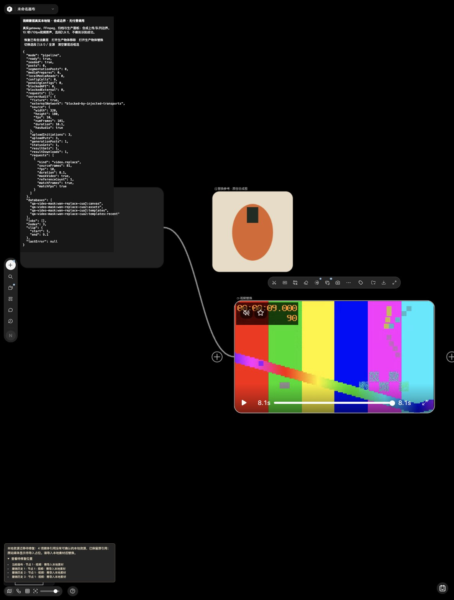

# 视频物体编辑与 Agent 本机验收 · 2026-10-05

本批接通正式工具栏与 Agent 的视频物体移除／替换：已有完整时序蒙层 → 原视频和蒙层同裁 → fal CDN 上传 → 单次任务 → 原身份恢复 → 真实 MP4 校验、原音轨处理、本地归档 → 连接结果并保存。协议为显式 `fal-video-mask-native` / Wan VACE 独立替代，不是原站私有模型的同效果证明。

**新视频首次目标识别仍须独立分割服务。** 仅有 fal Key 不足以完成识别与编辑全流程。真实账号上传权限、模型可用性及视觉质量未用 Key 验证；本批没有付费生成。

## 参考与实现边界

- 官方 Web：对实际 5.1 秒视频打开物体替换、添加蒙层、框选并取消；核对目标／参考卡、四角控制、白色确认条、禁用生成与空白关闭。未确认付费识别或生成。Escape 取消是本地增强，本次官方观察没有看到响应。
- 官方安装包：`/Applications/TapNow.app/Contents/Resources/web/assets/page-DVqoHdTT.js`，SHA256 `8334adc98d6ec24265d45ed4f45458be19d137b5391e5b3abb77e064d221cd86`。原包只作本机研究依据，不随运行时调用。
- 公开供应商合同与原站差异见 [初始就绪研究](VIDEO-MASK-PROVIDER-READINESS-20261005.md)、[原生适配](WAN-VACE-VIDEO-MASK-NATIVE-20261005.md) 和 [SAM2 分割合同缺口](VIDEO-SEGMENTATION-FAL-CONTRACT-20261005.md)。SAM2 公开 RLE 类型尚不足以确认编码基数、行列顺序与游程语义，未凭返回类型猜出可运行适配。
- 来源与结果均为本地或显式配置供应商，不依赖原站账号、API 或 CDN。原音轨由本机保留；真实模型只编辑图像。选段要求 CFR 5–30 fps、81–241 帧，不补帧、截断或改速。

## 已交付

| 层 | 实现与证据 |
| --- | --- |
| 媒体准备 | 完整 MP4 / RLE 解码、按同一 `sourceClip` 裁出视频和逐帧黑白 mask；核对帧数、fps、PTS、尺寸和原音频样本。[媒体合同](VIDEO-MASK-MEDIA-PREPARATION-20261005.md) |
| 上传与队列 | 正式 initiate + 签名 PUT；限制认证 origin、DNS/TLS peer、重定向、回显和大小。上传证据、队列身份先落盘，再执行后续操作。[上传](FAL-CDN-UPLOAD-20261005.md) / [恢复](VIDEO-MASK-DURABLE-RECOVERY-20261005.md) |
| 恢复与公开状态 | 重启后只读原 manifest、只查原任务，不重新上传或 POST；公开回执隐藏私有路径、签名 URL 与准备记录。来源不明保持 unknown，不能当作生成成功 |
| 工具栏 | 配置预检、实际完整来源与蒙层、原尺寸 PNG 参考、选择／关闭守卫、生成结果等待真实画布保存；失败重试复用原节点。[前端合同](VIDEO-MASK-FRONTEND-NATIVE-20261005.md) |
| Agent | 正式 ask/auto、上传说明、审批时来源与配置绑定、派发前持久任务 ID、高清替换参考与结果保存重试。[Agent合同](AGENT-VIDEO-MASK-CLOSURE-20261005.md) |
| 封面与性能 | 无封面的编辑结果实际解码首帧为最大 320px JPEG，随结果节点保存；取消／失败释放 decoder。蒙层选择拖动按 RAF 合并，暂停不持续刷新 overlay |
| 品牌 | 平台尺寸应用固定字典派生为 freenow / 本机图片裁切，保留原始版本、来源与用户标题。[审计范围](FREENOW-RUNTIME-BRAND-AUDIT-20261005.md) |

## Computer Use 实际结果

使用正式页面模块和独立数据库，不读取日常项目或真实配置。以下明确区分供应商模拟边界与真实本地处理。

| 场景 | 实际观察 |
| --- | --- |
| 工具栏缺配置 | 生成禁用；生成 prepare / POST / 识别 POST 均 0 |
| 工具栏替换协议 | 实际 picker 选图；完整 8 秒视频、240 帧 / 30 fps RLE、原 `[1,5)` clip 与 512×512 PNG；一次 prepare 和本地拒绝 POST，无虚构结果 |
| 关闭迟到准备 | 等待配置时 Escape 关闭，再释放配置；prepare、POST、素材读取和 job 均 0。QA 控件 pointerdown 隔离后重新验证 |
| 原生移除组合 | 实际 10.1 秒 / 101 帧 / 10 fps / AAC 来源，选段 `[1,9.1)`；两个上传、一个 queue POST，归档 1280×720 / 81 帧 / 8.1 秒 MP4；原片保留，新节点及一条边保存 |
| 原生替换组合 | 实际 picker 选参考；三个上传、一个 queue POST、一次结果下载；同样得到 81 帧 / 8.1 秒真实归档视频。刷新保留结果、连线及实际 320×180 JPEG 首帧封面，POST仍为1 |
| 视频播放 | 移除和替换实际视频播放成功；AAC 复制 8 秒、FLAC32 裁片 5.0625 秒样本均在 `muted=false` 下播放至 ended，无媒体 error。证明播放兼容，未做工具音频听辨 |
| Agent 手动移除 | 正式确认卡显示 Wan VACE、fal CDN 和本机原音说明；批准前 POST / sourceReads / maskReads 都为 0。允许后 POST1、acknowledged=true、结果 applied=true、节点3／边1；刷新原任务与结果保持，无重提 |
| Agent 自动替换 | 原 PNG 512×320 读取一次，缩略图读取0；完整来源8秒、mask240帧和clip1..5准确提交；POST1、acknowledged=true、applied=true、节点3／边1 |
| Agent 审批中换源 | `agent-mask-drift-cua3` 先观察到clip变为2..6、保存蒙层仍绑定1..5，再点允许；显示“来源视频或项目已变化”，POST / sourceReads / maskReads / jobs 均0，无结果节点 |

原生组合页只在 CDN / queue / download 供应商传输边界使用固定合成响应；真实 gateway、adapter、uploader、FFmpeg、持久服务和本地媒体 HTTP 均运行。输出由合成来源转码生成，**不是模型物体编辑效果**。

Agent QA 则使用固定 LLM 工具调用和固定 4 秒 MP4；正式审批、TaskService、素材读取、应用与画布存储真实运行。已经 applied 的任务刷新只恢复画布／会话，本次没有重新 GET 的浏览器观察；原 ID GET、服务重启与不重发由组合专项证明。

QA 空迁移索引会使公开 `/qa/*.mp4` 来源及其撤销记录提示待迁移。已展开确认不涉及 `/api/generation/media/*` 结果或新封面；没有为消除提示修改正式迁移策略或用户数据。





## 定向检查与交审

不重复全套测试，各 owner 的有意义改动分别运行专项，最后交叉只读复核。

| 专项 | 结果 |
| --- | --- |
| fal 上传 | 16 项通过 |
| 真实媒体 | 8 项通过；独审复现并修正错比例放行，真实81帧同裁及357,210音频样本完整保留 |
| adapter 与组合 | adapter 15 项、真实 FFmpeg + uploader + durable HTTP 重启组合 2 项通过 |
| durable 准备与媒体 | 10 + 11 项通过；检查点写失败停止后续操作，重启不重上传／POST |
| Toolbar 与保存 | 22 项通过；独审另执行实际 UI 两种关闭／保存生命周期 |
| Agent 与 QA | 15 项通过；审批期间来源变更、配置漂移、清空配置及保存失败重试已覆盖，独审另复跑3项高风险窄测 |
| 路由与公开投影 | 接线3项、公开投影2项通过；私有准备标记不泄露，身份保存失败零后续网络 |
| 首帧封面 | 新增2项通过；实际替换页刷新封面可解码 |
| 配置快照 | 6项通过；旧查询不一致响应拒绝，最新失败清空快照，同值配置的两个并行任务均成功且各POST一次 |
| 平台尺寸品牌 | 5项通过；浏览器已见“本机图片裁切”，成功态点击受 opaque iframe 输入工具限制，未计为通过 |

相邻旧 durable/world 测试曾出现9项与媒体归档、取消和错误码期望有关的失败，详见[持久恢复记录](VIDEO-MASK-DURABLE-RECOVERY-20261005.md)。没有放宽生产媒体合同迎合这些期望，不声明全库通过。

最终交审还发现配置并发读取的错误绑定：旧查询返回B、较新快照为已批准A时，旧实现仍把B写入任务请求header。现将任务配置绑定与当前快照一致性检查放在同一同步步骤；陈旧不一致响应拒绝，不自动重读或提交。相同完整配置允许并行，避免阻断正常组图／分组任务。配置专项与实际header回归位于 `tests/generation-configuration-snapshot.test.cjs`；正常 Agent 替换在修复后的路径再次成功，回执为单次POST与已保存结果。

QA第一次点击“改变来源选段”实际被高层Agent面板遮盖，来源没有变化，不能据其后成功提交判定生产守卫失败。控制面板已调整层级和纵向布局，并隔离pointerdown；诊断显示实际clip，data/blob只展示类型与长度。修复后取得上表零派发证据及[截图](screenshots/agent-video-mask-source-guard-20261005.jpg)。

## 复现

需要项目依赖与 FFmpeg / FFprobe，不需要真实 Key：

```sh
# 静态缺配置、拒绝和迟到配置场景；脚本输出独立临时端口。
node scripts/build-video-mask-native-fixture.cjs
node scripts/serve-video-mask-native-fixture.cjs
# 打开 /qa/video-mask-native-app.html?mode=unconfigured|native|delayed&session=unique

# 真实本地媒体链路；供应商边界仍为固定合成 transport。
node src/features/video-mask/qa/native-server.cjs
# 打开 /qa/video-mask-native-app.html?mode=pipeline&session=unique
# /api/generation/fixture-audit 读取提交次数与实际媒体参数。

# 在已启动的主开发服务中验证正式 Agent。
node scripts/build-agent-video-mask-fixture.cjs
# /qa/agent-video-mask-app.html?session=unique
# 另可加 &kind=replace&auto、&missing-mask、&configured=false。
```

每个独立场景换 session；刷新恢复则保持 session。HTML由脚本生成且不提交，公共夹具和复现脚本纳入 Git；运行状态、真实 Key、原始抓包和私人媒体均不发布。

AAC／FLAC32兼容检查用当时生成的临时样本，通用QA服务器不携带开发机 `/tmp` 路径依赖；逐样本与封装合同可用媒体专项重新验证。

交付检查：45个变更JS模块语法通过，变更文档本地链接零缺失，diff空白检查通过。公开Git索引审计覆盖2,214个blob，凭据与私有路径发现均0；扫描不读取真实`.env`。主4173服务已优雅重启，首页和公开生成配置均HTTP200，标题为freenow；未配置模型保持明确不可用，没有刷新用户原项目。

配置真实供应商时，将 [原生适配配置](WAN-VACE-VIDEO-MASK-NATIVE-20261005.md) 合并到现有路由；分割服务使用独立合同，不能用其他模型 Key 冒充。结果面积下限720²与比例容差是本机保守验收规则，不代表 fal 对所有画幅的精确720p定义。任意色彩格式逐RGB无损、所有播放器兼容、长时间内存与全站逐态一致性仍开放。
