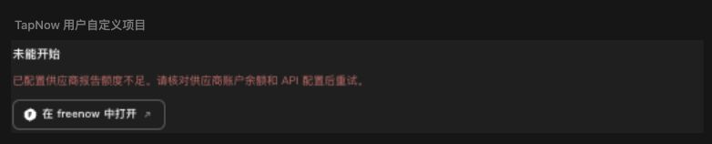

# 本地视频工具、素材容量与品牌实机验收 · 2026-10-05

本记录整理主线程已执行的真实 Computer Use（CUA）。本地验收使用生产控件、独立 QA 数据库、合成 Key 和隔离 HTTP fixture；未读取真实 Key、调用收费模型或使用私人会话。另有官方 Web 的只读界面操作，未提交官方生成。以下结果只覆盖明确列出的路径，不宣称全站复刻完成。

## 视频拟音：正式按钮与 Agent 确认链

复现入口由 `node scripts/qa-video-audio-native.cjs` 打印随机 loopback URL。它运行正式画布、AudioAPI、GenerationAPI、持久 gateway 和生产适配器；固定供应商身份通过可信服务端接缝进入隔离 HTTP fixture。详细合同见 [ThinkSound 显式替代接口](VIDEO-AUDIO-NATIVE-20261005.md)。

主线程实际使用正式音频按钮提交一次、Agent 确认卡提交一次，共 **2 个任务**。来源 MP4 原生播放得到 **8 秒、320×180、readyState 4**，播放至结束；不是只有文件存在或容器头检查。

两份输出均为 **256,044 bytes、PCM16、单声道、16 kHz 的 WAV**。原生播放器实际播放至 8 秒并触发 ended，刷新后产物与播放恢复。这些 WAV 是 fixture 的固定 **440 Hz 音调**，不是 ThinkSound 生成的拟音；结果只证明请求、归档、解码、播放和持久化链，不证明真实模型效果或音质。

- Agent 默认卡在真实公开 metadata 返回后显示 **ThinkSound Video-to-Audio（显式替代 Sonilo 音效）**和“跟随视频”，确认启用。默认 10 秒没有被当作用户指令传递；请求重建后 `inputs[0].duration` 与 `parameters.duration` 均为 **8**，供应商 wire **没有 `duration` 字段**。
- 明确指定 5 秒与 8 秒源视频冲突时拒绝，未提交新任务。缺 Key、缺路由时正式按钮禁用，没有额外提交。
- 已提交任务只 GET 原任务 ID；CDN 读取不携带 Authorization。没有重 POST 来恢复任务，也没有调用真实供应商。


## 延长镜头：官方操作对照与本地阻断

主线程在官方 Web 实际操作“回到节点”→视频节点工具栏的 **30s 图标**→“视频创作 Beta”→“延长镜头”，确认两种方向、整数 **4–30 秒**（默认 **8 秒**）和四种连续性模式。30s 是工具栏图标，不是源视频时长；该源播放器实际为 **5.1 秒**。Escape 关闭参数层后保留创作层；没有点击官方生成或取得官方生成结果。

本地隔离入口由 `node scripts/build-video-extension-fixture.cjs` 创建：

```text
/qa/video-extension-app.html?mode=native&session=<fresh-session>
/qa/video-extension-app.html?mode=unconfigured&session=<another-fresh-session>
```

在 native 模式，主线程实际选择“片头延长”、**30 秒**和“延续运镜”，验证参数层 / 创作层的 Escape 分层以及参考选择的进入、退出。源 **1080p、无声**保持，公开别名固定为 **seedance-2.5**。由于 Ark 本地视频传输尚未接通，正式“确认并生成”禁用；**POST 0、trim 0**。与前端专项检查共同确认，生成所需的媒体准备、裁片和提交被提前阻止；UI 自身仍会加载视频，不能将其写成全部视频读取为零，也不能称作延长生成已完成。

unconfigured 模式也已实际点击“打开视频延长”：正式“确认并生成”禁用，状态明确“所选生成服务尚未配置，缺少 GENERATION_API_KEY”；仍显示 seedance-2.5 / 1080p / 无声。fixture receipt 为 **posts:0、trimCalls:0、blockedAPI:0、jobs:[]**。

详细协议与来源边界见 [延长镜头参考生成合同](VIDEO-EXTEND-NATIVE-20261005.md)及 [Ark 本地视频传输](ARK-LOCAL-VIDEO-TRANSPORT-20261005.md)。方向和连续性通过 `prompt_simulation` 提示词表达；没有实测供应商连续性、向前 / 向后生成效果或只返回新增片段的质量。


## 高清素材：正式保存、picker 重插与刷新

在 `src/features/library-asset-roundtrip/qa/roundtrip.html?session=<fresh-session>&capacity=1`，主线程实际保存 **6,607,120 bytes、2048×1152 的本地合成 PNG**，再从画布空白右键“添加资产”的正式 picker 重插。

```text
原始 SHA256
0e9a5c34a7274b5643bb6bd4ec3fb6aed93a20d91d41a81c63064677fa1bdb16
```

源坐标 **54015.125 / -4155.375**未漂移；picker 使用 **128×72** 预览，画布仍为 **2048×1152** 原图。权威记录、插入内容、来源字段、原始 SHA 核对均为 true；同一 session **两次刷新后仍为 true**。两份旧 localStorage 库键写入计数为 **0**。这是实际生产库 IDB 保存链的容量验收，不以 QA preferences 成功代替权威记录。

本次容量路径**未测试下载**；不能借用以前另一素材往返路径的下载证据。实现、迁移 / CAS / 导出边界和既有测试见 [生产素材库本地容量](LIBRARY-LOCAL-CAPACITY-20261005.md)。

## 模板编辑器：脏稿 reload 与已保存版本

在明示合成数据的 `src/features/agent-apps/qa/template-editor.html`，主线程修改 HTML 后尝试 reload，编辑器和脏稿保留，页面加载计数未增加。**工具没有呈现可观测的原生 beforeunload dialog**；不声称看到或点击了浏览器原生提示。该结果证明本次 reload 尝试没有卸载页面，结合既有定向事件测试记录离页保护的范围。

保存到 **version 2** 后正常 reload，实际存储正文及 version 2 保持。这里仍是普通合成 HTML 与独立真实 artifact store，未取得或导入任一匹配官方 SHA 的模板正文。详见 [模板正文编辑与离页保护](AGENT-TEMPLATE-EDITING-20261003.md)。

## 制作进度：opaque iframe 与可见品牌

首次真实 CUA 发现外层 opaque iframe 的模块 import 被 CORS 拦截。仅修复两条精确公开路径 `src/features/agent-apps/production-progress-local-brand.mjs`、`assets/branding/freenow-mark.svg`；重启后复验通过。

生产 card / host / proxy 的中文、英文，深色、浅色以及供应商错误 / 配额状态均显示 **freenow**。F 图实际解码，原生解码尺寸 **24×24**；现有页脚布局仍以 15×15 CSS 尺寸显示。用户正文 **“TapNow 用户自定义项目”**原样保留。没有全局替换用户作品、来源名称或协议标识。



派生完整性、隔离及许可见 [制作进度品牌专项](FREENOW-PRODUCTION-PROGRESS-BRAND-20261005.md)。

## 验证与剩余工作

本次文档收尾没有重跑测试。沿用各专项已记录的结果：ThinkSound 适配器及差异检查、前端音频预检组合 **22/22**；Agent 默认时长专项先 **7/7**，随后焦点新增检查 **1/1**、文案两项定向检查 **2/2**；延长镜头 adapter / Ark **29/29**、前端 **12/12**；素材容量、模板离页保护及品牌 / CORS 结果见各自专项文档。上述差异 / 重复运行不相加为新的全项目通过总数，原有 fixture 失败也按对应文档保留。

三张本批 JPG 都是主线程真实本地截图，保留完整组件和周围上下文后裁剪；没有改变布局或 viewport 来制造画面，也没有生成式修图。数据均为本地合成内容，**不是原站截图或模型生成质量证据**；登记见 [截图索引](screenshots/README.md)。

仍未完成：**92 份精确官方 HTML 正文**、**SPZ 依赖授权待答复**、**Ark 本地视频上传 / 发布**、其余专用 adapter 及真实 Key 下的供应商验收。公共索引扫描由主线程在提交前进行，本记录不将其写成已通过。没有全站完成声明。
