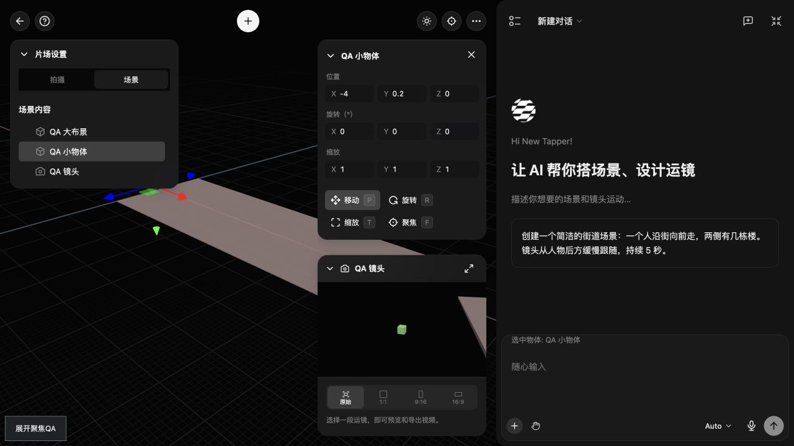

# 片场聚焦保持整场导航速度

本批修复世界视口聚焦物体后WASD速度随物体大小跳变的问题；不代表完整片场交互或视觉验收完成。

## 官方依据与本地差异

官方发布 `eb1c3578957450302e3cff5edd2ad253d0874421` 的 `page-BLLZVxQI.js`，可读副本 `reference/studio-v2-page-readable.js:2620–2628`：

- `frameObject` 根据对象世界边界中心、半对角线及横竖较窄FOV计算取景距离，调整世界相机位置、lookAt、near与far；不修改导航速度。
- `frameScene` 调用 `frameObject(root)` 后才设置 `controls.speed=Math.max(0.1,radius)`。
- `:2691–2700` 场景树选中调用 `frameObject`；`:2703–2707` 聚焦选择同样调用它；`:2866–2893` 的F、对象聚焦、场景树与查看全景完成后交接世界canvas焦点。

本地 `SceneRuntime.focus` 原来对任意对象都设置 `controls.speed`。80米布景中选中0.4米物体会把速度从整场半对角线降到0.5，随后选大布景又跳速。场景树、F、对象“聚焦”和Agent对象聚焦都复用该路径。

## 修改

`src/features/studio-v2/runtime.mjs` 仅在 `object===this.content` 的整场取景分支重算速度；普通对象取景保持已有速度。全景按钮与新增模型后的整场取景继续使用场景半径。没有改世界相机取景数学、焦点交接、坐标、对象/关键帧、历史、保存或公共API。

同链核对：本地边界球半径等于官方世界Box3尺寸半对角线，最小radius为0.5；距离 `radius/sin(min(verticalFov,horizontalFov)/2)*1.15`、方向 `[1,.6,1]` 归一化、near `max(.001,radius/1000)`、far `max(1000,distance*100)` 均与官方一致。横竖画幅、偏移旋转父级及无几何相机节点已经定向验证，没有据此增加其他取景行为。

## 窄验证与公开复现

```sh
node --test tests/studio-v2-focus-navigation-speed.test.cjs tests/studio-v2-focus-navigation-speed-qa.test.cjs tests/studio-v2-viewport-shortcuts.test.cjs tests/studio-v2-scene-panel.test.cjs
node src/features/studio-v2/qa/generate-focus-navigation-speed-app.cjs
```

12项检查通过，含本批3项生产SceneRuntime/Navigation检查、2项真实GLB/QA隔离检查及7项邻接快捷键/场景树检查。真实Navigation.update一秒W位移保持整场speed，Shift保持三倍；选小物体、大布景、无几何镜头后速度不变。场景边界扩大再查看全景重新计算speed。检查对象TRS、revision、undo/redo未被聚焦改变。

公开入口：`http://localhost:4173/src/features/studio-v2/qa/focus-navigation-speed-main.html?session=focus-manual`。从正式index接入CanvasApp/StudioAPI/WebGL，独立IndexedDB及页面内偏好存储；模型/API和外部请求在发送前拒绝，CSP限制网络/iframe。

1. 点击“准备并打开真实片场”。QA写入真实GLB：80×0.2×30大布景、0.4米小物体及镜头；经正式入口打开后点击正式查看全景。
2. “记录速度与数据基线”；`speed` 应等于 `sceneRadius`。
3. 依次“正式树选择小物体”“正式树选择大布景”“正式树选择镜头”。世界视角应分别取景，焦点回canvas，speed保持基线。本批聚焦不写对象TRS与revision/历史；既有选择路径的矩阵分解应按浮点容差核对，不能对转换后TRS使用JSON字节相等。
4. 小物体选中后按F，或点击正式对象“聚焦”；同样保持speed。世界viewport可继续WASDQE导航。
5. 点击正式“查看全景”，恢复整场取景并以当前整场radius设置speed。
6. `window.StudioFocusNavigationSpeedQA.read()` 及可见回执记录speed、sceneRadius、世界相机位置/quaternion/near/far/aspect、选中身份、原对象TRS及历史/revision。

本子任务没有使用Computer Use。Three/Navigation和GLB验证不代替实际GPU、持续按键和全部视觉验收；主线程负责真实入口复验。本批不改只读聚焦原本不产生文档保存版本的合同，也不宣称浏览器刷新会持久保存导航speed。

## 主线程实机复验

2026-10-05主线程通过隔离入口正式树依次选择small、large与camera：导航speed均保持 `44.69339996159`。小物体取景near/far为 `.001/1000`，大布景约 `.04272/11624`；速度保持与各物体取景裁剪面独立。

选择camera后scaleX由1变为 `0.9999999999999999`，属于既有变换选中路径的浮点矩阵分解，不由本批focus速度分支写入。本批不扩大修复该路径，实际TRS验收使用浮点容差。上述记录不扩展为持续WASD按键、全部GPU状态或刷新速度持久化验收。

主线程另外通过实际viewport按F、正式对象“聚焦”按钮和“查看全景”复验：speed始终为 `44.693399961591744`，revision与undo均为0；整场取景恢复基线，far为 `12161.663`。未验证持续浏览器WASD或刷新后的speed持久化。


