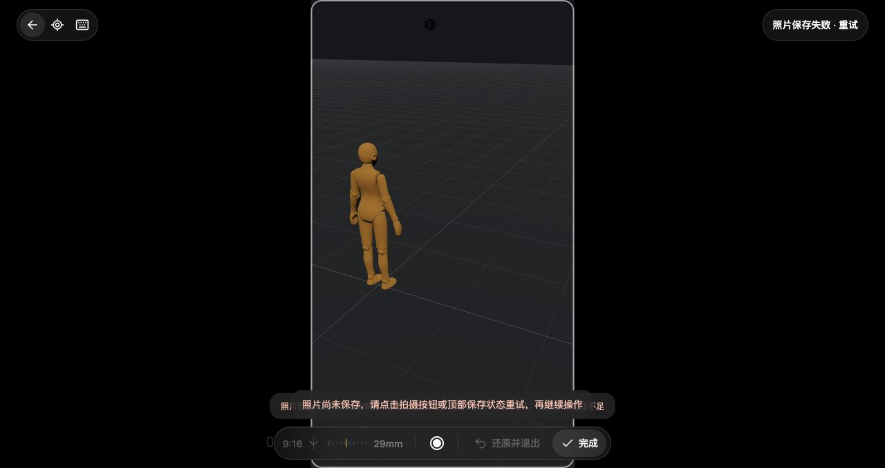

# V3 摄像机操控、光学与拍摄 · 2026-10-08

**当前源码已打通摄像机接管、三维飞行、光学滑尺、完成／还原、真实 PNG 拍摄和失败重试。** 本轮使用生产 `entry.mjs`、Three.js、LocalAssets、CanvasApp 与 IndexedDB，在独立公开项目中完成 Computer Use 验收。此批不在已发布的 `v0.1.0-alpha.1` 包内，不代表完整导演工作区或全站一比一验收。

## 使用流程

1. 在无限画布中进入导演片场，选择独立状态的摄像机，点击“操控摄像机”。
2. 左键拖动改变朝向，WASD 三维移动，Q/E 升降，Shift 加速；通过画幅菜单、焦距滑尺或预设改变镜头。方向键位于滑尺时只改焦距。
3. “完成”提交一笔领域编辑并返回原视角；“还原并退出”恢复这一段的初始镜头。失焦或隐藏只停止输入，保留编辑。
4. 快门将有效画框编码为 PNG，保存到本地素材并连接到画布图片节点。拍摄先提交当前镜头，再继续保留接管；下一段还原不撤销已经拍摄的镜头。
5. 照片保存失败时保持镜头、照片与回执，点击“重试保存照片”或顶部“照片保存失败 · 重试”。重试复用同一图片，不再次渲染或创建节点。

普通 GLB 只有画幅、焦距、快门和完成／还原；没有真实景深渲染能力，因而不显示光圈和拾取对焦。Spark 场景已接光圈／点对焦参数，真实 SPZ 景深像素仍未实机验收。有摄像机关键帧、播放／scrub、基准或只读范围时拒绝可写接管，不能降级为 base 编辑。

## 官方依据与本地模块

唯一设计依据为官方安装包、官方 Web 及[公开文档](https://docs.tapnow.media/zh/docs/canvas/create-text-and-3d)。本地 QA 只用于实现验收，不作为设计依据。具体函数、offset 和 SHA 见[源码研究](research/STUDIO-V3-CAMERA-POSSESSION-20261008.md)。

| 模块 | 已实现职责 |
| --- | --- |
| [camera-marker](../src/features/studio-v3/CAMERA-MARKER.md) | 原始 GLB、0.25m 身体、Z+0.13 偏移、双线短视锥、官方材质／层、拾取与变换 pivot；光学原点不偏移 |
| [camera-navigation](../src/features/studio-v3/CAMERA-NAVIGATION.md) | Quaternion 三维飞行、惯性、4px 拖动门槛、滚轮意图与 Alt 支点输入；使用宿主按需帧循环 |
| [camera-edit-session](../src/features/studio-v3/CAMERA-EDIT-SESSION.md) | 镜头作者事务、checkpoint、完成／取消、来源围栏和 viewport lease |
| [camera-history-adapter](../src/features/studio-v3/CAMERA-HISTORY-ADAPTER.md) | 真实领域 reducer／history、光学保留 lookAt、位姿原子清除 lookAt、事务 owner |
| [camera-control-hud](studio-v3-camera-control-hud-contract.md) | 原图标、圆环快门、画幅菜单、log 滑尺、指针捕获、弹簧回落与局部交互终止 |
| [camera-capture](../src/features/studio-v3/CAMERA-CAPTURE.md) | PNG、LocalAssets、连接图片、守卫保存、同照片重试；每个异步边界检查 owner/source/setup/fence |

进入／返回使用 0.8s／0.55s 的 cubic ease-in-out，输入与过渡都 tick 后再合并是否请求下一帧。接管采用官方原始 camera rotation，不用 derived lookAt 偷换作者朝向。接管时全部 camera marker 被隐藏；这是官方 `LU→NU→OH→LH` 上游列表门禁，和 photographic profile 的拍摄排除是两条独立规则。

快门直接将照片加入画布，不自动添加 `capturedPhotos` 或 Saved Views。官方 `w2`、历史照片加载和 `saveCurrentView` 是独立功能。本地保存失败的回执目前只存在于当前页面；刷新前须先重试保存。

## 真实界面

本机独立服务 `4196`、新项目 `qa-director-possession-public-1008`，环境无供应商 Key。人物采用本地原模型；没有生成模型调用、原站运行请求或私有官方项目截图。三张 JPEG 均由 CUA 获取真实 1280×720 页面，再直接截取 `(0,42,1280,678)` 的生产 iframe 区域，仅去除 QA 顶部工具栏，没有拼接、改样式或补画。

| 接管与竖幅焦距 | 保存失败与重试 |
| --- | --- |
|  |  |

## 本轮实机结果

| 操作 | 真实结果 |
| --- | --- |
| 新片场、人物、当前视角摄像机 | 生产入口创建、保存与再次打开成功；独立状态摄像机可接管 |
| 指针朝向、W/E 输入 | 位姿实际变化并保存到 revision 4；不是仅改变 DOM |
| 焦距尺拖动 | 23.018 → 28.25871986424353mm，保存 revision 5；9:16／FOV 64.99195200952812 |
| 修复后滑尺 ArrowRight | 焦距变为 29.386115702481316mm／FOV 62.97778609048918，保存 revision 6；position／rotation 与 revision 5 一致 |
| End 到 400mm、实际拖动后还原 | “还原并退出”后保存回读的完整 states 与之前相等，revision 仍为 6；正常视角与操作条恢复 |
| 首次 PNG | 素材真实解码为 763×1356，画布有连接图片；拍摄后仍接管，完成／关闭成功 |
| 两笔照片保存注入失败 | 同时拒绝 `createConnected` 自动保存及最后受守卫保存，确实进入失败回执；只拒绝第一笔不能证明最终拍摄失败 |
| 待重试 HUD | ratio／焦距／还原／完成禁用；快门和顶部状态提供重试；返回／恢复视图／Escape 保留镜头并提示先重试照片 |
| 两种重试入口 | 顶部状态重试前后均 4 张；修复后的快门重试前后均 5 张，没有多创建照片 |
| 最终刷新 | revision 6、5 张照片的 ID／captureId／asset／763×1356 不变；每张 `complete=true`，摄像机参数恢复 |

最终 optical position 为 `(2.390759573249417, 2.6069987269341603, 3.07116020266861)`，rotation 为 `(-0.4664352709229325, 0.4636937811120845, -2.3306333290935844e-16)`／YXZ。plan transform 的 Y 旋转按现有反射约定为负值；不能直接把 optical 与 plan 的数值相等当验收标准。最终 `capturedPhotos=0`、`views=0`，符合本批直接快门合同。

## 两项实机／交叉复审修复

- HUD 方向键被 window capture 导航先抢走。工具栏添加官方 `data-world-workspace-block-movement-hotkeys="true"` 标记，navigation 在捕获阶段按 closest 避让；滑尺 ArrowRight 修改焦距而不改朝向，画布方向键仍可导航。
- 待保存回执可被顶部恢复视图或直接选择绕过。asset 写入失败、尚无 nodeId 时切镜头会使原回执永久 stale。恢复／3D／俯视／预览／变换／操控／选择／关闭入口现在共用保存守卫；Agent `select` 明确拒绝。关闭错误保留真实重试提示，不再覆盖为已禁用的“完成／还原”。

新增 scope 回归使用真实 CameraCapture／StudioSession 和生产闭包：首次 asset 写失败，全部相关入口没有 runtime 副作用；第二次成功复用原 render／encode，只有一个图片节点；清回执后恢复视图正常可用。1/1 通过，未重复全库。

## 定向检查范围

本批按变更分段运行：marker helper 5、既有 marker 1、navigation 11、编辑会话最初 13 与 checkpoint 增量 7、capture 8、history adapter 11、HUD 最初 15 与后续 pending／键盘增量分别通过。runtime 光学／取景相关 16、entry／runtime-locks 11、possession runtime 最初 10 与后续 3 项分别通过。HUD 捕获隔离新增 2＋相关 IME 1、scope guards 新增 1 单独通过。

这些数字表示各次专项范围，不合计成全仓重跑或统一通过率。最终 entry／runtime／render-graph 语法检查通过；截图、存档与真实图片解码是宿主集成证据。

公开提交前 `git diff --cached --check` 通过，16份变更Markdown本地链接缺失为0；公开索引检查覆盖2778个blob（2208文本、570二进制跳过），凭据发现0、私有路径0。这是当前提交索引检查，不声称本轮重扫全部Git历史。临时4196服务及验收标签已关闭，未改动4173／4195。

## 仍开放的差异

- 官方独立 4096 长边离屏 JPEG .92；本地保留 viewport 实际像素、最大边 4096 且不放大，编码 PNG。这次实际是 763×1356，不宣传为 4K。
- marker 暴露身体 `outlineTarget`，完整身体轮廓 pass 尚未消费；选中短视锥颜色不等于官方完整 silhouette。
- Saved Views／历史照片面板、摄像机关键帧和录制、完整平面图、时间编辑、生成 UI、完整 V3 Agent 编排仍未完成。
- Spark 光圈／点对焦已接参数和轴向距离，真实 SPZ 视觉、全部硬件输入／IME／触屏／断点仍未实机验收。
- history API 没有 transaction ID；adapter 以 lane／label／scope 描述识别，不能区分外部越过宿主路由重建的相同描述事务。
- 未调用真实模型；独立供应商配置与质量验收仍需按各自合同处理，不能保证仅一个 Key 启用全部能力。
