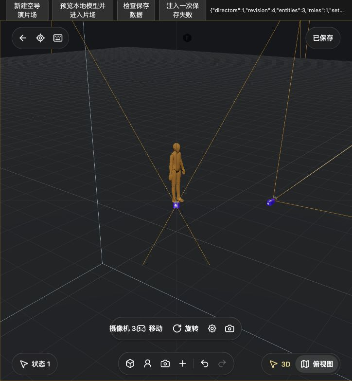
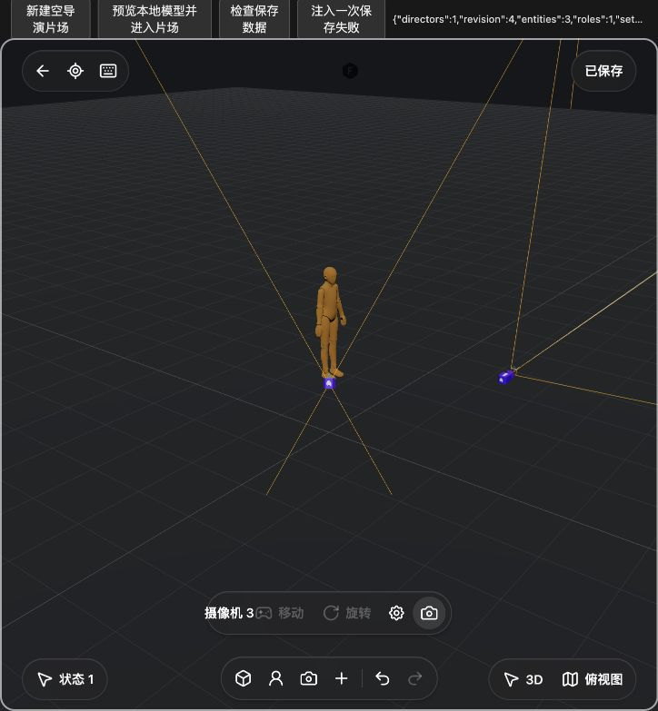
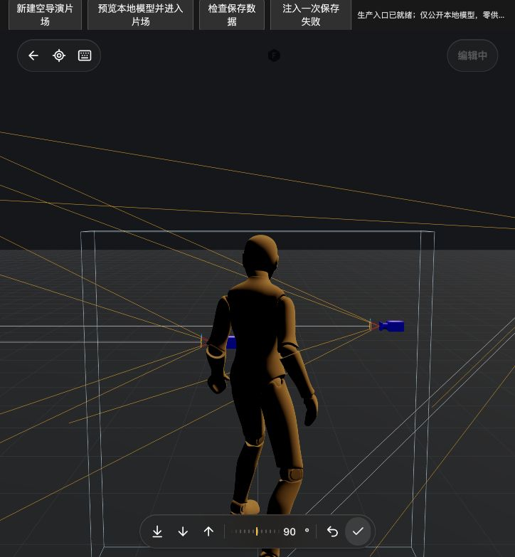

# 导演片场操控与摄像机创建 · 2026-10-08

本批接入真实人物／道具操控、原始操控工具条、地面放置摄像机和当前视角取景创建。依据[官方安装包函数与界面合同](research/STUDIO-V3-CONTROL-MODES-20261008.md)，不使用 localhost 作为设计来源。**这是局部闭环，不是全产品或完整摄影机操控验收。** 前批[实体与状态验收](STUDIO-V3-ENTITIES-20261008.md)中标为未接入的操控和创建入口，以本页增量为准。

## 操作与实现

- 人物／道具：实体菜单、选中工具条和 C 键进入；WASD、Shift、Q/E、G、指针环绕和滚轮跟随接真实模型、支撑与网格碰撞。一次进入至完成是一笔历史，完成提交，“还原并退出”恢复进入前状态。提交失败保留停止的事务，阻止新建、菜单和关闭继续执行。
- 临时动画：使用 Idle／Walking／Running，并按素材实际剪辑降级；完成后恢复用户姿态，不把临时行走写入存档。静态 Standing 空闲停止帧循环；真实动态 Idle 仍播放，不能称所有空闲人物都停止渲染。
- 工具条：官方 SVG 与动作顺序，落地、下移、上移、旋转刻度与数字、还原、完成；处理草稿、IME、失败回执和焦点轮转，输入不穿透为场景快捷键。
- 坐标：人物领域／渲染及摄影机 plan／optical 双向转换。官方 heading 反射保留俯仰和滚转，不是清空 heading 或只改 Euler.y；冲突以 quaternion 等价判断。[坐标定义与奇异边界](../src/features/studio-v3/TRANSFORM-COORDINATES.md)
- 摄像机创建：“选择地面位置”、空地右键“放置在此处”与“以当前视角添加”。地面命中高度加 1.6；独立 PerspectiveCamera／OrbitControls 调整取景，不修改导航或已保存镜头；确认一起创建 optical pose 及对应 plan pose。地面模式 Escape 退出，当前视角模式 Escape 确认。
- 取景器：19 个画幅、焦距／光圈预设、全景深和对焦距离；真实画幅黑边、拾取范围及 Spark 参数。光学修改不重设 Orbit pivot，保留非零 roll；来源、状态或所有者失效释放租约。
- 保存状态：操控或 Gizmo 事务期间显示“编辑中”并禁用保存；成功非 preview 阶段即时刷新，包括无变化完成／取消，不在每帧复制整个领域状态。

权限、输入和错误合同见[操控模块](../src/features/studio-v3/CONTROL-SESSION.md)、[工具条](studio-v3-control-hud-contract.md)及源码。V3 Agent 本批仍仅支持 `read/select/undo`。

## 真实页面与存档证据

独立服务 `localhost:4196`，后端数据 `build/qa/studio-v3-control-1008/backend`，未继承供应商 Key。[QA 宿主](../src/features/studio-v3/qa/main.html)承载生产 CanvasApp、Three.js 与 IndexedDB，独立公开素材测试项目为 `qa-director-control-public-1008`。仅用实际 UI 点击、键盘和指针，没有注入业务状态、读取用户私人项目或调用原站运行服务；用户 4173 未修改。

| 实机路径 | 可复核结果 |
| --- | --- |
| 人物操控完成 | 原人物 → 操控 → 上移 → heading 90° → 完成。真实保存 Y=`0.9999451279999999`、domain rotation `(0,π/2,0)`；动画尾端确认保存实际姿态，不称恰好 1 m |
| 还原退出 | 第二次操控改为 270°后还原；保存仍为 90°，authored pose 为 Standing |
| 当前视角竖幅 | 9:16、35 mm 创建，关闭、刷新、重开回读 revision=3，FOV=`54.43222311461495`，f/11、全景深；[完整 optical／plan 回读](screenshots/20261008-studio-controls/viewfinder-reopen.json) |
| 地面放置 | 点击真实空地创建摄像机 2；关闭、刷新后 revision=4，位置 `(2.758444552189509,1.6,-0.4280990621820546)`；[回读](screenshots/20261008-studio-controls/ground-placement-reopen.json) |
| 遮挡修复 | 载入最终 body 偏移代码后创建摄像机 3，返回导航不再出现紫色模型内部覆盖；预览与 Escape 返回正常 |
| 空地右键 | “放置在此处”创建摄像机 4并关闭菜单，位置 `(3.6447416302631366,1.6,1.3128898151220714)` |
| 事务状态 | 刷新最终修复后进入操控，立即“编辑中”并禁用；不改动完成，恢复“已保存”和可用按钮 |
| 最终持久化 | 保存、刷新、重开后完成空提交，再关闭读取 IndexedDB：revision=6、5 实体、1 角色、2 setup；90°／Standing和35 mm／9:16保留，空提交未增加revision。[最终回读](screenshots/20261008-studio-controls/final-readback.json) |

早期 `control-readback.json`（revision=2）缺旋转字段，不作为最终角度证据，以后两份完整回读为准。保存状态修复前页面仍缓存旧 entry，首次开始显示“已保存”的轮次不计通过；正常关闭刷新后重新确认“编辑中”及空提交恢复。

## 实机发现与修复

1. capture 监听的 window blur 收到子 BUTTON blur，按钮归还 Canvas 焦点立即取消操控。现在仅真 window blur 取消，工具条／Canvas 焦点轮转保留。
2. dock 的 `pointer-events:none` 与工具胶囊遗漏 `.sv3-actions` 导致点击穿透。补齐后创建入口真实执行。
3. 真实 OrbitControls 构造时初始 lookAt 改变取景朝向。构造前保留 optical pose、构造后恢复，并用 local Y 恢复 up，保留 roll。
4. 摄像机 GLB 居中于 optical origin，导航进入双面模型内部。按官方最长轴 0.25、asset yaw π/2、局部 Z 后移 0.13 修正，没有任意 proximity 隐藏阈值。预览仅临时排除自身 guide，并在 finally 恢复；此本地策略不是已证实的官方全局 guide 规则。
5. cancel 后返回导航过渡被换选／Gizmo／来源变化打断可能保留 disabled Orbit，现在恢复权限；开始和空提交无领域变化通知，单独刷新保存状态。

## 截图

本地公开模型的真实浏览器截图，上方保留 QA 控件，无拼接或生成式修图。

## 定向检查与交叉审阅

沿用本批专项，最后仅补新故障检查；未重复全仓，不合计为产品完成率。

| 范围 | 本批证据 |
| --- | --- |
| 坐标转换 | 13 项通过，含 quaternion 等价、6 Euler order与原奇异边界 |
| 光学与实体动作 | 更新后29项通过，pose冲突、lookAt、fallback、optics-only保留 |
| 操控模块 | 原14项及受影响专项通过；新增descendant blur与原窗口生命周期定向2项通过。最新文件15项未整套重跑 |
| 工具条 | 14项通过，含真实控制会话、IME／草稿及点击还原前blur |
| 取景器参数UI | 9项通过；DOM专项不代替复杂官方滑尺视觉验收 |
| 取景器运行时 | 5项通过，真实Three OrbitControls与指针事件宿主；renderer受控，实际渲染以截图为证 |
| 创建与集成守卫 | 最终11项通过；实际entry closures与真实reducer/history，VM仅DOM宿主 |
| camera body最后修复 | 新1项通过：真实原GLB几何归一化、body在optical origin后方、向前射线不命中自身及optics不变；Node bitmap shim仅PNG元数据，不冒充纹理渲染 |
| 最后检查 | entry/runtime/render-graph语法与差异空白；原包body处理及finally恢复经另一代理只读交叉审阅；保存状态实机重验 |

## 未完成与边界

- 摄影机 possession 操控未实现，本批是只读实体预览及创建取景器。操控进入0.8 s过渡、temporal selected/time-key authoring仍缺。失焦／隐藏采用保守取消，和官方部分菜单关闭策略有记录中的差异；locked／baseline入口限制未完全分层对齐。
- camera body已对齐，完整官方helper仍不同：短视锥双线、layer 5、材质/renderOrder、分离pivot/pick/outline、根scale=1及退化bounds规则；当前Three.CameraHelper不能称一比一。复杂焦距／光圈滑尺仍未复制。
- 俯视转透视仅保证地面投影一致，离地对象不同。真实高斯景深、复杂世界碰撞和大场景性能未验，普通GLB无景深虚化，没有编造性能提升百分比。
- V3真平面投影／放置、时间轴、生成UI、拍摄回画布及完整Agent仍需推进。92份技能正文、Auto／原Enhancor等长期缺口保持开放。
- 无新依赖、无供应商请求；旧macOS Alpha不含本批源码。外部能力需各供应商分别配置与验证，不保证任意一个Key启动所有能力。
