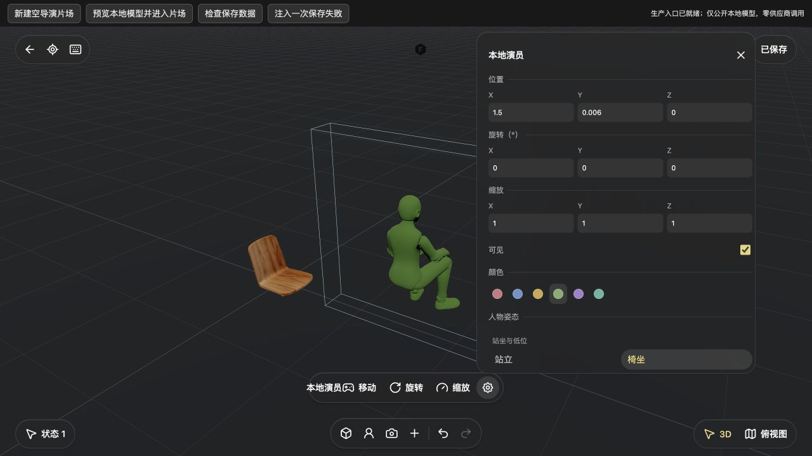
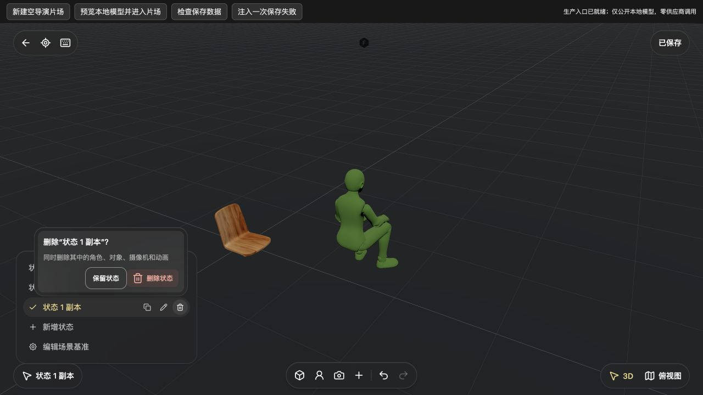
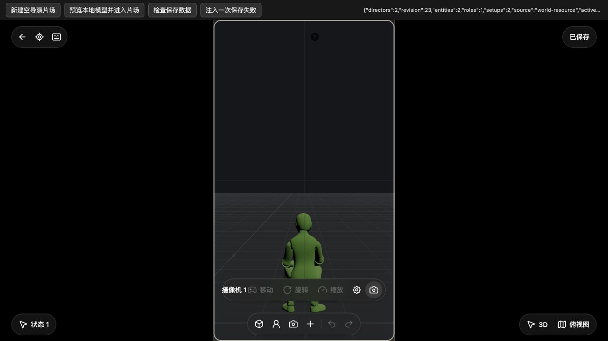

# 导演片场实体、状态与镜头 · 2026-10-08

本批继续官方导演工作区的 P1 部分实现，接入真实人物姿态、实例颜色、道具材质、镜头光学、状态复制／删除和嵌套菜单。**不是整个片场或全产品验收完成。** 前批生产入口与保存规则见[生产验收](STUDIO-V3-PRODUCTION-20261008.md)；官方证据见[实体菜单合同](research/STUDIO-V3-ENTITY-MENU-20261008.md)与[镜头光学合同](../src/features/studio-v3/CAMERA-OPTICS.md)。

后续同日增量已接人物／道具操控、heading转换、地面摄像机放置和当前视角创建，见[操控与创建证据](STUDIO-V3-CONTROLS-20261008.md)。下文保持本实体批次当时的验收范围；摄影机possession、时间、拍摄和完整Agent仍未完成。

## 用户操作和本地逻辑

- 实体属性：位置、旋转、缩放、可见性、官方六色；内置人物提供官方九姿态，道具支持原材质／白模／默认材质。数值草稿 Enter、change、blur 共用一次提交，Escape 丢弃；关闭会释放异步读取和监听。未把 GLB 中的行走等全部动画剪辑当成姿态菜单。
- 实体操作：名称输入、聚焦、落到地面、恢复初始摆放、复制、锁定／解锁、从场景移除。摄像机没有人物／道具的聚焦、落地和锁定项。官方操控角色／操控模式尚未接入，当前 TransformControls 不作为它的替代验收。
- 落地：按实际渲染模型的世界 AABB 底部中心与四角采样，排除自身；优先选择底部上方 3 cm 以内的最高支撑，否则选择全部候选最低支撑。普通本地网格直接使用 Three 射线，不要求官方 boundsTree；尚无高斯世界碰撞代理。先取消拖动并等待其同步，再读取模型和计算，避免重新写入已取消的拖动草稿。
- 恢复初始摆放：人物／道具恢复 identity，摄像机恢复 `(0,1.6,0)`、零旋转和单位缩放，并保留镜头光学。不是恢复会话打开时的位置。本批只编辑 setup base，未声称实现时间关键帧编辑。
- 删除：当前状态拥有的实例走局部移除，继承场景基准的实例按官方规则走全局级联。普通实体直接执行，无新增确认。单个实体删除保留角色定义；状态删除只回收候选且无剩余引用的角色。
- 状态：每行可复制、重命名和删除；复制非当前状态也生成独立实体、角色和视图 ID，内部关联重映射。删除有二级确认，最后独立状态可删除并自动补一个新的空状态。整次复制／删除各是一笔历史。
- 镜头：焦距／FOV／传感器裁切一致；画幅、光圈、对焦及全景深参数保存。只读预览使用真实实体相机，横竖幅居中补黑边，选取射线使用相同 frame rect；Escape 回原 3D／俯视图，预览不能被 Orbit 或变换控件改写。
- 景深：参数已赋给真实 Spark 实例，仅覆盖高斯渲染。普通 GLB 没有景深虚化，面板明确提示；本批未做真实 SPZ 景深像素验收。

## 实际浏览器验收

使用独立 `localhost:4196`、`build/qa/studio-v3-1008/backend`，显式清空模型 Key。功能内 [QA 页面](../src/features/studio-v3/qa/main.html) 打开 `qa-director-public-1008-a`，加载真实画布入口和 IndexedDB。模型为本地公开人物、餐椅；没有读取用户私有素材、供应商调用或原站运行请求。用户 4173 服务未改动。

| 实际路径 | 结果 |
| --- | --- |
| 人物属性 | 本地人物绿色、椅坐实际渲染；真实键盘把 Y 改到 3 后执行落地，回读 Y=`0.005886657753309876`，X=1.5。面板显示四舍五入值 0.006，未写回圆整数 |
| 状态确认 | 删除弹层保留父菜单；Escape 回焦对应删除按钮；“保留状态”不改数据；确认后整组关闭。最后状态删除后实体列表为空，撤销恢复原人物 |
| 连续历史 | 实际删除两个状态→两次撤销→两次重做，最终列表仅“状态 1”，重做按钮禁用，无误冲突 |
| 镜头参数 | 恢复位置 Y=1.6；设置位置 `(1.5,1.6,5)`、50 mm、9:16；FOV=`39.597752709049864`。输入焦距 0 被拒绝并恢复 50；没有成功写入非法数值 |
| 保存与预览 | 正常关闭、刷新、重开及 IndexedDB 回读 revision=23，仍是绿色 Sitting、镜头 50 mm／9:16；真实竖幅预览居中黑边，没有全屏拉伸；Escape 恢复变换按钮 |
| 非当前状态复制 | 从空状态复制原状态，修改副本人物名称为“演员副本”。回读 revision=26：4 个实体、2 个角色、4 个 setup（含基准）；原“本地演员”名称和 ID 保留，新角色／实体 ID 均不同，光学与姿态独立复制。[回读 JSON](screenshots/20261008-studio-entities/copy-readback.json) |
| 确认菜单快捷键 | 焦点在“保留状态”时实际按 Delete、Backspace、G、L、⌘Z，菜单、镜头和数据不变，没有场景快捷键穿透 |
| 基准创建与删除 | 基准禁用添加摄像机；新增共享人物成功，回独立状态其变换按钮禁用。从“从场景移除”直接删除，最终基准为空，原实体与副本保留。最终 revision=32：4 实体、3 角色、4 setup；第三个未引用角色按单实体删除合同保留。[最终回读 JSON](screenshots/20261008-studio-entities/final-readback.json) |

一次创建复验发现本地默认 `ground:{}` 没有 y，直接相加产生 NaN，人物未创建。已统一有限地面高度、缺省 0 后刷新重验，基准人物真正创建并完成删除；专项覆盖空地面和负地面。该失败轮次不计作成功创建。一次 DOM 入口点击因刷新后节点变化失败，改用新 AX 中实际入口成功；没有绕过页面业务逻辑。

道具全部材质／颜色组合、九姿态全部浏览器鼠标路径、可见性全态、输入法硬件和大型场景未逐态实机验收。参数和 DOM 专项不是整个产品视觉通过。

## 截图

原始浏览器截图，未合成或生成式修图；上方是 QA 控件，下方是真实工作区。

## 定向检查和交叉修复

沿用各负责模块的新鲜专项，不重复旧全仓或合计成产品完成率：

| 范围 | 本批证据 |
| --- | --- |
| 光学与既有实体动作 | 26 项及 1 项受影响真实 Three 投影检查 |
| 属性面板 | 11 项，实际本地 GLB 九姿态校验、单次提交／失败恢复／生命周期 |
| 实体菜单动作 | 新 7 项 + 受影响删除 1 项 |
| 状态复制／删除 | 7 项；完整级联、新 ID、关联重映射、精确撤销重做 |
| 同历史通道连续重做 | 新 3 项，跨通道冲突仍阻断 |
| 嵌套菜单 | 原 10 + 新 16 项；所属关闭、外点、父动作、不活动回调和一次 dispose |
| 落地 | 5 项，真实 Three 网格、角支撑、自排除、坡度与旋转缩放 |
| 运行时光学与取景 | 新 11 项，preview／capture、真实投影、黑边拾取、过期结果、按需帧和清理 |
| 集成守卫 | 新 5 项，直接执行生产 entry closure／真实 history 与 reducer；覆盖快捷键、取消后同步、旧镜头锁含义和地面缺省 |

交叉审阅发现并修复菜单快捷键穿透、落地重新写入已取消拖动、历史镜头 `locked:true` 的 UI／运行时判断不一致。同通道连续重做误冲突也已修复；此项明确是本地可靠性补齐，不声称官方原实现正确。

## 仍开放的合同

官方操控模式、人物／相机 heading 映射、完整地面放置与当前视点 viewfinder、平面投影／拖摆、输入租约、时间轨道／播放、生成、拍摄回画布与完整 V3 Agent 仍需继续实现。当前普通添加摄像机是本地基础入口，没有冒充官方完整创建子菜单。官方取景框的 FOV 面积补偿、旧 focusDistance 兼容、复杂高斯碰撞／大场景性能仍未全验。

没有新增依赖，没有重建旧 Alpha；已发布 Alpha 不包含本批源码。接口可用性和供应商质量需按具体操作验证，不能写成全产品只填任意一个 Key 即可工作。
