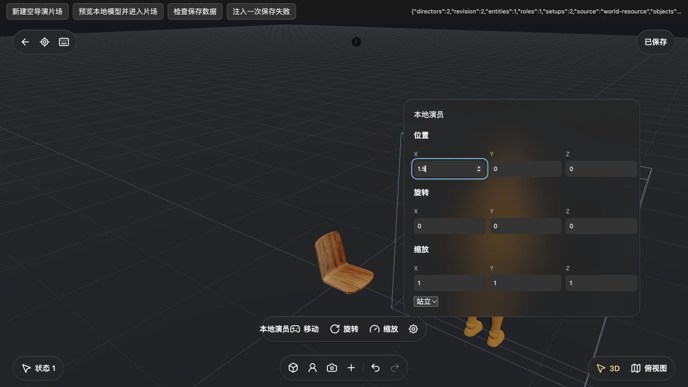
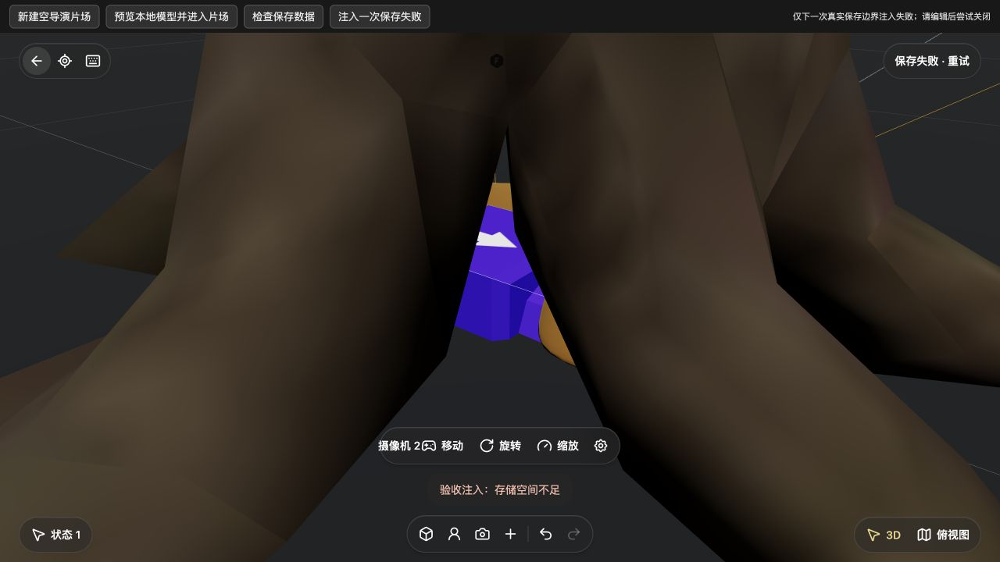

# 导演片场生产入口与本地保存 · 2026-10-08

本批把 `studio-v3` 的领域基础接入真实画布、IndexedDB 和 Three.js 工作区，交付 P0/P1 的部分闭环。**尚未完成整个导演工作区，不能用现有 v2 片场能力代替 V3 验收。** V3 是本项目的内部代际名称，官方导演工作区与独立 GLB 编辑器仍是两条并存入口。

后续同日[实体、状态与镜头增量](STUDIO-V3-ENTITIES-20261008.md)已接入九姿态、实例颜色、镜头光学、状态复制／删除和分层菜单，并有新的刷新／存档回读。下文保留本次最初生产批次的验收范围，不把后续证据混入旧计数。

## 最新：时间轴与只读历史相册的生产接线

[本批验收](verification/20261008-studio-temporal.md)单独记录 `temporal-actions`、`temporal-playback`、`temporal-workspace`、`timeline` 与 `photo-history` 的生产集成。时间作者操作进入独立setup的history lane；preview/playhead/loop仅用于显示，采样状态不送进session保存。当前只展示正在操控/选中/所选key所属实体的一条轨道，未制造全实体轨道表、缓动菜单或连续录制UI。

生产实机保存餐椅0/3000ms的X0→3，1500ms显示root X1.5而base X0；取消新key确认在视图复原修复后reload重验保持revision与keys。实际2000→997ms拖动只形成一笔undo，恢复0/2000/3000，redo/匀速及key/track删除undo通过。时长4→3秒后被末key阻止继续缩短；循环播放跨末端不改revision4，reload保存的keys恢复。带key的相机经真实焦距滑杆35→36.396mm，快门新增4096×2304 JPEG且HUD保留；继续改为37.848mm、完成并reload后key保留，base仍35mm，revision18/dirty false。普通快门没有增加两张历史照片。

相册仅在原 `capturedPhotos` 非空时显示入口，实机两张本地JPEG真实解码1280×678，逆序/缩略图/方向键/Escape通过。它不是镜头管理、生成历史或View保存，不重渲染/生成资产，普通快门仍只回填画布。模型导入/生成完整流程、P2全部交互与完整V3 Agent尚缺，SPZ像素未验；无新依赖或供应商调用，旧Alpha不含此批。以下最初生产批次的revision、测试计数和遗留门槛保留历史口径，后续补齐范围以较新的专项证据为准。

## 使用入口

- 本地 GLB/SPZ 资源节点 → 预览 →「在 3D 片场中使用」：创建连接原资源的独立 V3 owner，再打开导演片场。原资源节点不改写。
- `StudioAPI.createDirector()` 创建空导演片场。现有画布「添加 3D 片场」仍创建 v2；既有 studio/v2 节点不隐式迁移。
- V3 节点「进入片场」恢复其本地状态。
- 可创建人物、摄像机及现有本地道具；修改坐标/旋转/缩放、切换人物姿态；选择、重命名、复制、锁定或从当前状态移除。
- 状态菜单支持新增、复制、切换、重命名以及基准进入/退出。基准实体在独立状态只能读取变换，须回基准编辑。

## 保存和资源边界

`entry.mjs` → `session.mjs` → `CanvasApp.publishStudioV3` → `CanvasStore` 使用真实生产代码。候选完整画布先写入 IndexedDB，成功后才发布 live 节点与一笔画布历史。失败 payload 不进入 live graph 或 undo history；会话私有编辑保留，可重试。所有当前画布保存路径均捕获节点 write guard，排队保存再次检查会话、项目、owner/source 身份和版本。

关闭必须保存成功；失败保留片场、提示错误并允许重试。活动变换事务先取消；尚未完成事务不能伪报已保存。异步初次渲染失败会拒绝打开，已被新工作区替换的旧初始化不能清理新工作区。启动失败且保存失败时保留错误页，允许重试保存和返回。

运行资源只从本机 `asset:`、本地静态目录或本机归档路由读取；拒绝外部模型、重定向和 GLB 外部依赖。V3 GLB 预算 100 MiB，SPZ 使用现有 64 MiB 预算；这不是整场景峰值内存保证。静态 Standing 不持续刷新，动画/Orbit阻尼按需刷新，隐藏页面暂停。未给出无实测依据的 FPS 提升数值。

## 实际浏览器验收

独立 `localhost:4196` 服务，后台数据在 `build/qa/studio-v3-1008/backend`；显式空模型 Key，未调用供应商。使用 [功能内 QA 页面](../src/features/studio-v3/qa/main.html) 的公开项目 `qa-director-public-1008-a`，iframe 加载真实生产入口。QA 仅提供项目准备、公开模型导入、真实存档回读和一次错误注入。

| 路径 | 实际结果 |
| --- | --- |
| 空片场创建/编辑/刷新 | 官方人物 GLB 真正渲染；人物 X=2，摄像机、树及第二角色恢复；基准新增角色后回独立状态，该基准角色的变换控件禁用。首次关闭回读 revision=7、entities=4、roles=2、setups=2；刷新重开 X=2 |
| 属性菜单 | 数字输入 Escape 关闭面板并回焦触发按钮；无上层画布快捷键误触 |
| 俯视图 | 正交俯视实际显示树/网格/镜头范围；这是基础视图切换，尚不是官方完整平面图与站面放置交互 |
| 保存失败 | 在真实 `CanvasStore.save` 边界仅一次注入 `QuotaExceededError`，新增摄像机后关闭被拒，原场景保留；保存按钮重试成功。不是实际磁盘满测试 |
| 撤销/重做 | 新摄像机撤销后重做，再正常关闭；真实 IndexedDB 回读 revision=10、entities=5、roles=2、setups=2 |
| 本地模型到导演片场 | 公开餐椅 GLB 经真实 `WorldNode.importAt` 导入为本地素材，再从生产预览进入；创建第二个 V3 owner，sourceKind=world-resource，原来源保留并连线；模型及新增人物实际渲染 |
| 模型片场刷新 | 关闭/刷新后 source owner revision=1、entities=1、roles=1，重开恢复模型和人物 |
| 重命名/数值提交 | 同锚点的上下文菜单能进入重命名框，Enter 保存「本地演员」并回焦；真实键盘输入 X=1.5 并 Return 提交，关闭回读 revision=3、name=本地演员、position={x:1.5,y:0,z:0} |

本轮发现并修复菜单同锚点切换、未等待异步重命名、首次渲染吞错、旧会话清理和错误页无法重试保存。交叉审阅已确认相应修复。

无效轮次如实排除：最初 QA 直接用 `/assets/...` 填资源节点，预览的本地素材守卫按设计拒绝；随后改为真实导入，未放宽生产守卫。另一次 `locator.fill` + Tab 只改变输入框显示值，实际存档仍是 X=0；未计作坐标编辑成功。随后使用真实键盘输入和 Return，已从存档读到 X=1.5，截图覆盖为正确提交后的状态。

日志保留一条早期 `MutationObserver.observe` 非 Node 错误（2026-10-07T21:48:28Z，缺源码位置）；后续加载没有新增该记录，尚未定位来源，不能声称整页零错误。

## 实机截图

未经拼接或生成式修图；上方是独立 QA 控件，下方是正式片场。人物和餐椅来自已本地化公开示例资源，不包含私人项目或 Key。

## 定向检查与未验范围

沿用本批已运行证据，不重复全仓测试，也不合计为整产品完成率：

- CanvasApp 持久化 30/30；联合真实 app/store/session 保存回归 10/10，仅 IDB事件与 renderer 是受控替身。
- 会话专项先 27/27，补充受影响检查两批 2/2；当前文件有 30 项，不称整套重新全跑。
- runtime 最新 20/20，新增三项使用真实 Three TransformControls 验证取消/换选/正常提交；assets/runtime 前批 23/23。
- 实体动作先16/16、补充受影响4/4，当前18项；菜单10/10；异步命名4/4。
- 修改模块语法与差异空白检查通过。未做全部设备/视觉状态/大型场景性能、真实供应商或完整桌面新包验收。

## 后续门槛

[P0–P6 实现映射](research/STUDIO-V3-IMPLEMENTATION-MAP-20261008.md)继续有效：不把任何阶段的全部门槛标为完成。最初生产批次的P1光学/颜色、P3时间轨道/播放/镜头控制、P5取景/拍摄等缺口已有同日专项补齐部分；当前时间轴与相册以上方新证据为准，既有[操控与创建](STUDIO-V3-CONTROLS-20261008.md)、[镜头摄影与导出](verification/20261008-studio-shots.md)另有独立范围。P2站面放置/平面投影/拖摆方向/输入租约的完整流程、P4模型导入与生成任务UI、P6完整编排仍未完成。

V3 Agent 暴露 `read/select/undo`，其余操作明确拒绝；生成结果暂不落入 V3，保留结果，不误路由旧 v2。`scene_read` 返回版本、能力、单位、对象与保存状态；尚未实机验证 Agent SDK 的 V3 全链。P6 完整编辑/生成/拍摄编排仍未完成。

现有 Alpha 是先前 commit 的安装包，**不包含本批新源码**。不支持任意官方紧凑存档或旧节点迁移。模型接口与供应商验证应按具体操作分别补齐；不能称全产品只填任意一个 Key 即可工作。
