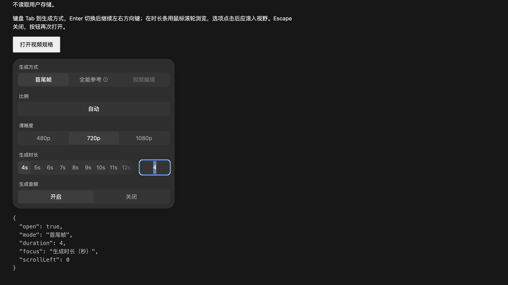

# 视频规格菜单：焦点与长时长浏览

## 官方证据与三个候选

2026-10-05 独立核对 `/Applications/TapNow.app/Contents/Resources/web` 的 0.4.81 安装包，与当前生产模块 `src/features/video-generation/menus.mjs` 比较。官方素材仅用于本地只读取证，不发布原始 bundle。

直接相关包：`assets/course-api-base-url-CGXqZmAy.js`，3,444,954 bytes，SHA-256 `157e386a92b4f5fa4b3b6111c41c178e160ca3025947fe63858d044ab6e593ca`。

| 候选 | 官方当前证据 | 本地差异与处理 |
| --- | --- | --- |
| 生成方式切换后的键盘焦点 | `si`（字符偏移 1742277）以 `String(value)` 为按钮稳定 key，点击只更新 value/onChange；`videoConfigs.generateMethod`（偏移 3180668）在同一面板使用此组件 | 本地 mode 变更重建所有子节点，删除当前焦点。现仅在被激活按钮拥有焦点时，把焦点恢复到归一化后的同一规格选中项；选项消失时回到面板 |
| 当前时长在横向条之外 | `si` 的布局 effect 在初次挂载、options/value 变化时，按当前按钮位置将选中项居中；ResizeObserver 重算 | 本地只更新高亮和边缘 mask。现初次绘制、选值和 resize 时滚入当前项；手动滚动只更新 mask，避免被拉回 |
| 鼠标垂直滚轮浏览时长 | `si` 的 onWheel 只在有 overflow、deltaX=0 时转换；像素级 deltaY 绝对值小于 50 放行；目标受滚动边界限制 | 本地没有 wheel 行为。现保留上述 guard，转换为水平滚动；`prefers-reduced-motion: reduce` 时使用 `auto`，其余用 `smooth` |

本地忽略目录中已有 readable 也能交叉核对：`canvas-current-readable.js:19832-19881` 的 `Xr`，以及 `29320` 附近的 `Ete`。当前安装包证据优先。

## 实现范围与生命周期

变更限于 `src/features/video-generation/menus.mjs`。重建和关闭都断开 ResizeObserver、移除 scroll/wheel listener 与旧分段键盘处理；已排队的帧通过 disposed/revision guard 失效。没有添加依赖，没有修改生成/供应商请求或用户配置。

回归测试：`tests/video-specifications-interaction.test.cjs` 覆盖焦点归一化、继续方向键跳过禁用项、不窃取外部焦点、选项滚入/resize、手动滚动、wheel guard/边界、reduced motion、重建和关闭清理。

```sh
node --test tests/video-specifications-interaction.test.cjs
node --test --test-name-pattern='closed or rebuilt video specifications' tests/node-generation-menu-dismissal.test.cjs
node --check src/features/video-generation/menus.mjs
```

已验证：专项 5/5、旧 stale-duration 回归 1/1、加上视频引用配置回归共 13/13；正式模块与 QA 脚本语法检查、`git diff --check` 通过。完整旧菜单套件首个 legacy modelMenu 测试仍有既有异步夹具问题：`node-editor.js` 的 modelMenu 等待 depthComposerReady，而该夹具把 import 替换成永不 resolve 的 Promise 后立即断言菜单已打开。完整组合 13/14，其余通过；本批没有修改 node-editor.js 或该夹具。

## CUA 验证入口

`http://localhost:4173/src/features/video-generation/qa/specifications.html` 是最小隔离页面，直接导入正式模块和 Seedance 2.5 catalog，初始选中 30 秒、一张合成图片引用，不运行生成、不访问用户存储。该页面仅搭建打开/关闭宿主；验收对象是正式菜单，不是从 QA 反推产品需求。

1. 点击“打开视频规格”，确认 30s 出现在横向条内。
2. Tab 到“全能参考”，Enter 激活，继续 ArrowLeft / ArrowRight；焦点和描边应留在生成方式的可用按钮，不能跳到 body。
3. 在时长条上垂直滚轮，确认能浏览前面的时长，滚动后不会立刻回到 30s。横向触控板滚动继续使用原生行为。
4. 选择另一时长，应滚入视野。数值输入选择末端时长也应滚入。
5. Escape 关闭，再打开；当前选择继续可见，无旧 listener 重复滚动。

## 真实 CUA 验证结果

2026-10-05 主任务通过上述隔离宿主验证正式生产菜单：

| 操作 | 实际结果 |
| --- | --- |
| Tab 两次到“全能参考”，Enter 切换 | 设置切换为全能参考，焦点保留在全能参考按钮 |
| ArrowLeft 到“首尾帧”，Enter 切回 | 焦点转到首尾帧并在切换后保留 |
| 初次打开，当前 30s | scrollLeft 为 568；30s 的左右坐标 310..342，完全位于容器 44..344 范围内 |
| 原生 wheel：deltaY=-120、deltaX=0 | scrollLeft 从 568 变为 448；继续其它工作后仍为 448，没有被自动拉回选中项 |
| Escape 关闭，再打开 | 菜单关闭，焦点返回入口按钮；能够再次打开 |
| 时长输入框填入 4，Enter | duration 为 4，scrollLeft 为 0，当前时长进入视野 |
| 时长输入框内 Escape，再按一次 Escape | 第一层回到菜单，第二层关闭并将焦点返回入口 |

截图（输入 4 后的选中态）：



独立只读交审也已通过，未发现确定问题。该页使用真实生产菜单与隔离宿主；正式 node 整页的外层关闭本批未重验，不能将本页结果扩展为完整画布宿主的 Escape 验收。
