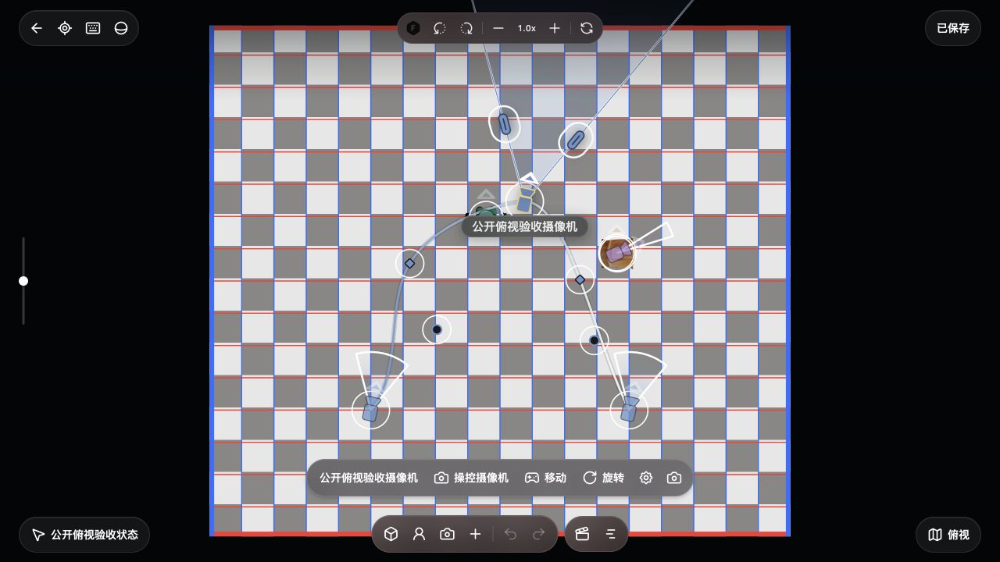

# 2026-10-08 平面放置、轨迹与关键帧验收

本批补齐角色/机位放置、时间轨迹曲线、关键帧位置/朝向和相机关键帧 FOV。**这是导演片场 P2 的增量，完整功能对齐仍在进行。** 参考为[官方安装包源码合同](../research/STUDIO-V3-PLAN-PLACEMENT-PATHS-20261008.md)，本地生产页面只用于实现验证；不以本机其他项目作为参考。

## 实现与所有权

- 新角色名/六色草稿、已有角色和摄像机菜单接入真实放置。新摆位固定首次支撑点，点击采用零朝向，拖动仅改变朝向；选择最高有效支撑面，normal.y 至少 .65，无命中回退地面，摄像机高度加 1.6m。已有实体和关键帧移动保留 authored Y。
- 曲线点击只选择实体或接近端点的 key；曲线拖动锁定原 segment/t 并修改 bend，不隐式新增关键帧。Bezier 首/末控制点、bend、key 位置及 sampled heading/相机 FOV 可编辑，hold 与端点保护遵循合同。
- 关键帧右键/已选 key 再次点击只有“删除关键帧”；bend 右键直接重置，endpoint 右键消费但不修改。端点近锚点时使用 30px 屏幕代理，并保留初始指针偏移。
- 所有作者操作复用真实 session/history 和 temporal 作者目标，固定目标 key，不把采样快照写回 base。一手势一事务；来源/状态/原生对象换代与迟到 lease 均被围栏拒绝。
- 轨迹 geometry cache 随作者 editEpoch、状态或资源来源失效；选中、播放头与纯保存 revision 不重建曲线。稳定 SVG 节点和局部 RAF 承接预览；这不是全设备 FPS 验收。
- 提交失败仍保留原 owner/lease；回滚失败可重试。无变化事务消费后正常释放编辑权、没有撤销记录；真实保存确认不终止 key 光学编辑。
- 最终截图发现本地常驻“添加摄像机”入口保留旧选择，工具条遮挡提示。进入 pending 前清除旧实体选择和 temporal key，实机提示可见、Escape 保持俯视。官方 setter 清 action/key，正常入口避免旧选中实体；本地清实体选择与提示底部留白是入口适配，不声称官方提示固定在 84px。

模块合同：[放置](../../src/features/studio-v3/PLAN-PLACEMENT.md)、[轨迹作者桥](../../src/features/studio-v3/PLAN-TRAJECTORIES.md)、[交互层](../../src/features/studio-v3/PLAN-SURFACE.md)。

## 原生浏览器操作

独立 4196 服务、公开 GLB/原人物和摄像机资源、`qa-plan-public-1008` 项目，供应商 Key 为空。准备夹具通过真实领域/session/CanvasStore 种入房间、餐椅、机位及三条真实时间 key；后续操作均由 CUA 原生点击、拖拽与键盘完成。诊断按钮只读取作者/持久化/历史，不保存、不移动场景。十组读数保存在[原生操作记录](20261008-studio-plan-placement-paths.json)，不读取隐藏 window app 状态。

| 操作 | 观察结果 |
| --- | --- |
| 新角色 | 青绿色 `#63B5A2` 的“本地放置角色”由角色菜单创建，位置 `(-.2137117117,≈0,-.9671439296)`；单笔历史，撤销移除、重做恢复，关闭/刷新后仍在。 |
| 支撑面机位 | 摄像机 2 固定在 `(1.8165495492,2.0467237839,-.4323177934)`；餐椅支撑约 .44672378m 加1.6m，拖朝向为1.14378332rad；一笔历史，资源 ready，刷新保留。 |
| 曲线 bend | 原生拖动创建 spatialBend，一笔 history，原 base 摄像机位置未改变。 |
| key FOV | 中间 key 的32.26880217°/35mm/.22rad改为43.84138799°/25.16046606mm/.07401850rad；其他key和base不变，一次撤销恢复原光学/朝向。该编辑最终已撤销。 |
| 起点控制 | 原生 endpoint 拖至 `(-.9778084715,1.5,.7536810804)`，只一笔history，Y保持。 |
| key 位置 | 中间key移至 `(.3828729282,1.5,-1.2326345352)`；base仍为 `(-2,1.5,2)`，一笔history。 |
| 删除/恢复key | 右键菜单只显示删除，删除中间key后剩两条；一次撤销恢复三条及已编辑位置。删除最终已撤销。 |
| bend直接重置 | 刷新代码后的正式页面右键bend，无菜单、曲线改变、撤销变为可用；一次撤销恢复完全相同的可见SVG路径。此项是DOM几何/原生操作证据，未另读取作者JSON。 |
| pending与菜单 | 新角色空名禁用，输入/颜色草稿可用；Escape先关闭子菜单并回父项。由已选key进入机位pending后，选中key数变0、实体工具条消失、提示可见；Escape取消pending仍在俯视。 |

关闭 QA 工作区后，独立正式生产页面重新加载同一项目并复验菜单、已保存机位的 Y=2.047m 属性、轨迹及 pending 可见性。QA 操作时 iframe/诊断展开影响投影；最终图证在生产页面实际1280×720视口采集，未为截图变更视口、样式、裁切或拼接。

## 完整生产截图

| 截图 | 范围 |
| --- | --- |
| [轨迹/key/FOV控件](../screenshots/20261008-studio-plan-placement-paths/plan-paths.jpg) | 三个时间key、Bezier控制/弯曲和当前key光学，与真实房间共用投影。 |
| [角色子菜单](../screenshots/20261008-studio-plan-placement-paths/role-placement-menu.jpg) | 角色名、六色、“添加并放置”、右侧子菜单；截图草稿未提交成第二角色。 |
| [已保存支撑面机位](../screenshots/20261008-studio-plan-placement-paths/camera-placement.jpg) | 真实机位属性Y=2.047m、朝向65.5°。 |
| [关键帧菜单](../screenshots/20261008-studio-plan-placement-paths/key-menu.jpg) | 只有删除关键帧。 |
| [放置提示](../screenshots/20261008-studio-plan-placement-paths/pending-placement.jpg) | 最终修复后提示不被工具条遮挡。 |

## 分批检查与未验范围

沿用本连续批次实际执行结果，不合计成全仓总数、也未重复重跑成功套件：placement 12/12；路径和关联temporal首次27/27、后续key光学/缓存新增4/4；surface首次25/25、后续key光学2/2；入口新增6/6、旧review11/11；菜单hover1/1、旋转click/键盘2/2；commit/cancel/no-op及save-ack失败边界3/3。截图遮挡修复后仅新增入口“selected camera → pending”回归1/1，并刷新生产页面原生复验。

key-heading独立鼠标路径、极端proxy/混合hold曲线、此批保存失败UI组合仍未全量原生复验；相关领域/输入回归不替代实机全态验收。orbit/3D添加角色仍立即创建，不能称完整三维放置对齐。完整Saved Views、模型导入/生成任务生命周期与P4 UI、持物呈现、完整V3 Agent编排仍缺；真实SPZ/DOF GPU、跨设备/大场景性能与逐像素对比仍未验。GLB景深虚化未实现。

本批无新依赖、无供应商生成API或TapNow服务调用。旧 macOS Alpha不包含10月8日源码增量；不能宣称所有功能只填一个Key即可运行。
