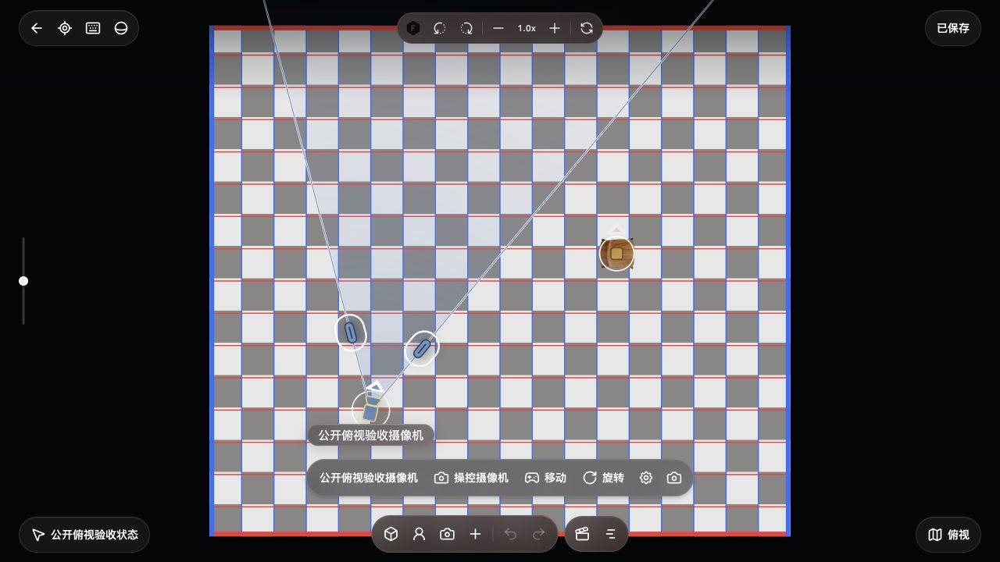

# 2026-10-08 俯视、房间与场地来源验收

接入独立正交俯视、现有实体移动/朝向/摄像机 FOV、真实六面房间及本地场景选择。**本批是 P2 的已验证子集，完整产品还原仍在进行。** 设计依据为[官方安装包合同](../research/STUDIO-V3-PLAN-20261008.md)。本次打开线上原画布看到的是既有导演台节点；它不能作为新版 Workspace 俯视面板逐像素一致的验收证据。本地页面仅验证实现。

## 实现

- 投影与命中共用最近一次成功显示的 projection；平移、缩放、旋转和剖切为本地导航状态，不写作者历史。
- 默认剖切 1.6 米，真正修改正交相机 near；`all` 使用场景深度范围。旋转步长 15°、缩放倍率 1.12，保留导航阻尼。
- 现有实体拖动保留 Y、缩放、倾斜；摄像机通过既有 plan/optical 坐标转换。FOV 拖动同时提交 heading/fov，并保持对侧边缘。
- 现有时间作者桥承接俯视编辑，固定编辑目标，不把采样快照写回基础状态；此规则有真实 session/temporal 的专项回归。本批浏览器没有另建关键帧重测。
- 六个内向平面、真实 bounds、64px 程序纹理与标线构成房间；宽/深/高、参考图案、样式和间距接入同一房间配置。
- 场地支持空白、房间与画布中的本地 GLB/SPZ 世界结果。原 `sourceBinding` 保留为来源记录；历史场景支持 direct 和官方 `lod_assets` 的本地 `100k`/`full_res` 候选。每个 URL 使用自身配对格式，远程资源必须先本地化。
- 关闭菜单同步取消其房间租约，迟到的准备不能创建新事务；返回画布先取消俯视事务。等待时间作者恢复和渲染同步后，复核完整作者身份，避免旧操作写入新状态。
- marker 不再逐帧重插 DOM；原生轻点在 pointerup 完成选择，后续 click 保护只作用于原指针/marker。长中文实体名正确截断。场地菜单外壳避免 `will-change:opacity` 阻断子面板 backdrop 模糊。

## 真实浏览器操作

使用独立 4196 服务及 `qa-plan-public-1008` 项目，未继承供应商 Key。准备按钮通过真实领域 reducer、session/history、CanvasStore 写入公开餐椅 GLB、相机和 8×6×3.2 米房间；后续编辑通过生产 UI 的原生点击、拖拽、键盘完成。[诊断页](../../src/features/studio-v3/qa/plan.html)只读按钮不保存或移动场景。

1. 切入俯视，真实 WebGL 房间和 SVG 节点正常显示。餐椅第一次拖至屏幕 `(694,248)`，投影结果与终点一致，Y=0，只有一笔实体变换历史，实际项目记录已保存。
2. 右旋后最终 rotation=−π/12，zoom=1.12。再拖餐椅至 `(752,286)`，反投影为 `(1.8085553303580018,0,−0.4245288312410299)`，单次提交，无残留事务。后续正式页面原生旋转也确认每次 15°；阻尼阶段读数逐渐收敛。
3. 房间宽度文本修改为 9 米；深度从 6 米向右 scrub 64px 得到 `7.917047464637365` 米，连续预览只增加一笔历史。Escape 先收起设置侧栏，再关闭菜单并回焦；刷新 revision 5 后房间和节点位置保留。此轮文本操作确认了值提交，不单独宣称 Enter 键路径已验证。
4. 复验原生点击能一次选中摄像机。左侧 FOV 手柄拖动后，FOV 从 `32.26880217111643°` 变为 `46.744283887363174°`，heading 从 `0.22` 变为 `0.039908257501529286` rad；位置仍为 `(-2,1.5,2)`。一次撤销同时恢复 35mm、原 FOV 与 heading。
5. 朝向手柄独立拖动使可见 glyph 从 `12.605071492878114°` 变为 `45°`，撤销恢复原朝向。剖切 `all` 时 near=`44.79999997615814`；恢复初始视图仍停留俯视，剖切恢复 1.6 米/near=48.4。导航未增加历史记录。
6. 空白场地切换保留实体，可撤销回房间。初始 3D 场景列表显示空态；显式导入 607700 字节的公开餐椅 GLB **来源加载样本，非生成结果** 后，列表提供缩略图与选择项。选择变为 `history-world`，runtime source 为 ready、root 存在；保存回读 revision 10、dirty=false。撤销恢复房间。
7. 返回画布、重开正式项目后再截图；原生摄像机选择、长名称布局和场地设置面板均在正式页面复验。图片没有拼接或生成式修图。

数据见 [plan-state.json](../screenshots/20261008-studio-plan/plan-state.json)。诊断值对应各步当时状态，后续操作继续提高 revision；不把不同轮次数字当作同一最终快照。

## 图证

| 图证 | 内容 |
| --- | --- |
| [俯视摄像机](../screenshots/20261008-studio-plan/plan-camera.jpg) | 正式生产页面、房间与相机 FOV/朝向编辑控件。 |
| [场地设置](../screenshots/20261008-studio-plan/space-room.jpg) | 9×7.9×3.2 米参数、参考样式与标线间距。 |
| [现场房间](../screenshots/20261008-studio-plan/room-orbit.jpg) | 同一保存场景的真实六面房间。 |
| [本地场景列表](../screenshots/20261008-studio-plan/source-picker.jpg) | 显式导入的本地公开 GLB 来源加载样本。 |

## 定向验证与边界

沿用本批各模块实际执行结果，不重跑全仓，也不把重复用例合计成性能/质量指标：投影/导航 21 项，renderer 3 项、runtime 3 项；plan surface 最后全文件 19 项通过，随后仅旋转/键盘窄验证 2 项；plan 作者桥初次 8 项及取消幂等新增 1 项；room/space 13 项；菜单初次 7 项通过，修正浮点断言后失败 wheel 项单独通过；来源初次 7 项及混合格式新增 1 项；新增 entry 租约/关闭/fence 回归 11 项通过，旧入口受影响 5 项重新通过。CSS 模糊修正通过真实浏览器计算样式和截图复验，不增加镜像样式测试。

仍缺完整路径/关键帧曲线、端点/弯曲和新放置支撑面流程、完整视图管理、模型导入/生成任务生命周期及完整 V3 Agent 编辑/生成/拍摄编排。真实 SPZ/高斯景深像素、大场景性能和全设备视觉未验；本批仅 GLB 实机，不能据此宣称 SPZ 已交付或所有操作仅填 Key 即可运行。GLB 景深虚化与持物呈现仍未实现。旧 macOS Alpha 不包含此源码增量。本批没有新增依赖或供应商生成调用。

上述路径/新增摆位缺口为当时状态，后续补齐和独立实机范围见[放置、轨迹与关键帧增量](20261008-studio-plan-placement-paths.md)；不改写本页历史操作数字。
