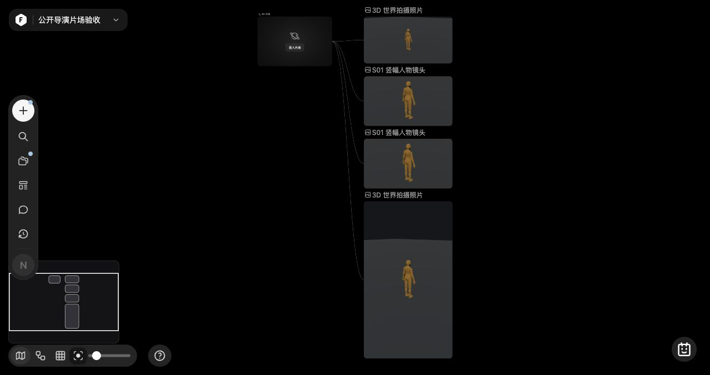

# 2026-10-08 镜头管理与离屏摄影验收

本批在真实生产入口完成镜头管理、摄影与导出的局部验收。全产品还原仍未完成，不能据此宣称全部页面或全部模型可用。官方安装包与官方 Web 是设计来源；localhost 只用于验证本地实现。

## 环境与来源

- 生产入口置于独立 QA 页的 iframe：`src/features/studio-v3/qa/main.html?project=qa-director-manager-public-1008`。
- 独立服务端口 4196，启动时清空继承环境，仅保留本机 PATH/TMPDIR 与隔离数据配置，没有供应商 Key。未触碰既有 4173/4195 服务。
- 项目为新建公开验收项目，场景为本地演员模型；动态视频使用仓库公开餐椅 GLB。没有私人项目、官方用户素材或外部生成调用。
- 官方交叉来源、原函数与边界见[Views/照片研究](../research/STUDIO-V3-VIEWS-PHOTOS-20261008.md)。没有依据导出回调虚构“保存当前视图”按钮。
- Computer Use 通过真实 UI 操作；DOM 只读取可见记录与图像解码尺寸。媒体数据由显式 QA 按钮送到仅本机 4197 的审计服务，未使用页面注入提取 Blob。

## 真实交互结果

| 能力 | 观察结果 |
| --- | --- |
| 人物轮廓 | 点击人物后有实际橙色轮廓，模型与画布正常显示；不是矩形包围框。摄影输出排除描边及摄像机辅助标记。 |
| 镜头缩略图 | 独立 renderer 生成真实 JPEG；9:16 缩略图为 101×180，匹配 320×180 包围尺寸。 |
| 重命名与跳转 | “摄像机1”改为“竖幅人物镜头”，刷新后名称保留；点击卡片进入实际关联摄像机的工具栏。 |
| 删除与撤销 | 确认删除后面板显示“暂无镜头”；退出面板并撤销，原镜头与名称恢复。该验证只操作可撤销的独立测试项目。 |
| Escape / 焦点 | 删除确认、重命名、批量选择逐层取消；再按 Escape 关闭面板，焦点回到镜头管理触发按钮。忙碌状态仍可取消本地 UI。 |
| 横幅快门 | 图像真正解码为 4096×2170，带真实摄像机 provenance；快门未追加历史照片或 views。 |
| 竖幅快门 | 9:16 输出真正解码为 2304×4096 JPEG；存储失败提示“重试保存照片”，成功后恢复快门与光学按钮。 |
| 镜头批量导出 | 真实独立渲染 4096×2304 图片，节点与连线写入生产画布。失败关闭面板后，重开恢复原批次与“重试保存”。 |
| 动态导出 | VP9 WebM，1280×720、30 fps、1 秒、56649 bytes；浏览器解码成功，独立 ffprobe/FFmpeg 确认 30 帧、30 个不同画面。首/中/末检查帧有餐椅和地面且角度变化。 |

### 幂等持久化

测试钩子仅拒绝含**新媒体 ID**的两笔保存（创建节点的 autosave 与最终 guarded save），不会阻断拍照前的场景 flush。

批量导出 `2106a09e-bd26-4428-a5d7-aef75d9843cc` 遭遇存储空间错误后，面板 close/reopen 与重试成功。节点 `3dd7a7d9-b811-4e07-8473-8497a385cb9e`、素材 `asset:476afc48-9248-44ee-b1ef-6e3bae1c242d` 保持原值，刷新后该 exportId 仍仅一节点。画布中的另一张同名输出属于此前另一次独立导出，并非该回执的重复写入。失败期间没有使用“检查保存数据”按钮兜底保存；仅在重试成功后读取持久状态。

竖幅照片 captureId `eb258f1b-31c3-4907-b083-133c05f8b2a4`，节点 `168dd496-9758-461d-9266-6f071bd2e679`，素材 `asset:a61d2cba-5da2-401a-a593-56621ff97318`。失败后的同一快门重试成功，刷新仍只有这一个新增照片。原横幅照片与两笔独立镜头导出保持原 ID；`capturedPhotos=0`、`views=0`。

交互验收发现并修正：画布 projectIdentity 为含 updatedAt 的对象，比较整个对象会在合法新增节点/保存后误判过期。批量保存现在只用稳定 project id 判断身份，同时保留 owner、source、state 与 fence 守卫。

交叉复审还确认并修复静默半场景路径：`graph.sync` 将资源加载失败写入 report 而不拒绝，原 `runtime.renderPhoto` 仍可编码剩余场景。现在只等待必需来源与可见非camera实体，失败/过期/默认 30 秒超时不调用编码器；隐藏内容与编辑标记不阻塞。新增 readiness 5 项以及受影响的 Spark/drain 2 项均通过。重载新代码后，真实生产 9:16 快门再次保存成功，浏览器 warn/error 日志为空。此次主动再次拍摄是一张新照片，不属于此前回执重试。

既有 optics 专项曾以 `deepStrictEqual` 比较矩阵分解后的 quaternion，差约 `1e-16`；本批改为文件已有的方向等价容差，保留目标方向、旋转变化和作者状态不变断言，只重跑 `look-at target movement` 这一项通过，未改生产光学逻辑。新增菜单 trigger/body 焦点 Escape 回归 1 项也通过。

## 截图与视频

原浏览器 viewport 为 1280×720，六张截图直接裁取生产 iframe 区域 `(0,42,1280,678)`。只移除 QA 控制栏，没有拼接、重绘或生成式修图。

| 证据 | 内容 |
| --- | --- |
| [画布图片节点](../screenshots/20261008-studio-shots/canvas-photo-nodes.jpg) | 快门图片、镜头输出与真实节点连线。 |
| [镜头管理](../screenshots/20261008-studio-shots/camera-manager.jpg) | 真实竖幅缩略图、标题与操作。 |
| [人物轮廓](../screenshots/20261008-studio-shots/actor-selection-outline.jpg) | 实际 WebGL 模型轮廓。 |
| [成功快门](../screenshots/20261008-studio-shots/portrait-shutter.jpg) | 资源就绪检查更新后的生产快门成功。 |
| [照片保存失败](../screenshots/20261008-studio-shots/portrait-photo-save-retry.jpg) | 保存错误与重试快门。 |
| [原批次恢复](../screenshots/20261008-studio-shots/batch-save-retry.jpg) | 重开面板后固定原选择和重试动作。 |
| [真实动态 WebM](../screenshots/20261008-studio-shots/dynamic-chair.webm) | 公开餐椅的一秒动态镜头；编码原始文件。 |
| [独立解码元数据](20261008-studio-shots-video.json) | ffprobe/FFmpeg 结果与逐帧摘要、文件 SHA256。 |

## 验证边界

专项覆盖 renderer 状态恢复、读回 drain、资源与 source fence、选择层别、拍照/批量保存回执、独立缩略图、timeline 采样、manager 焦点和菜单层级。专项主要使用真实 Three/领域对象及 GPU/存储 adapter；本页列出的 Computer Use 和实际视频文件才是本批内容与 UI 证据。不重复跑全项目测试，也没有以专项通过代替全站一致性。

尚未实机验证真实 SPZ 在 4096 下的 GPU LOD/排序/摄影景深；GLB 景深后处理与 holding 渲染尚未实现，导出针对这些情况明确拒绝。完整时间轴作者 UI、历史照片只读面板、俯视图全部交互、全 Agent 编排与各真实供应商端到端仍有差距。此 WebM 不证明长视频、所有动画通道、MP4、所有硬件编码器或桌面包导出均通过。旧 macOS Alpha 不包含本批源代码。
