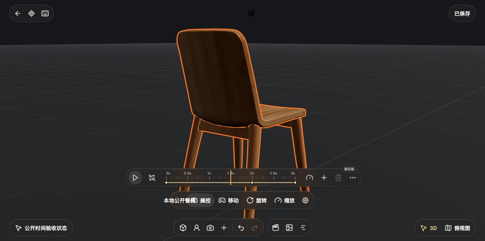

# 2026-10-08 时间轴与历史照片验收

本批接入导演片场的单目标时间轴、真实采样播放、关键帧作者操作和只读历史相册。**这是已验证的功能增量，完整产品还原仍未完成。** 官方安装包与官方 Web 提供设计证据；本地页面只用于验证实现，不作为官方行为来源。

## 实现与环境

- `temporal-actions.mjs` 处理作者目标、关键帧、通道、时长、曲线拆分和匀速分配；`temporal-workspace.mjs` 将操作接入真实 session/history。
- `temporal-playback.mjs` 只向运行时应用独立采样快照，播放头、循环和渲染 lease 不写入保存 schema。
- `timeline.mjs/.css` 采用官方单实体胶囊布局、中文、图标和菜单；没有制造全轨道表、缓动选择或连续录制按钮。
- `photo-history.mjs/.css` 读取已有 `capturedPhotos`，展示原始图片，不重渲染，不增加导出、删除或生成控制。
- 使用独立 4196 服务和新建项目 `qa-temporal-public-1008`；后端数据位于临时目录。启动时清空继承环境，仅保留 PATH、PORT 和隔离数据配置，零供应商 Key、零模型调用。
- [QA 入口](../../src/features/studio-v3/qa/temporal.html)嵌入真实生产画布，只负责创建公开餐椅/摄像机、导入两张仓库 JPEG 和读取领域/渲染诊断；未预建时间关键帧。

官方字段、函数、字典、尺寸和边界分别见[时间轴研究](../research/STUDIO-V3-TIMELINE-20261008.md)、[历史照片研究](../research/STUDIO-V3-PHOTO-HISTORY-20261008.md)。研究文件记录静态读取时的实现快照，最终生产结果以本页为准。

## 实际 Computer Use

浏览器操作包括真实指针、键盘、菜单、焦点和刷新；诊断仅通过页面的“读取场景与时间数据”按钮展示，再读取可见 JSON。

| 操作 | 实际结果 |
| --- | --- |
| 保存首帧与隐式创建 | 餐椅在0ms保存X=0；3000ms输入X=3并确认，产生第二关键帧。 |
| 中间采样 | 定位1500ms后真实Three实体root X=1.5，作者base仍X=0。 |
| 取消隐式编辑 | 在1500ms输入Z=2后取消，显示恢复X≈1.5000196/Z=0，base、key数量和revision不变。 |
| 关键帧原生拖动 | 新建2000ms key，原生指针拖到997ms，keys为0/997/3000；撤销恢复0/2000/3000，重做与匀速分配成功。 |
| 删除与撤销 | 删除单key和整个轨道后分别撤销，原keys和channels恢复。仅操作可撤销的独立验收项目。 |
| 时长 | 3秒延长到4秒，再缩短到3秒；3000ms末key阻止继续缩短。 |
| 循环播放 | 真实画面位置和播放头跨末端循环，revision保持4、base保持X=0，采样没有保存成作者状态。 |
| 保存重开 | 关闭、reload、再次进入后餐椅keys、通道、时长恢复；临时播放状态没有伪装成持久数据。 |
| 历史相册 | 两张本地JPEG均解码为1280×678，逆序、160px纵向缩略图、左右键、Tab和Escape可用。只读入口仅在已有历史照片时出现。 |
| 有key摄像机操控 | 时间0操控摄像机，真实焦距slider ArrowRight：HUD36mm，key=36.39634259895297，base仍35mm。 |
| key镜头拍照 | 快门显示“照片已保存到画布”，新增4096×2304真实解码JPEG节点，摄像机工具栏继续存在，历史相册仍2张。 |
| 拍照后继续编辑 | 再次ArrowRight后HUD38mm，key=37.848392988010275；完成、关闭并reload后revision18/dirty false，key保留，base35mm。 |

焦距滑杆为对数刻度，HUD显示取整值。早期点击AX中列出的50mm没有改焦：该预设在当前74px刻度窗口外、`pointer-events:none`，不能把未实际命中的按钮算作编辑成功。最终验收改用真实可见slider，没有强制点击隐藏预设。

## 本轮修复

实际操作发现并修复取消编辑恢复到base而非原暂停样本、异步定位忙碌状态中断自身手势、松手覆盖最终定位、key拖动时禁用被capture按钮、等待渲染后缺失source复核，以及渲染暂停期间重新开放导航输入。

key相机作者授权现在区分保存回执与作者修改：纯保存revision确认不使操控授权过期；真正的editEpoch/source/setup/owner变化仍撤销旧授权。无dirty的拍摄checkpoint不丢失原key授权。专项使用真实session、持久化和camera-edit模块，再通过上述生产UI验收交叉确认。

## 证据

截图没有拼接、重绘或生成式修图。浏览器viewport为1280×720；时间轴/快门/画布截取`(0,50,1280,637)`生产iframe区域，相册保留完整QA上下文。媒体均为本地公开资源，JSON包含的随机ID仅属于该新建验收项目。

| 文件 | 内容 |
| --- | --- |
| [餐椅时间轴](../screenshots/20261008-studio-temporal/timeline-chair.jpg) | 1.5秒采样画面与单目标轨道。 |
| [历史照片](../screenshots/20261008-studio-temporal/photo-history.jpg) | 原始照片、缩略图和只读提示。 |
| [key镜头快门](../screenshots/20261008-studio-temporal/keyed-shutter.jpg) | 拍照后继续保留的摄像机HUD。 |
| [画布照片节点](../screenshots/20261008-studio-temporal/keyed-photo-nodes.jpg) | 新照片节点和真实连接。 |
| [刷新后领域与运行时诊断](../screenshots/20261008-studio-temporal/temporal-state.json) | 两实体、轨道、base/key光学、revision和历史照片。 |

## 定向检查与边界

沿用本批逐个代理的专项结果，不将不同轮次重复计入总数，也没有重跑全仓套件：

- temporal作者23/23，playback初次10/10及后续受影响clock2/2。
- temporal宿主最终17/17，包含真实session/camera-edit/persistence/异步runtime sync回归。
- timeline原专项19个累计用例，后续只运行受影响10项；真实宿主拖动/定位包含在该窄范围内。
- 相册初次9/9、后续焦点受影响3/3；runtime时间输入/暂停6/6。
- entry最终12/12，取消授权断言确认静默返回，不启动操控或弹出通用错误。
- 改动模块语法和差异空白检查通过；没有新增依赖。

相册样例是旧`capturedPhotos`结构的显式导入，不代表普通快门创建历史记录。现有快门只写画布，这与官方证据一致。曲线拆分保存子区间中点约束，不保证整个路径逐点不变。距离对焦插值及目标优先级保持官方源码合同。

仍缺官方完整平面图交互、模型导入/生成任务UI和完整V3 Agent编辑/生成/拍摄编排；holding呈现与真实SPZ像素/摄影景深尚未验收。没有进行真实供应商调用、大场景性能、全设备或新版桌面包验收；旧Alpha不含本批。不能据此宣称全产品仅填任意一个Key即可完整使用。
